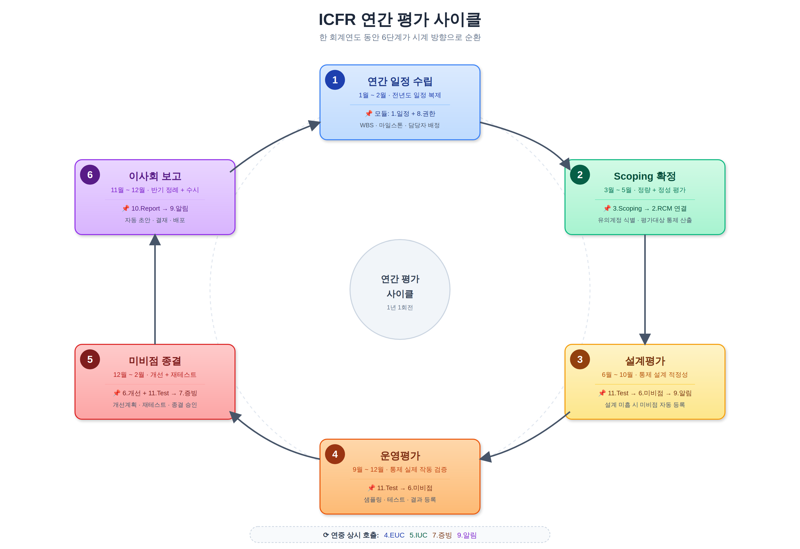
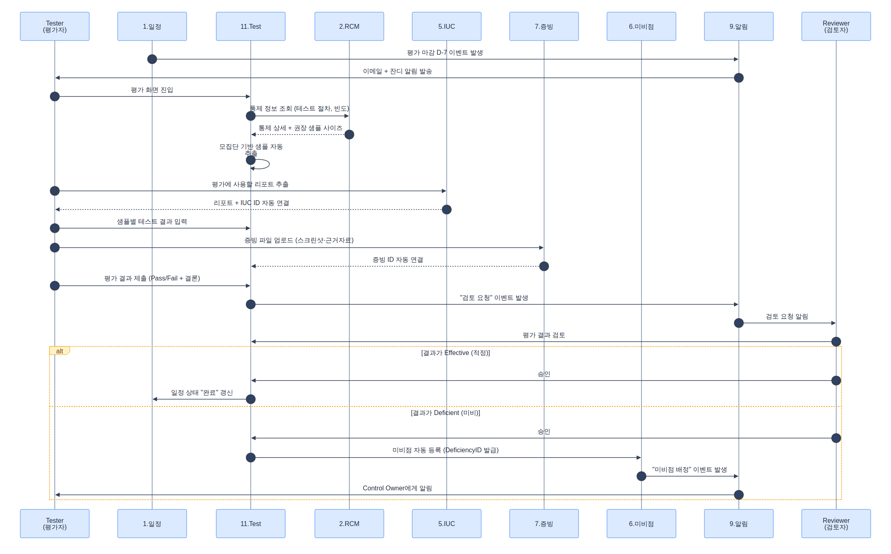
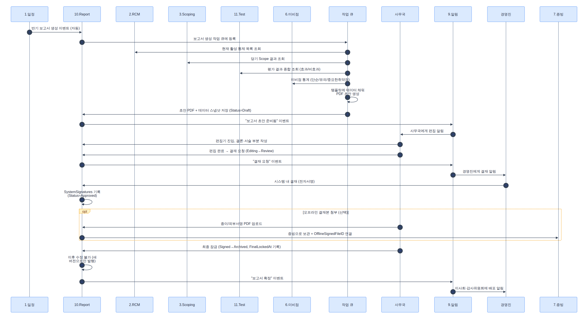
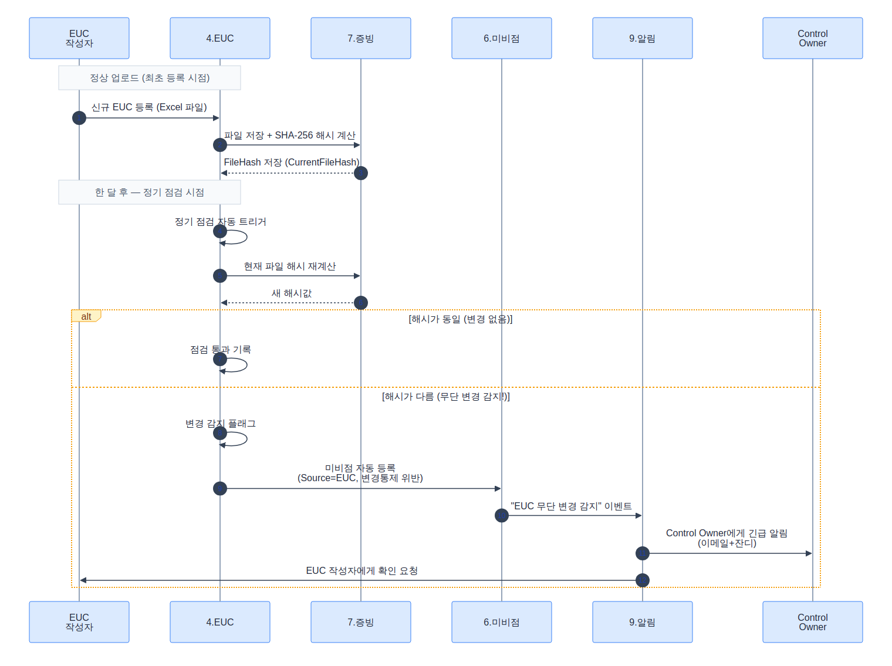
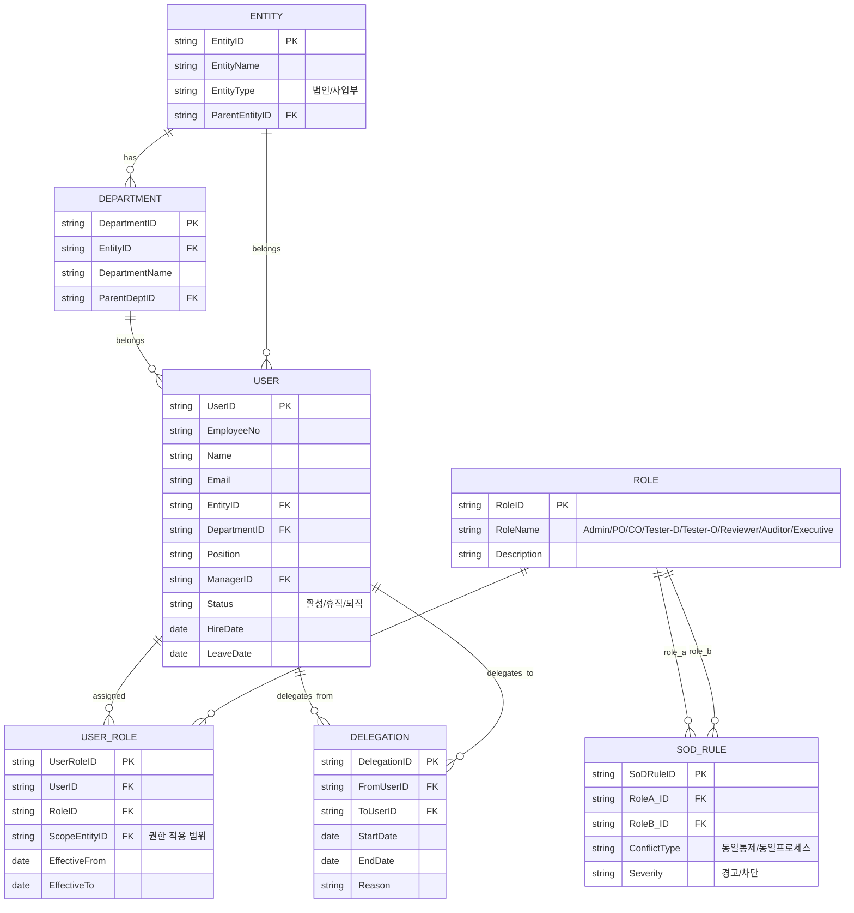
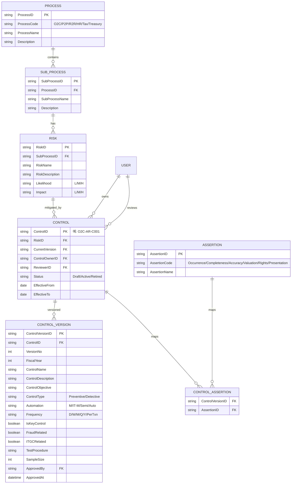
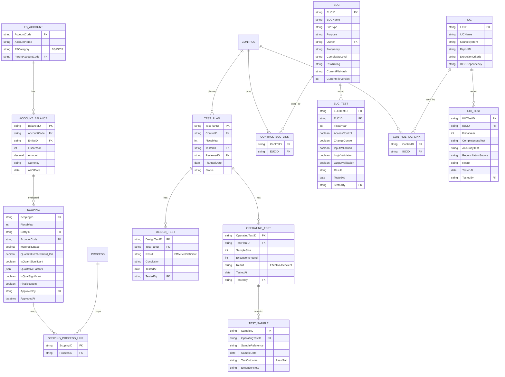
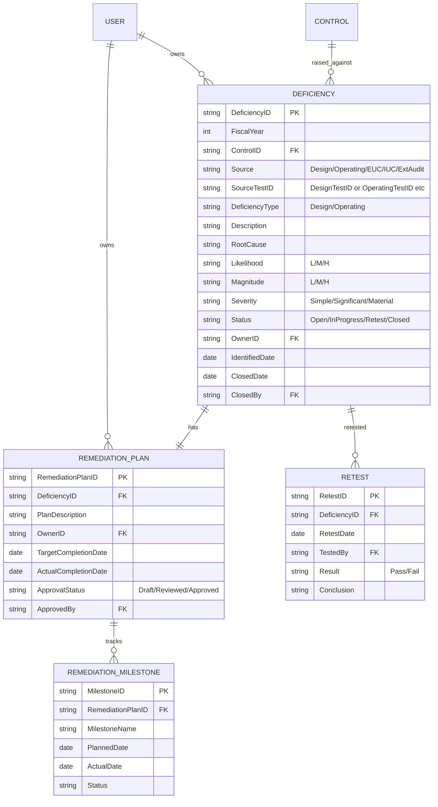

# ClaudeICFR.md — 내부회계관리제도(ICFR) 시스템 개발 기록

> **이 문서의 역할**
> 이 파일은 ICFR 시스템 개발의 **단일 진실 공급원(Single Source of Truth)** 입니다.
> - Claude(AI 보조)는 새 세션마다 **이 파일을 먼저 읽고**, 기존 코드는 필요할 때만 Git에서 직접 확인합니다.
> - 새로 합류하는 개발자도 이 문서만 끝까지 읽으면 프로젝트의 현재 상태와 다음 할 일을 이해할 수 있어야 합니다.
> - **모든 의사결정·범위 변경·완료 항목은 이 문서에 즉시 반영**합니다. 코드만 바뀌고 문서가 안 바뀌면 안 됩니다.

---

## 0. 문서 사용 규칙 (READ FIRST)

### 0.1 Claude 세션 시작 시 작업 절차
1. 이 파일 전체를 읽는다.
2. `섹션 12. 진행 상태 보드`에서 현재 어디까지 왔는지 확인한다.
3. `섹션 13. 다음 작업(Next Up)`을 확인하고 사용자에게 진행 의사를 묻는다.
4. 필요한 경우에만 Git에서 해당 파일을 직접 fetch하여 확인한다. **전체 코드 베이스를 무작정 읽지 않는다.**
5. 작업 완료 후 반드시 `섹션 12`, `섹션 13`, `섹션 14. 변경 로그`를 업데이트한다.

### 0.2 토큰 절약 원칙
- 이미 합의된 사항은 이 문서에서 짧게 참조만 한다 (재설명 금지).
- 코드 전체를 다시 붙여넣지 않는다. 파일 경로·함수 시그니처·핵심 변경점만 기록한다.
- 큰 결정(아키텍처, 데이터 모델 변경)은 `섹션 10. 의사결정 기록(ADR)`에 1건당 10줄 이내로 요약한다.

### 0.3 새 개발자 온보딩 체크리스트
- [ ] 섹션 1~3 (개요/아키텍처/기술스택)을 읽는다 → 30분
- [ ] 섹션 4 (모듈 명세) 정독 → 60분
- [ ] 섹션 5 (데이터 모델) 정독 → 30분
- [ ] 섹션 7 (Git/브랜치 전략) 읽고 로컬 환경 셋업 → 30분
- [ ] 섹션 12~14에서 현재 진행 상황과 다음 작업 확인 → 15분

---

## 1. 프로젝트 개요

### 1.1 목적
한국 외감법 및 K-IFRS 환경의 내부회계관리제도(ICFR) 운영 전 과정을 디지털화하여, 사무국·통제 수행자·내부감사·외부감사인이 한 시스템에서 협업하도록 한다.

### 1.2 범위 (11개 핵심 모듈)
1. 일정관리 (Schedule Management)
2. RCM 관리 (Risk Control Matrix)
3. Scoping
4. EUC (End User Computing)
5. IUC (Information Used in Control)
6. 개선계획 관리 (Remediation)
7. 증빙 관리 (Evidence)
8. 담당자 지정 및 관리 (User & Role)
9. 메일발송 (Notification)
10. Report (이사회 보고서 / PBC 패키지)
11. Test (설계·운영평가 실행)

### 1.3 대상 사용자
- ICFR 사무국 (Administrator)
- 프로세스 책임자 (Process Owner)
- 통제 수행자 (Control Owner)
- 설계/운영평가자 (Tester)
- 검토자 (Reviewer)
- 외부감사인 (External Auditor, 읽기 전용)
- 경영진 (Executive, 대시보드)

---

## 2. 아키텍처 개요

### 2.0 핵심 원칙
- **RCM이 전역 키(ControlID)** 로 평가·미비점·IUC·EUC·증빙을 묶는다.
- **모든 데이터는 불변 감사로그(audit trail)** 를 남긴다.
- **이벤트 기반 알림** — 도메인 이벤트가 발생하면 Notification 모듈이 구독한다.
- **역할 기반 접근제어(RBAC)** — API 게이트웨이에서 일괄 검증, SoD 룰 실시간 체크.

---

### 2.1 시스템 컨텍스트 다이어그램

```
                        ┌──────────────────────────────────────────────┐
                        │              ICFR 시스템                      │
  ┌──────────────┐      │  ┌─────────┐  ┌────────┐  ┌──────────────┐  │
  │ ICFR 사무국  │◄────►│  │일정관리  │  │ RCM   │  │ Scoping      │  │
  │ (Admin)      │      │  └─────────┘  └────────┘  └──────────────┘  │
  └──────────────┘      │  ┌─────────┐  ┌────────┐  ┌──────────────┐  │
  ┌──────────────┐      │  │  EUC    │  │  IUC   │  │ 개선계획     │  │
  │ Process Owner│◄────►│  └─────────┘  └────────┘  └──────────────┘  │
  └──────────────┘      │  ┌─────────┐  ┌────────┐  ┌──────────────┐  │
  ┌──────────────┐      │  │ 증빙관리 │  │User&Role│ │ Notification │  │
  │ Control Owner│◄────►│  └─────────┘  └────────┘  └──────────────┘  │
  └──────────────┘      │  ┌─────────┐  ┌────────┐                    │
  ┌──────────────┐      │  │ Report  │  │  Test  │                    │
  │   Tester     │◄────►│  └─────────┘  └────────┘                    │
  └──────────────┘      └──────────┬───────────────────────────────────┘
  ┌──────────────┐                 │
  │   Reviewer   │◄────────────────┤  외부 시스템 연동
  └──────────────┘                 │
  ┌──────────────┐          ┌──────┴───────────────────────────────────┐
  │External Audit│◄────────►│ SSO/IdP │ ERP/회계 │ SMTP │ 잔디Webhook │
  │ (읽기전용)   │          │         │ 시스템   │      │ 파일저장소  │
  └──────────────┘          └──────────────────────────────────────────┘
  ┌──────────────┐
  │   경영진     │◄── 대시보드                산출물
  └──────────────┘         ┌──────────────────────────┐
  ┌──────────────┐         │ PBC 패키지 (zip+인덱스)  │
  │이사회/감사위 │◄── PDF  │ 이사회 보고서 PDF        │
  └──────────────┘         └──────────────────────────┘
```

**행위자 (8명)**

| 역할 | 주요 접점 모듈 |
|---|---|
| ICFR 사무국 (Administrator) | 전 모듈 관리 |
| 프로세스 책임자 (Process Owner) | Scoping, RCM, 일정, Report |
| 통제 수행자 (Control Owner) | Test, EUC, IUC, 증빙, 개선계획 |
| 평가자 (Tester — 설계/운영) | Test, 증빙 |
| 검토자 (Reviewer) | Test, 개선계획, Report |
| 외부감사인 (External Auditor) | 증빙(읽기), PBC 패키지 |
| 경영진 (Executive) | 대시보드, Report |
| 이사회 / 감사위원회 | Report (PDF 수령) |

**외부 시스템 (5개)**

| 시스템 | 연동 방식 | 주요 용도 |
|---|---|---|
| SSO / IdP (SAML·OIDC) | OAuth2/OIDC | 사용자 인증·세션 |
| ERP / 회계시스템 | API / Excel | Scoping 재무데이터 취득 |
| 메일 SMTP | SMTP | Notification 발송 |
| 잔디 Webhook | HTTPS POST | 팀 채널 알림 |
| 파일저장소 (S3/MinIO/NAS) | S3 API / 마운트 | 증빙·EUC·보고서 파일 저장 |

---

### 2.2 컴포넌트 도식 (6계층)

```
┌─────────────────────────────────────────────────────────────────┐
│  Layer 1 — 프레젠테이션                                          │
│  Web UI (React/Vue + TypeScript)                                 │
│  · 11개 모듈 화면 · 대시보드 · PBC Builder · 보고서 뷰어         │
└─────────────────────────┬───────────────────────────────────────┘
                          │ HTTPS / REST·GraphQL
┌─────────────────────────▼───────────────────────────────────────┐
│  Layer 2 — API 게이트웨이                                        │
│  인증(JWT검증) / 인가(RBAC·SoD) / Rate Limit / 라우팅            │
└──┬──────────────────────┬───────────────────────────────────────┘
   │                      │
┌──▼──────────────────────▼────────────────────────────────────┐
│  Layer 3 — 응용 모듈 (비즈니스 로직)                           │
│  일정관리 · Scoping · EUC · IUC · 개선계획 · 증빙관리          │
│  Notification · Report · Test                                  │
└──┬───────────────────────────────────────────────────────────┘
   │  의존 (읽기/쓰기)
┌──▼───────────────────────────────────────────────────────────┐
│  Layer 4 — 마스터 모듈                                         │
│  RCM(ControlID 발급·버전관리) · User&Role(RBAC·SoD) · Codebook│
└──┬───────────────────────────────────────────────────────────┘
   │  공통 서비스 호출
┌──▼───────────────────────────────────────────────────────────┐
│  Layer 5 — 횡단 인프라                                         │
│  이벤트 버스(도메인 이벤트 발행/구독)                           │
│  감사로그(불변 AuditLog 적재)                                   │
│  파일저장소 어댑터(S3 API 추상화)                               │
│  작업큐(비동기: 보고서 생성·메일 발송·파일 해시 검증)            │
└──┬───────────────────────────────────────────────────────────┘
   │
┌──▼───────────────────────────────────────────────────────────┐
│  Layer 6 — 데이터                                              │
│  RDBMS (PostgreSQL / MySQL / Oracle — 섹션 3 미정)            │
│  파일 오브젝트 스토어 (S3 호환)                                 │
└──────────────────────────────────────────────────────────────┘
```

**모듈 간 주요 의존 관계**

| 소스 모듈 | → 의존 대상 | 이유 |
|---|---|---|
| Test | RCM | ControlID 기준으로 TestPlan 생성 |
| Test | 증빙 | 테스트 결과 증빙 첨부 |
| Test | 개선계획 | 미비점 자동 등록 |
| Scoping | RCM | Scope In → 평가 대상 통제 목록 |
| EUC / IUC | RCM | 통제-EUC·IUC 매핑 |
| Report | Test / 개선계획 / Scoping | 보고서 원본 데이터 수집 |
| Notification | 전 모듈 | 도메인 이벤트 구독 후 발송 |
| 모든 모듈 | User&Role | 권한 검증 |
| 모든 모듈 | 감사로그 | 변경 이력 적재 |

---

### 2.3 연간 평가 사이클



> SVG 원본: `docs/diagrams/annual_cycle.svg`

---

### 2.4 도메인 이벤트 흐름 (5개 시나리오)

#### 시나리오 1 — 운영평가 → 미비점 → 개선 → 종결



> Mermaid 원본: `docs/diagrams/scenario1_operating_test.mmd`

**이벤트 체인 요약**
1. `TestPlan 생성` → Test 모듈이 Control Owner에게 할당 알림 발송
2. `OperatingTest 완료(미비점 있음)` → Deficiency 자동 생성 + Control Owner 알림
3. `RemediationPlan 등록` → Reviewer 검토 요청 알림
4. `RemediationPlan 승인` → 마일스톤 추적 시작
5. `Retest 완료(Pass)` → Deficiency 종결 + 감사위원회 알림 (선택)

---

#### 시나리오 2 — 이사회 보고서 생성



> Mermaid 원본: `docs/diagrams/scenario2_board_report.mmd`

**이벤트 체인 요약**
1. `보고서 초안 자동 생성 트리거` → Report 모듈이 Test·개선계획·Scoping 데이터 스냅샷
2. `초안 편집 완료` → 검토자 승인 요청 알림
3. `시스템 결재 완료` → 오프라인 서명본 업로드 대기
4. `오프라인 서명본 첨부` → 보고서 최종 잠금(Locked)
5. `배포` → 이사회·감사위 수신인에게 PDF 링크 발송

---

#### 시나리오 3 — EUC 변경 감지 → 재점검



> Mermaid 원본: `docs/diagrams/scenario3_euc_change.mmd`

**이벤트 체인 요약**
1. `EUC 파일 업로드` → 파일 해시(SHA-256) 자동 계산
2. `해시 불일치 감지` → `EUCFileChanged` 이벤트 발행
3. Notification 모듈 구독 → Control Owner·EUC Owner 즉시 알림
4. `EUC 점검 요청 생성` → 점검 일정 등록(일정관리 모듈)
5. `점검 결과 미비` → Deficiency 자동 등록

---

#### 시나리오 4 — PBC 패키지 생성

**트리거**: 외부감사인 요청 또는 사무국 수동 실행

1. 사무국이 대상 FiscalYear·ControlID·기간 범위를 지정하여 PBC 생성 요청
2. 작업큐(비동기)가 해당 TestPlan·샘플·증빙·미비점 데이터를 수집
3. 파일저장소에서 증빙 파일을 zip으로 번들링 + 인덱스(Excel) 자동 생성
4. `PBCPackageReady` 이벤트 → 외부감사인에게 다운로드 링크 메일 발송
5. Evidence 모듈에 PBC 패키지 파일 등록(접근 로그 포함)

---

#### 시나리오 5 — SoD 위반 감지

**트리거**: 사용자 역할 변경 또는 통제 담당자 지정 시 실시간 체크

1. `UserRole 변경` or `Control.ControlOwnerID 변경` 이벤트 발행
2. User&Role 모듈이 SoD 룰 테이블과 대조 (Control Owner = Tester 금지 등)
3. **경고**: 관리자 알림 발송, 작업 진행은 허용하되 위반 로그 기록
4. **차단**: 지정 불가 처리, 관리자에게 승인 요청 알림
5. AuditLog에 SoD 위반 시도 스냅샷 적재

---

## 3. 기술 스택

### 3.1 결정 요약

| 영역 | 결정 | Phase 확장 |
|---|---|---|
| Backend | FastAPI (Python 3.12+) | — |
| Database | PostgreSQL 16 | — |
| Frontend | React 18 + TypeScript 5 + Vite + shadcn/ui + Tailwind CSS | — |
| 인증 | JWT (Phase 1) | Phase 2: OAuth2 → Phase 3: SSO/Keycloak |
| 파일 저장 | MinIO (S3 호환, Docker) | Phase 2+: AWS S3 가능 |
| 작업 큐 | FastAPI BackgroundTasks | Phase 1.5+: Celery + Redis |
| 배포 | Docker Compose | Phase 2+: Kubernetes (필요 시) |

### 3.2 결정 이유 (요약)

- **FastAPI**: Claude Code 호환성 최상, 개발 속도 빠름, 자동 API 문서, Pydantic 강타입
- **PostgreSQL 16**: JSONB 필드 다수 활용(QualitativeFactors, SystemSignatures 등), 무료, 무결성·이력 강력
- **React + TS + shadcn/ui**: 표·폼·워크플로 중심 업무 UI 최적, 한국 표준, AI 호환성 최상
- **JWT 단계화**: MVP는 빠른 셋업 우선, SSO는 실 서비스 진입 후
- **MinIO**: S3 호환으로 미래 마이그레이션 자유, Docker 1분 셋업
- **BackgroundTasks 단계화**: MVP 부하 가벼움, 인터페이스 추상화 후 Celery 전환 용이
- **Docker Compose**: 단일 서버 ~ 수백 명 규모에 충분, 로컬·운영 환경 일치

자세한 의사결정 배경·대안 비교는 섹션 10의 ADR-0008~0014 참조.

### 3.3 표준 라이브러리·도구

**Backend**
- ORM: SQLAlchemy 2.x
- 마이그레이션: Alembic
- 검증·문서: Pydantic v2
- 테스트: pytest
- 린터·포매터: ruff
- ASGI 서버: uvicorn
- 인증·암호: python-jose, passlib, bcrypt
- S3/MinIO 클라이언트: boto3
- 외부 API 호출: httpx (잔디 Webhook 등)

**Frontend**
- 라우팅: React Router v6
- 서버 상태: TanStack Query
- 클라이언트 상태: Zustand
- 폼·검증: React Hook Form + Zod
- 표: TanStack Table
- 차트: Recharts
- 다이어그램: Mermaid.js (.mmd 파일 그대로 활용)
- HTTP 클라이언트: axios
- 테스트: Vitest
- 코드 품질: ESLint + Prettier

**Infra**
- 컨테이너: Docker + Docker Compose
- 데이터베이스: PostgreSQL 16
- 파일 저장: MinIO
- 리버스 프록시: Nginx (Phase 2+)
- CI/CD: GitHub Actions

---

## 4. 모듈별 상세 기능명세

### 4.1 일정관리 (Schedule Management)
**목적**: 연간 ICFR 운영 사이클의 모든 활동을 계획·추적하고 지연을 사전에 인지.

**주요 화면**: 연간 마스터 일정(간트), 활동 상세, My Task, 지연/임박 알림

**핵심 엔티티 필드**
- ScheduleID, FiscalYear, ActivityType(설계/운영/EUC/IUC/보고/감사), ActivityName, ParentScheduleID
- PlannedStart/End, ActualStart/End, Progress, Status(미착수/진행중/지연/완료)
- OwnerUserID, RelatedRCMIDs[]

**주요 기능**
- 템플릿 기반 연간 일정 자동 생성(전년도 복제)
- WBS 계층(분기→월→활동)
- D-7/D-3/D-Day 알림
- 지연 자동 판정
- Excel/PDF 내보내기

**연계**: RCM, 담당자관리, 메일발송

---

### 4.2 RCM 관리 (Risk Control Matrix)
**목적**: 모든 ICFR 활동의 기준이 되는 통제 마스터를 버전 관리.

**주요 화면**: 인벤토리(트리+그리드), 통제 상세(탭), 버전 비교, 변경 승인 워크플로

**핵심 엔티티 필드** (Control)
- ControlID(PK, 예: O2C-AR-C001), RCMVersion, ProcessID, SubProcessID, RiskID
- ControlName, ControlDescription, ControlObjective
- ControlType(예방/적발), Automation(수동/IT의존수동/반자동/자동)
- Frequency(일/주/월/분기/연/거래시), IsKeyControl, Assertions[](발생/완전성/정확성/평가/권리의무/표시공시)
- FraudRelated, ITGCRelated
- ControlOwnerID, ReviewerID, TestProcedure, SampleSize
- EffectiveFrom/To, Status(Draft/Active/Retired)

**주요 기능**
- 버전 관리(스냅샷, Diff)
- 변경 워크플로(작성→검토→승인→적용)
- 일괄 등록(Excel 업로드)
- 다축 검색/필터
- 통제별 영향도 조회(연결 평가/미비점/IUC를 한 화면에)
- 변경 이력

**연계**: Scoping, 일정, IUC, 미비점, 증빙

> **책임 명확화**: 평가 실행(테스트 계획·설계·운영·샘플·결과)은 **11. Test 모듈**로 분리. RCM은 통제 정의·버전 관리·변경 워크플로·영향도 조회·전역 키(ControlID) 발급에 집중.

---

### 4.3 Scoping
**목적**: 정량·정성 기준으로 유의계정 및 평가 대상 프로세스/통제 결정.

**주요 화면**: 재무제표 입력, 정량 결과, 정성 평가, 최종 Scope 승인

**핵심 엔티티 필드**
- ScopingID, FiscalYear, EntityID, AccountCode, AccountBalance
- TotalAssetsOrRevenue, MaterialityBase(PM), QuantitativeThreshold(%)
- IsQuantitativelySignificant, QualitativeFactors(JSON), IsQualitativelySignificant
- FinalScopeIn, LinkedProcessIDs[], ApprovedBy/At

**주요 기능**
- 재무제표 데이터 업로드(Excel/ERP)
- 정량 임계치 자동 적용
- 정성 체크리스트
- Account-Process 매핑
- Scope 결과 → RCM 평가 대상 자동 생성
- 변경 이력·사유, 승인 워크플로

**연계**: RCM, 일정관리

---

### 4.4 EUC (End User Computing)
**목적**: 통제에 활용되는 사용자 계산자료(주로 Excel)의 적정성 관리.

**주요 화면**: EUC 인벤토리, 상세, 파일 업로드/버전, 점검 결과

**핵심 엔티티 필드**
- EUCID, EUCName, FileType, Purpose, LinkedControlIDs[]
- Owner, Frequency, ComplexityLevel, RiskRating(영향도×복잡도)
- AccessControl, ChangeControl, InputValidation, LogicValidation, OutputValidation
- FileHash(SHA-256), FileVersion, LastTestedDate, TestResult(적정/미비/개선중)

**주요 기능**
- EUC 식별 체크리스트
- 파일 업로드 + 해시 자동 → 무단 변경 감지
- 버전 비교
- 위험도 자동 산정
- 정기 점검 일정 자동 생성
- 미비 시 미비점 자동 등록

**연계**: RCM, 미비점, 증빙, 일정

---

### 4.5 IUC (Information Used in Control)
**목적**: 통제 수행에 사용된 시스템 산출 정보의 완전성·정확성 검증.

**주요 화면**: IUC 인벤토리, 상세, 통제별 IUC 매핑

**핵심 엔티티 필드**
- IUCID, IUCName, SourceSystem(SAP/Oracle/자체개발 등), ReportID
- ExtractionCriteria, ExtractedBy/At, LinkedControlIDs[]
- CompletenessTest, AccuracyTest, ReconciliationSource
- TestResult(적정/미비), ITGCDependency

**주요 기능**
- 인벤토리 관리
- 통제-IUC 1:N 매핑
- 완전성·정확성 결과 기록
- ITGC와 연결(ITGC 미비 시 IUC 영향 자동 표시)
- 증빙 첨부

**연계**: RCM, ITGC(향후), 증빙, 미비점

---

### 4.6 개선계획 관리 (Remediation)
**목적**: 미비점 식별 → 종결까지 라이프사이클 관리.

**주요 화면**: 미비점 인벤토리, 상세, 진행 대시보드, 심각도 워크시트

**핵심 엔티티 필드**
- DeficiencyID, FiscalYear, LinkedControlID
- Source(설계/운영/EUC/IUC/외부감사), DeficiencyType(설계/운영)
- Description, RootCause
- Likelihood, Magnitude, Severity(단순/유의/중요한취약점)
- RemediationPlan, RemediationOwner, TargetCompletionDate, ActualCompletionDate
- ProgressStatus(계획수립/진행중/재테스트/종결), RetestResult, RetestEvidenceIDs[]
- ApprovedBy

**주요 기능**
- 평가/EUC/IUC 모듈에서 자동 등록
- 심각도 워크시트(Likelihood × Magnitude)
- 계획 수립→검토→승인 워크플로
- 마일스톤 추적
- 마감 임박/지연 알림
- 재테스트 등록 및 종결 승인
- 연도 간 이월 트래킹

**연계**: RCM, EUC, IUC, 증빙, 메일, 일정

---

### 4.7 증빙 관리 (Evidence)
**목적**: 모든 활동의 증빙 통합 저장 및 추적.

**주요 화면**: 증빙 라이브러리, 상세, PBC 패키지 빌더, 접근 로그

**핵심 엔티티 필드**
- EvidenceID, FileName, FileType, FileSize, FileHash, StoragePath
- Source, LinkedEntityType, LinkedEntityID, LinkedControlID, FiscalYear
- Tags[], UploadedBy/At, RetentionUntil, ConfidentialityLevel(일반/대외비/기밀)

**주요 기능**
- 드래그앤드롭, 폴더 일괄 업로드
- 출처 기반 자동 분류
- 태그·메타데이터 검색
- 미리보기(PDF/이미지/Excel)
- PBC 패키지(zip+인덱스) 생성
- 접근 로그
- 보존기간 만료 알림
- 외부감사인 읽기 전용

**연계**: 거의 모든 모듈

---

### 4.8 담당자 지정 및 관리 (User & Role)
**목적**: 조직 마스터 + 역할 기반 권한 + SoD.

**주요 화면**: 조직도, 사용자 관리, 권한 매트릭스, SoD 위반 모니터링

**핵심 엔티티 필드** (User)
- UserID, EmployeeNo, Name, Email
- EntityID, DepartmentID, Position
- Roles[], Status(활성/휴직/퇴직), ManagerID

**역할**: Administrator / Process Owner / Control Owner / Tester(Design) / Tester(Operating) / Reviewer / External Auditor / Executive

**주요 기능**
- HR 연동(입·퇴사 반영)
- 권한 매트릭스
- 통제별 담당자 일괄 지정
- SoD 룰(Control Owner = Tester 금지 등)
- 위임(Delegation)
- 권한 이력

**연계**: 전 모듈

---

### 4.9 메일발송 (Notification)
**목적**: 이벤트 기반 자동 알림 및 발송 이력.

**주요 화면**: 템플릿 관리, 트리거 룰, 발송 이력, 사용자별 채널 선호

**핵심 엔티티** (NotificationRule)
- RuleID, EventType, TriggerCondition(JSON), TemplateID, Recipients, Channels[], IsActive

**핵심 엔티티** (NotificationLog)
- LogID, RuleID, RecipientID, Channel, SentAt
- DeliveryStatus(성공/실패/대기), OpenedAt
- RelatedEntityType, RelatedEntityID

**주요 기능**
- 변수 치환 템플릿({{UserName}}, {{ControlID}}, {{DueDate}})
- 룰 기반 자동 발송
- 즉시/예약 발송
- 발송 결과 추적
- 다채널(Email + Teams/Slack)
- 사용자별 채널·시간대 설정
- 자동 재시도

**연계**: 전 모듈(이벤트 소스)

---

### 4.10 Report (이사회 보고서 / PBC 패키지)
**목적**: 내부회계관리제도 운영 결과를 이사회·감사위원회에 보고하는 공식 문서를 생성·관리하고, 외부감사인 요청 자료(PBC 패키지)를 번들링.

**산출물**
- 이사회 보고서: 반기(H1·H2) 및 수시 — 시스템 결재 + 오프라인 서명본 첨부 후 최종 잠금
- PBC 패키지: 외부감사인 요청 자료 zip (증빙·테스트결과·미비점·인덱스Excel 포함)

**핵심 엔티티 필드** (Report)
- ReportID, ReportType(BoardReport/PBCPackage), FiscalYear
- ReportingPeriod(H1/H2/Q1~Q4/AdHoc), Status(Draft/Editing/Approved/Signed/Archived)
- TemplateID, GeneratedAt/By, EditedContent(JSON — 섹션별 편집 내용)
- SystemSignatures(JSON — 결재선·승인자·일시), OfflineSignedFileID(FK→Evidence)
- FinalLockedAt, DistributedTo(수신인 목록), SourceDataSnapshot(JSON — 생성 시점 원본 데이터)

**주요 기능**
- 자동 초안 생성 (Test·개선계획·Scoping 데이터 스냅샷 기반)
- 섹션별 편집 및 버전 비교
- 시스템 결재 워크플로 (작성→검토→승인)
- 오프라인 서명본 첨부 후 최종 잠금 (이후 편집 불가)
- 배포 이력 및 수신인별 접근 로그
- PBC 패키지 비동기 생성 (작업큐) + 다운로드 링크 발송

**연계**: Test, 개선계획, Scoping, 증빙, Notification, User&Role

---

### 4.11 Test (설계·운영평가 실행)
**목적**: 통제별 설계평가 및 운영평가를 체계적으로 계획·실행하고, 미비점 발생 시 개선계획 모듈로 자동 연결.

**두 가지 평가**
- **설계평가 (Design Test)**: 통제 설계의 적정성 평가 — 통제 목적 달성 가능 여부
- **운영평가 (Operating Test)**: 통제가 계획대로 운영되는지 샘플 기반 검증

**핵심 엔티티 필드**: 섹션 5의 `TestPlan / DesignTest / OperatingTest / TestSample` 참조.

**주요 기능**
- 평가 계획 수립 (FiscalYear·ControlID·Tester·기간 지정)
- 샘플 추출 (모집단 등록 → 무작위/속성 추출)
- 테스트 워크시트 작성 (설계: 체크리스트, 운영: 샘플별 Pass/Fail)
- 검토 워크플로 (Tester → Reviewer → 승인)
- 결과 자동 판정: 미비점 발견 시 개선계획 모듈에 Deficiency 자동 생성
- 재테스트 연결 (개선계획 종결 후 Retest 등록)
- 증빙 첨부 (Evidence 모듈 연계)

**연계**: RCM(ControlID), 증빙, 개선계획, 일정, Notification, User&Role

---

## 5. 데이터 모델 / ERD

### 5.1 설계 원칙
1. **RCM(Control)이 허브** — 모든 평가·미비점·IUC·EUC·증빙은 `ControlID`로 연결된다.
2. **버전·이력 분리** — 마스터 테이블(Active)과 이력 테이블(History)을 나누어 RCM/Scoping의 연도 간 변경을 추적한다.
3. **다형성 연결(Polymorphic Link)** — 증빙/알림은 `LinkedEntityType + LinkedEntityID`로 어떤 도메인 객체에도 붙는다.
4. **불변 감사로그** — 모든 주요 테이블은 `CreatedAt/By`, `UpdatedAt/By`를 가지며, 별도 `AuditLog` 테이블에 변경 전·후 JSON 스냅샷을 적재한다.
5. **소프트 삭제** — `IsDeleted`, `DeletedAt/By` 로 처리. 물리 삭제 금지(외부감사 대응).
6. **연도 분리(FiscalYear)** — 평가 결과·미비점·Scoping은 연도 키를 가진다. 마스터(RCM, User)는 EffectiveFrom/To로 시간 경계.

### 5.2 엔티티 그룹

| 그룹 | 엔티티 |
|---|---|
| **A. 조직·사용자** | Entity, Department, User, Role, UserRole, Delegation, SoD_Rule |
| **B. RCM 마스터** | Process, SubProcess, Risk, Control, ControlVersion, Assertion, ControlAssertion |
| **C. Scoping** | FSAccount, AccountBalance, Scoping, ScopingProcessLink |
| **D. 평가(Test 모듈)** | TestPlan, DesignTest, OperatingTest, TestSample |
| **E. EUC / IUC** | EUC, EUCTest, IUC, IUCTest, ControlIUCLink, ControlEUCLink |
| **F. 미비점/개선** | Deficiency, RemediationPlan, RemediationMilestone, Retest |
| **G. 증빙** | Evidence, EvidenceLink |
| **H. 일정** | Schedule, ScheduleControlLink |
| **I. 알림** | NotificationTemplate, NotificationRule, NotificationLog |
| **J. 시스템** | AuditLog, FileStore, Codebook |
| **K. 보고서** | Report, ReportTemplate, ReportSignature |

### 5.3 ERD (Mermaid)

> 가독성을 위해 5개 다이어그램으로 분할.

#### 5.3.1 조직·사용자·권한 (그룹 A)



#### 5.3.2 RCM 마스터 (그룹 B)



#### 5.3.3 Scoping · 평가 · EUC · IUC (그룹 C, D, E)



#### 5.3.4 미비점 · 개선 · 재테스트 (그룹 F)



#### 5.3.5 증빙 · 일정 · 알림 · 시스템 (그룹 G, H, I, J)


### 5.4 핵심 관계 요약

| 관계 | Cardinality | 설명 |
|---|---|---|
| Control → ControlVersion | 1:N | 통제는 연도/개정마다 버전을 가짐 |
| Control → TestPlan | 1:N | 평가연도별 테스트 계획 |
| TestPlan → Design/OperatingTest | 1:N | 한 계획에 설계·운영 테스트 결과 |
| Control → Deficiency | 1:N | 통제별 미비점 누적 |
| Deficiency → RemediationPlan | 1:1 | 미비점당 하나의 개선계획 |
| Deficiency → Retest | 1:N | 재테스트는 여러 번 가능 |
| Control ↔ EUC | N:M | CONTROL_EUC_LINK |
| Control ↔ IUC | N:M | CONTROL_IUC_LINK |
| Evidence → 어떤 도메인이든 | N:M | EVIDENCE_LINK 다형성 |
| User → Role | N:M | USER_ROLE, ScopeEntity로 범위 제한 |

### 5.5 공통 컬럼 (모든 비즈니스 테이블)

| 컬럼 | 타입 | 비고 |
|---|---|---|
| CreatedAt | datetime | 자동 |
| CreatedBy | string FK→User | 자동 |
| UpdatedAt | datetime | 자동 |
| UpdatedBy | string FK→User | 자동 |
| IsDeleted | boolean | 기본 false |
| DeletedAt | datetime | 소프트 삭제 |
| DeletedBy | string FK→User | 소프트 삭제 |
| RowVersion | int / timestamp | 낙관적 락 |

### 5.6 인덱스 / 제약 가이드

- **FiscalYear + ControlID** — 평가 결과·미비점 조회의 최빈 패턴. 복합 인덱스 필수.
- **모든 비즈니스 테이블 PK** — Surrogate UUID 채택 (ADR-0015 참조).
  - 자연키(예: `O2C-AR-C001`, 사용자 사번 등)는 별도 UNIQUE 컬럼으로 보관
  - 화면·보고서·외부감사 노출은 자연키, 내부 외래키는 UUID 사용
  - 예: `Control` 테이블 → `control_id UUID PRIMARY KEY` + `control_code VARCHAR UNIQUE`
  - ORM: SQLAlchemy 2.x `Mapped[uuid.UUID]` 타입
- **Evidence.FileHash** — 중복 업로드 검출용 인덱스.
- **EUC.CurrentFileHash** — 무단 변경 탐지 쿼리용.
- **NotificationLog.SentAt** — 파티셔닝 후보(월 단위).
- **AuditLog.EntityType + EntityID + ActedAt** — 변경 이력 조회용.

### 5.7 데이터 모델 관련 미결 사항 (Open Questions)

1. ~~PK 전략 (자연키 vs surrogate)~~ → **✅ 결정 완료 (ADR-0015): Surrogate UUID + 자연키 별도**
2. 다국어(영문 통제명) 지원 여부 — Phase 2 이후 재검토
3. ~~첨부 파일 저장소 (S3 호환 vs NAS)~~ → **✅ 결정 완료 (ADR-0012): MinIO 시작, Phase 2+ 옵션 확장**
4. 회계기간 변경(예: 분기 평가 추가) 시 FiscalYear → FiscalPeriod 확장 필요 여부 — Phase 3 이후 재검토

미해결 항목은 해당 Phase에서 다시 토론하여 ADR로 등록한다.

---

## 6. API 설계
> **상태**: TBD — 모듈별 구현 단계에서 OpenAPI 스펙으로 작성.
> 작성 위치: 코드 저장소 `/docs/api/openapi.yaml` (Git). 이 문서에는 모듈별 엔드포인트 요약만 둔다.

---

## 7. Git 저장소 / 브랜치 전략

### 7.1 저장소
- **호스팅**: GitHub
- **계정**: jeremydev99
- **Remote URL**: `https://github.com/jeremydev99/claude-icfr.git`
- **레포명**: `claude-icfr`
- **가시성**: **Public** (학습·기록 공유 목적)
- **로컬 경로**: `C:\claudeprojects\ICFR` (Windows)
- **운영 방식**: Claude Code가 파일을 생성/수정하고 `ClaudeICFR.md`를 갱신한 뒤, 커밋 메시지를 사용자에게 제시하여 **OK를 받은 후** git add → commit → push까지 직접 수행. claude.ai 채팅은 기획·설계 토론 전용.
- **민감정보 주의**: Public 레포이므로 `.env`, 토큰, 비밀번호, 실 계정 정보는 절대 커밋 금지. (이는 `.gitignore`에 반영됨)

### 7.2 디렉토리 구조 (제안)
```
claude-icfr/
├─ ClaudeICFR.md              ← 단일 진실 공급원
├─ CLAUDE.md                  ← Claude Code 자동 로드
├─ README.md
├─ .gitignore
├─ prompts/                   ← Claude Code 작업 명령 파일 (신규)
│   └─ README.md              ← 명명 규칙 안내
├─ docs/
│   ├─ adr/
│   ├─ api/
│   └─ diagrams/
├─ backend/
├─ frontend/
├─ infra/
└─ scripts/
```

### 7.3 브랜치 전략
- `main` — 배포 가능 상태만. 직접 push 금지.
- `develop` — 통합 브랜치.
- `feature/<module>-<short>` — 기능 단위 (예: `feature/rcm-version-diff`).
- `fix/<short>` — 버그 수정.
- `docs/<short>` — 문서 전용 변경.

### 브랜치 명명 규칙

모든 변경은 새 브랜치에서 시작하여 PR로 main에 머지한다.
main에 직접 push는 권장하지 않지만 현재는 강제하지 않음 (신뢰 기반).

| Prefix | 용도 | 예시 |
|---|---|---|
| `feature/be-<이름>` | 백엔드 신규 기능 | `feature/be-rcm-api` |
| `feature/fe-<이름>` | 프론트엔드 신규 기능 | `feature/fe-rcm-list` |
| `feature/infra-<이름>` | 공통 인프라 | `feature/infra-docker-compose` |
| `fix/<이름>` | 버그 수정 | `fix/jwt-expiry` |
| `docs/<이름>` | 문서만 변경 | `docs/api-standard` |

ADR-0017 (협업 분담) 참조.

### 7.4 커밋 컨벤션 (Conventional Commits)
```
feat(rcm): 통제 버전 Diff 화면 추가
fix(eviden): 업로드 시 한글 파일명 깨짐 수정
docs(claudeicfr): 진행 상태 보드 업데이트
refactor(notif): 발송 큐 추출
```

### 7.5 PR 규칙
- 모든 PR은 **ClaudeICFR.md의 어느 항목과 연관되는지** 본문에 명시.
- 리뷰어 1명 이상 승인 후 머지.
- 머지 후 `섹션 12~14`를 같은 PR(또는 후속 docs PR)에서 갱신.

---

## 8. 환경 / 셋업

### 8.1 셋업 완료 현황 (2026-05-11)

- [x] GitHub Public 레포 `jeremydev99/claude-icfr` 생성
- [x] 로컬 작업 폴더 `C:\claudeprojects\ICFR` 생성
- [x] 핵심 문서 4종 배치: `ClaudeICFR.md`, `CLAUDE.md`, `README.md`, `.gitignore`
- [x] 디렉토리 구조 생성: `docs/{adr,api,erd}`, `backend`, `frontend`, `infra`, `scripts`
- [x] Git 초기화 + 첫 커밋 (`c010c9d`) + GitHub push 완료
- [ ] 기술 스택 결정 (다음 단계)
- [ ] 백엔드/프론트엔드 스켈레톤 생성 (기술 스택 결정 후)

### 8.2 신규 합류자 셋업 절차

```bash
# 1) 레포 클론
git clone https://github.com/jeremydev99/claude-icfr.git
cd claude-icfr

# 2) 핵심 문서 정독
#    - ClaudeICFR.md 섹션 0 (문서 사용 규칙)
#    - ClaudeICFR.md 섹션 12 (진행 상태)
#    - CLAUDE.md (Claude Code 사용 시)

# 3) (향후) 백엔드/프론트엔드 의존성 설치
#    기술 스택 결정 후 이 섹션 갱신 예정
```

### 8.3 Claude Code 사용자

레포 루트의 `CLAUDE.md`가 세션 시작 시 자동 로드됨. 사용자는 별도 지시 없이 Claude Code를 ICFR 폴더에서 실행하면 됨.

### 8.4 향후 작성 예정

- `.env.example` — 환경변수 템플릿 (기술 스택 결정 후)
- 로컬 개발 서버 실행 명령
- 시드 데이터 적재 스크립트
- Docker compose 파일

---

## 9. 테스트 전략
> **상태**: TBD

원칙(잠정):
- 단위 테스트 — 도메인 로직 80% 이상
- 통합 테스트 — 모듈 간 연계(특히 RCM ↔ 평가 ↔ 미비점)
- E2E — 핵심 시나리오(연간 평가 사이클) 자동화

---

## 10. 의사결정 기록 (ADR)

> 형식: 날짜 / 결정 / 배경 / 대안 / 결과. 각 1건 10줄 이내.

### ADR-0001 (2026-05-11) — 프로젝트 단일 진실 공급원으로 ClaudeICFR.md 채택
- **배경**: Claude 세션 간 컨텍스트 유실, 신규 개발자 온보딩 시간 단축 필요.
- **결정**: 모든 진행상황·결정·다음 작업을 `ClaudeICFR.md`에 누적 기록. Claude는 이 파일을 우선 읽고 필요 시에만 Git 코드를 fetch.
- **대안**: Notion/Confluence 사용 — Git과 분리되어 코드 변경과 문서 동기화가 약함.
- **결과**: 채택. 위치는 레포 루트.

### ADR-0002 (2026-05-11) — Git 호스팅 GitHub + 사용자 직접 push 채택
- **배경**: Claude는 외부 Git 호스팅에 직접 인증·push할 수 없음(보안). 사용자는 GitHub 업무 계정 보유.
- **결정**: GitHub Private 레포 사용. Claude는 파일을 생성/수정만 하고, 사용자가 로컬에 받아 commit·push.
- **대안**: (1) Claude에 토큰 제공 — 자격증명 노출 위험. (2) Claude가 매번 사용자에게 코드 업로드 요청 — 비효율.
- **결과**: 채택. 다음 세션 시작 시 사용자는 최신 `ClaudeICFR.md`만 업로드하면 됨(코드는 필요할 때 발췌하여 업로드).

### ADR-0003 (2026-05-11) — 레포 가시성 Public 채택
- **배경**: 학습·기록 공유 목적. 사내 정책상 비공개 의무가 없는 일반 회계감사 표준 기반 시스템.
- **결정**: GitHub `jeremydev99/claude-icfr` 를 **Public** 으로 운영.
- **대안**: Private — 협업자 추가가 번거롭고, 외부 참조용 URL 공유가 불편.
- **결과**: 채택. 단, **민감정보(자격증명, 실 계정, 회사 고유 데이터) 절대 커밋 금지**. `.gitignore`에 `.env`, 토큰류 사전 차단. 실제 회사 데이터를 다루게 되는 시점에 가시성 재검토 필요.

### ADR-0004 (2026-05-11) — Claude Code가 git commit·push 자동 수행 채택
- **배경**: claude.ai 채팅에서 설계 토론 후 파일 반영을 사용자가 직접 하는 방식은 번거롭고 누락 위험이 있음.
- **결정**: Claude Code가 파일 수정 + `ClaudeICFR.md` 갱신 후 커밋 메시지를 제시 → **사용자 OK 확인** → git add·commit·push를 직접 실행.
- **대안**: 사용자가 직접 push — ADR-0002 원안. 반영 누락·지연 위험.
- **결과**: 채택. `CLAUDE.md` 섹션 5·7 반영. claude.ai는 기획·토론 전용, Claude Code는 실행 전용으로 역할 분리.

### ADR-0005 (2026-05-13) — Report 모듈 신설
- **배경**: 이사회 보고서 및 외부감사인 PBC 패키지는 별도 생명주기(초안→결재→잠금→배포)를 가지며, 기존 9개 모듈에 포함하기 어려움.
- **결정**: Report를 독립 모듈(10번)로 신설. 보고서 유형(BoardReport/PBCPackage)을 단일 Report 엔티티로 통합 관리.
- **대안**: 증빙 모듈에 통합 — 결재·잠금·배포 워크플로가 증빙과 성격이 달라 부적합.
- **결과**: 채택. 섹션 1.2·4.10·5.2·K 그룹 반영.

### ADR-0006 (2026-05-13) — Test 모듈 신설 (RCM에서 분리)
- **배경**: RCM은 통제 정의·버전 관리에 집중해야 하나, 평가 실행 기능이 혼재되어 단일 책임 원칙 위반 우려.
- **결정**: 설계·운영평가 실행(TestPlan·샘플·결과)을 Test 모듈(11번)로 분리. RCM은 ControlID 발급·버전·변경 워크플로에만 집중.
- **대안**: RCM 내 서브모듈 — 경계가 모호해져 장기적으로 비대해질 위험.
- **결과**: 채택. 섹션 1.2·2.2·4.2·4.11·5.2·D 그룹 반영.

### ADR-0007 (2026-05-15) — MVP 전략으로 Walking Skeleton + A-1안 채택
- **배경**: 11개 모듈 동시 개발은 9-12개월 소요. 빠른 출시·점진 확장 필요.
- **결정**: Phase 0에서 전체 골조 셋업 + Phase 1에서 5개 모듈 필수 기능만 구현(A-1안).
- **대안**: 시나리오 A(작은 MVP), 시나리오 B(균형), 시나리오 C(전체).
- **결과**: A-1안 채택 — 시나리오 A에서 한 번 더 잘라낸 최소형. Phase 1.5/2/3로 단계 확장.

### ADR-0008 (2026-05-15) — Backend = FastAPI (Python) 채택
- **배경**: Claude Code 의존도 높음. 사용자 모든 기술 가능. 회사 제약 없음(전문 SW 개발사).
- **결정**: FastAPI + Python 3.12+.
- **대안**: Spring Boot(Java), NestJS(TypeScript).
- **결과**: AI 호환성·개발 속도·표현력으로 FastAPI 채택. SQLAlchemy 2.x + Alembic + Pydantic v2 표준.

### ADR-0009 (2026-05-15) — Database = PostgreSQL 16 채택
- **배경**: ICFR ERD에 JSON 필드 다수(QualitativeFactors, SystemSignatures, AuditLog 등). 무결성·이력 관리 중요. 비용 최소화.
- **결정**: PostgreSQL 16.
- **대안**: MySQL, Oracle.
- **결과**: JSONB·Temporal Tables·무료로 채택. SQLAlchemy 2.x + Alembic.

### ADR-0010 (2026-05-15) — Frontend = React + TS + Vite + shadcn/ui 채택
- **배경**: 표·폼·워크플로 중심 업무 UI. AI 호환·생태계·인력풀 중시.
- **결정**: React 18 + TypeScript 5 + Vite + shadcn/ui + Tailwind CSS.
- **대안**: Vue 3, Next.js.
- **결과**: 사내 업무 시스템엔 Next.js의 SSR 불필요. React + shadcn/ui로 결정. TanStack Query/Table, Zustand, RHF+Zod 표준.

### ADR-0011 (2026-05-15) — 인증 단계화 (Phase 1 JWT → Phase 2 OAuth2 → Phase 3 SSO)
- **배경**: MVP는 빠른 셋업 필요. SSO는 실 서비스 도입 단계에 적합.
- **결정**: Phase 1 JWT 자체 인증. Phase 2 OAuth2 도입. Phase 3 Keycloak/SAML SSO.
- **대안**: 처음부터 SSO.
- **결과**: 단계화 채택. python-jose + passlib + bcrypt 표준.

### ADR-0012 (2026-05-15) — 파일 저장 = MinIO (S3 호환) 채택
- **배경**: 증빙·EUC·보고서 PDF 대량 처리. S3 호환 표준으로 미래 마이그레이션 자유.
- **결정**: MinIO (Docker).
- **대안**: 사내 NAS, 로컬 디스크, AWS S3.
- **결과**: MinIO 채택. boto3로 S3 API 사용. Phase 2+에 AWS S3 또는 사내 MinIO 서버로 이전 가능.

### ADR-0013 (2026-05-15) — 작업 큐 단계화 (Phase 1 BG Tasks → Phase 1.5+ Celery)
- **배경**: MVP의 작업 부하는 가벼움. 별도 인프라 도입은 시기상조.
- **결정**: Phase 1 FastAPI BackgroundTasks. Phase 1.5+ Celery + Redis 전환.
- **대안**: 처음부터 Celery, RQ.
- **결과**: 인터페이스 추상화 후 단계 채택. Phase 1.5에서 정기 스케줄·재시도·분산 필요해지면 Celery로 갈아끼움.

### ADR-0014 (2026-05-15) — 배포 단계화 (Phase 1 Docker Compose → Phase 2+ K8s 검토)
- **배경**: 사용자 수 수십~수백 명. 단일 서버로 충분.
- **결정**: Phase 1 Docker Compose. Phase 2+ 필요 시 Kubernetes.
- **대안**: 처음부터 Kubernetes, 베어메탈.
- **결과**: Compose 채택. 컨테이너 표준이라 추후 K8s 이전 자유. GitHub Actions로 CI/CD.

### ADR-0015 (2026-05-15) — PK 전략으로 Surrogate UUID + 자연키 별도 채택
- **배경**: ICFR ERD에 22개 엔티티가 외래키로 강하게 연결됨. 통제 코드 변경 가능성 있고, 자연키 충돌·중복 위험 존재. 섹션 5.6에서 잠정 권장됨.
- **결정**: 모든 비즈니스 테이블의 PK는 Surrogate UUID. 자연키(예: `O2C-AR-C001`, 사번)는 별도 UNIQUE 컬럼.
- **대안**: 자연키 PK (가독성 우선) / Hybrid (일부 자연키, 일부 UUID).
- **결과**: UUID 채택. 외래키 변경 자유 + 100% 유일성 보장 + UI는 자연키 노출로 사용자 경험 동일.
- **영향**: SQLAlchemy 2.x `Mapped[uuid.UUID]` 표준. 모든 테이블의 `id` 컬럼 UUID. 자연키 컬럼은 각 테이블 도메인에 맞게 명명 (control_code, employee_no 등).

### ADR-0016 (2026-05-15) — 시드 데이터로 Acme Corp 가상 회사 + 옵션 Y 규모 채택
- **배경**: Public 레포라 실 회사 데이터 절대 금지. 동시에 개발·시연·테스트를 위한 충분한 샘플 필요.
- **결정**: 가상 회사 **Acme Corp** 1개 + 옵션 Y 규모(부서 5·사용자 20·통제 50·평가 50·미비점 5).
- **대안**: 옵션 X (최소), 옵션 Z (풍부 3-5개 회사), 회사명 대안(샘플 주식회사 등).
- **결과**: 옵션 Y + Acme Corp 채택. IT 업계 표준 가공명이라 외부 개발자가 즉시 "샘플"임을 인식 가능.
- **영향**: Phase 0 마지막 단계에서 Alembic seed 스크립트로 자동 생성. 섹션 16에 명세 누적.

### ADR-0017 (2026-05-19) — 협업자 합류 + Backend/Frontend 수평 분담 채택
- **배경**: 비개발자 2인 협업 환경. AI 도구 의존도 높음. 충돌 최소화 필요. 영역 경계가 명확한 분담 필요.
- **결정**:
  - **TrustBuilder** (GitHub: `jeremydev99`) = **Backend** 전담 (`backend/`, `infra/` 일부, 시드 데이터)
  - **Regina** (GitHub: `0reiko0`) = **Frontend** 전담 (`frontend/`)
  - **공통**: 문서(`ClaudeICFR.md`, `CLAUDE.md`, `README.md`), ADR, 명세 표준, `docker-compose.yml` 설계
- **Phase 0 작업 분담**:
  - TrustBuilder: 1.인프라 + 2.백엔드 골조 + 3.백엔드 모듈 골조 + 6.시드 데이터
  - Regina: 4.프론트엔드 골조 + 5.프론트엔드 모듈 골조
  - 순차 진행: TrustBuilder가 백엔드 골조 → Regina의 ClaudeICFR.md 정독 완료 후 프론트엔드 시작
- **운영 원칙**:
  - PR 리뷰: 셀프 머지 기본 (영역이 깔끔히 분담). 문제 시 Claude.ai 또는 Claude Code에 해결 요청
  - 일일 진행 공유: ClaudeICFR.md 섹션 18 (자동 추가·자동 푸시)
  - 정기 회의: 없음. 필요 시 즉시 대면 회의 (같은 사무실). Phase 끝 회고
  - API 명세 합의: FastAPI 자동 OpenAPI를 단일 진실 공급원. 명세 표준은 섹션 19 + ADR
  - 명세 동기화 체크: 코딩 전 자동 체크 (CLAUDE.md 섹션 9)
- **대안**: 단독 진행 / 모듈별 분담 / 계층+모듈 혼합
- **결과**: 수평 분담 채택. backend/, frontend/ 폴더로 자연 분리되어 충돌 최소화. API 명세가 두 영역의 인터페이스.

### ADR-0018 (2026-05-19) — 작성자·역할 표기 규칙
- **배경**: 협업자 합류로 변경 로그·ADR에 두 명의 작성자 표기 필요. 과거 "Admin" 표기와의 정합성도 필요.
- **결정**:
  - **변경 로그·ADR 작성자**: GitHub Display Name 사용 (TrustBuilder, Regina)
  - **호환성 명시**: 과거 변경 로그의 `Admin` 표기는 `TrustBuilder`와 동일 의미. 별도 정정 없음 (이력 정확성 보존)
  - **코드·기술 식별자**: 소문자 `admin` (예: Role enum의 `ADMIN`, 데이터베이스 컬럼)
  - **한글 강한 문맥의 본문**: "관리자" 사용 (예: "관리자만 접근 가능합니다")
- **대안**: 일괄 정정 / 본명 표기 / "사용자(이름)" 형식
- **결과**: GitHub Display Name 채택. 미래 작성 시점부터 적용. 과거 항목은 호환성 표기로 처리.

### ADR-0019 (2026-05-19) — 상용화 타깃 시장 채택 (중소 상장사·중견기업 + 회계법인 채널)

- **배경**:
  - 한국 ICFR 시장은 대기업(빅4 점유)과 중소·중견(솔루션 부족) 양극화
  - 외감법은 자산 1천억 이상 기업에 ICFR 의무화 → 중소·중견도 의무 있으나 솔루션 부족
  - 중소·중견은 자체 IT 인력·예산 제약, 회계법인이 사실상 ICFR 운영 컨설팅 수행
  - 빅4 시스템 가격(수억~수십억)은 중소·중견 도입 불가

- **결정**:
  - **타깃 시장**: 중소 상장사 + 중견기업 (자산 1천억 ~ 5조 구간)
  - **도입 모델**: 설치형 (주력) + 회계법인 SaaS (B2B2B 핵심 채널) + 사내 클라우드 (보조)
  - **가치 제안**: 자유도보다 표준 강제 (소중기는 IT 인력 부족) + 회계법인 협업 워크플로 + 자동 업데이트
  - **가격 정책**: 빅4 시스템 대비 1/10 ~ 1/100
  - **상세 비전**: 섹션 20 참조

- **대안**:
  - 대기업 시장 진입 (빅4 경쟁) — 가격·신뢰도 진입장벽 큼
  - 글로벌 진출 우선 — 한국 시장 검증 없이 위험
  - SaaS Only 모델 — 데이터 민감도로 한국 시장 부적합
  - 자유도 최대화 (대기업식) — 소중기 IT 부담 가중

- **결과**:
  - 위 결정 채택
  - 시스템 설계가 "자유도"가 아닌 "표준 자동화 + 회계법인 협업"으로 정렬
  - Phase 1.5 PoC로 본 가설 검증 후 본격 추진
  - 검증 항목: 회계법인의 클라이언트 관리 의사 / 중견기업 표준 강제 수용 여부 / 가격대 시장 반응

- **영향**:
  - Phase 2~3 설계 시 멀티테넌시(회계법인 SaaS)·회계법인 콘솔 우선
  - 자유도 부여 영역 한정 (회계법인 멀티 클라이언트만 ⭐⭐⭐⭐⭐, 나머지 ⭐⭐ 이하)
  - 표준 양식·표준 워크플로를 시스템에 내장 (사용자 입력 부담 최소화)

### ADR-0020 (2026-05-21) — UUID PK 정책 (UUIDv7 기본 + 유연한 옵션)
- **배경**: 작업6에서 Claude Code가 PK를 UUID로 자율 결정(명세서는 int). 현재 UUIDv4(`default=uuid4`). Phase 1부터 모델 대거 추가 예정 → 일관 정책 + 미래 효율 고려 필요.
- **결정**: ① PK 타입 UUID 유지 ② **UUIDv7 기본 채택** (시간 기반 정렬, B-tree 인덱스 효율 ↑) ③ Python 애플리케이션 레벨 생성(`default=uuid7`) ④ `uuid-utils>=0.7.0` (Rust 기반 고성능) ⑤ v4·사용자 지정 UUID는 호출자가 직접 지정(추상화 없음).
- **구현**: `base.py`에 `uuid7()` 헬퍼 1개만 추가. `UUIDPrimaryKeyMixin` `default=uuid7` 변경. 작업6 시드 재실행으로 전체 v7 통일.
- **원칙**: 코드 가벼움 극도 경계 — 추상화·팩토리·전략 패턴 미사용. `uuid7()` 함수 1개로 끝.
- **결과**: 채택. 모든 PK UUIDv7. pytest 30개 통과. DB 검증(id 15번째 글자 `7`) 완료.
- **향후**: PostgreSQL 17+ 네이티브 v7 함수 표준화 시 server_default 추가 검토(Phase 2+).

### ADR-0021: Phase 1 협업 룰 (TrustBuilder + Regina 인터리브)

**날짜**: 2026-06-02
**상태**: 채택
**컨텍스트**:
- Phase 0 까지는 단순 순차 협업 (작업4 Regina 골조 → 작업5 Regina 모듈 골조).
- Phase 1 부터는 백엔드·프론트엔드가 페어로 묶여 작업4·5·6 진행 예정.
- 두 사람이 동시에 일하면서 의존성 충돌 없이 진행할 룰 필요.
- 어제 (5/21) PDF 문서로 Regina 와 공유 + 일부 토론 진행.

**결정**:
1. **시나리오 C — 인터리브 패턴** 채택:
   - TrustBuilder 가 항상 1단계 앞선 백엔드 진행
   - Regina 는 이전 모듈 FE 작업
   - 한 모듈 끝나면 자연 다음으로 이동
2. **API 명세 자동 생성** (OpenAPI/Swagger UI) + 작업 시작 전 30분 합의 (대면)
3. **백엔드 완료 신호** = 같은 사무실 대면 (PR/commit 메시지는 보조)
4. **모듈 완성 시점 정기 통합 테스트** — 둘이 같이 화면 띄우고 API 호출 확인

**Mock 데이터 사용 룰** (본 세션 학습 반영):
- FE 작업 시 백엔드 미완 영역은 Mock 사용 가능
- 단, **TODO 주석 명시 의무** ("// TODO: replace with axios.post(...)")
- 모듈 완성 시점에 Mock → 실 API 전환 필수
- 예: `useControls.ts` 가 좋은 패턴 — TODO 주석으로 의도 표시

**비대칭 git 룰** (ADR-0017 유지):
- TrustBuilder: main 직접 push (PM 권한 + 명세 사전 승인)
- Regina: 브랜치 → PR → TrustBuilder 머지

**결과**:
- 두 사람 100% 시간 활용 + 의존성 자연 해결
- Mock 사용 시점·전환 시점 명확
- Phase 1 작업4·5·6 진행 기반

**참조**: `docs/Phase1_협업룰_Regina공유_20260521.pdf`

### ADR-0022: 기술 신뢰성·도메인 자산 영업자료 누적 원칙

**날짜**: 2026-06-02
**상태**: 채택
**컨텍스트**:
- 본 세션 중 FastAPI 의 기원·인기·신뢰성 정보 조사 결과를 보고 사용자가 결정.
- 본 시스템이 사용하는 모든 외부 도구·표준·사례는 회계법인 협상 시 "검증된 글로벌 표준 사용" 메시지로 활용 가능.
- 잊지 않고 매번 누적해야 자산이 됨.

**결정**:
- 본 시스템이 새 외부 도구·라이브러리·표준·사례를 도입하거나 발견할 때마다 영업자료에 즉시 누적.
- 누적 항목:
  - 도구·라이브러리: 제작자, 출시 시점, 라이선스, 사용 기업, GitHub Star 등
  - 표준: K-ICFR, SOX, K-IFRS, ISO 등 시스템 적합성
  - 사례: 사이냅소프트 등 실제 회사 양식 적용 결과
  - 기술 신뢰성: 글로벌 사용량, 엔터프라이즈 채택 사례
- **위치**: ClaudeICFR.md 의 신규 섹션 (섹션 22 신설 예정 — "기술스택 영업자료").
- 자료 누적되면 향후 별도 `docs/sales_tech_stack.md` 로 이관 가능.

**현재까지 누적할 항목** (다음 세션부터):
- FastAPI (Sebastián Ramírez, 2018, MIT, Microsoft·Netflix 사용)
- PostgreSQL (16.x, ACID, 글로벌 표준)
- UUID v7 (RFC 9562, 시계열 정렬 가능, 인덱스 효율)
- 사이냅소프트 RCM 적용 사례 (93통제, 한국 코스닥 상장 SW 사)

**결과**:
- 회계법인 협상 시 기술 신뢰성 자료로 즉시 활용
- "이거 어떻게 만들었냐" 질문에 자신감 있는 답변

**자동화 룰**:
- claude.ai 가 본 시스템 작업 중 새 외부 도구·표준 사용·발견 시 → 자동으로 본 영업자료 누적 권고

### ADR-0023: 데이터 복구 정책 — 시드 외 사용자 업로드 데이터 보호

**날짜**: 2026-06-02
**상태**: 채택
**컨텍스트**:
- 본 세션 중 Phase 1 작업3 진행 시점에 사이냅소프트 95통제 손실 사고 발생.
- 원인: 작업3 명세서 10.3 절의 `docker compose down -v` (볼륨 포함 완전 삭제) 가 시드 외 데이터 (Excel 업로드 결과) 까지 삭제.
- 시드 코드는 자동 재실행되지만, Excel 업로드는 시드 아니라서 미복구.
- 사용자가 직접 검증 ("30개만 보이는데?") 으로 발견 → Excel 재업로드 5분만에 복구.
- 회계법인 시연 시점이었다면 큰 사고 가능성.

**결정**:
- **작업 명세 작성 시점**: `docker compose down -v` 또는 DB 완전 재초기화 포함된 명세는 반드시 다음 두 가지 명시:
  1. "사용자 업로드 데이터 손실 위험" 경고
  2. 복구 절차 (예: "Excel 재업로드 필요")
- **시드 정책**:
  - 핵심 도메인 데이터 (사이냅소프트 양식 등) 는 시드에 자동 import 옵션 검토
  - 또는 별도 "기본 데이터 import" 명령 (예: `dev.ps1 import-defaults`)
- **명세서 작성 자동 점검**: claude.ai 가 명세 작성 중 `down -v` 발견 시 자동 경고 + 복구 절차 요구.

**미래 보강 (Phase 1.5+)**:
- 자동 백업: 일정 주기로 PostgreSQL `pg_dump` → MinIO 저장
- 회계법인 PoC 시점에 운영 환경의 백업 정책 ADR 별도 등록 예정

**본 사고의 학습 가치**:
- 사용자 직접 검증의 가치 입증 (본 세션 4번째 사례)
- CFO 출신 사업가의 데이터 감각이 시스템 무결성을 또 한 번 보호

**결과**:
- 같은 사고 재발 방지
- 미래 작업 명세 작성 시 자동 점검 룰 정착

### ADR-0026 (2026-06-26) — 멀티테넌시 1단계 구현 (tenant_id 전면 + 자동 격리)

ADR-0025 근간 구조의 1단계 구현. 결정 사항:
1. **TenantMixin → AuditedBase**: 전 비즈니스 18테이블에 `tenant_id` 자동. User/Tenant/UserTenantAccess는 tenant 비종속 `IdentityBase`(분리) → 라우터 무수정으로 일괄 적용.
2. **User는 tenant 독립(전역 계정)**. 접근 권한의 유일한 진실 원천 = `UserTenantAccess`(user↔tenant 다대다 + role). 한 계정 다중 회사.
3. **자동 격리 = ADR-0020 제로추상화의 명시적 예외**(누출 방지 우선). 수동 `.filter(tenant_id)` 금지. SQLAlchemy 이벤트: `before_flush`(쓰기 자동 stamp) + `do_orm_execute`+`with_loader_criteria(TenantMixin)`(읽기 자동 필터, 관계 전파). 활성 tenant는 요청 ContextVar.
4. **활성 tenant 확보**: `get_current_user`를 async화해 `X-Tenant-Id` 검증 후 ContextVar 설정(이벤트루프 컨텍스트 → 동기 엔드포인트 전파). 헤더 없으면 단일권한 자동수렴(온프레), 무권한 403, 다중권한 400.
5. **마이그레이션**: nullable 추가 → backfill → NOT NULL/FK/index(데이터 보존, ADR-0023). downgrade 왕복 검증. controls 95·evidence 4 보존 확인.
6. **DEFAULT_TENANT_ID = `d0000000-...0001`**: hex 전부 숫자인 UUID는 SQLite "UUID"(NUMERIC affinity) 컬럼에서 정수 강제변환 → 테스트 깨짐. 영문자 포함 고정값 채택(Postgres 무관).
- **미결(후속)**: `code` 등 글로벌 unique → tenant별 복합 unique 전환(현재 단일 tenant라 충돌 없음). tenant CRUD/온보딩 API. UserRole은 tenant 종속(회사별 역할)으로 결정.

### (다음 ADR은 여기에 추가)

---

## 11. 용어집 (Glossary)

| 용어 | 설명 |
|---|---|
| ICFR | Internal Control over Financial Reporting (내부회계관리제도) |
| RCM | Risk Control Matrix (리스크-통제 매트릭스) |
| Scoping | 평가 대상 범위 결정 |
| EUC | End User Computing (사용자 계산자료, 주로 Excel) |
| IUC / IPE | Information Used in Control / Information Provided by Entity |
| ITGC | IT General Controls |
| PBC | Provided by Client (외부감사인 자료 요청 목록) |
| SoD | Segregation of Duties (직무분리) |
| PM | Performance Materiality (수행 중요성) |
| Assertion | 경영자 주장 (발생, 완전성, 정확성, 평가, 권리와 의무, 표시와 공시) |

---

## 12. 진행 상태 보드 (Status Board)

> **이 보드는 매 작업 종료 시 갱신한다.**

### 12.1 단계별 진행률

| 단계 | 산출물 | 상태 | 완료일 |
|---|---|---|---|
| 1 | 모듈별 상세 기능명세 | ✅ 완료 | 2026-05-11 |
| 2 | 데이터 모델 / ERD | ✅ 완료 | 2026-05-11 |
| 3 | 전체 모듈 관계도(아키텍처) | ✅ 완료 | 2026-05-13 |
| 4 | 개발 우선순위 및 로드맵 | ✅ 완료 | 2026-05-15 |
| 5 | 기술 스택 확정 | ✅ 완료 | 2026-05-15 |
| 6 | Git 레포 생성 및 초기 커밋 | ✅ 완료 | 2026-05-11 |
| 7 | 로컬 환경 셋업 | ✅ 완료 | 2026-05-11 |
| 8 | Claude Code 동작 확인 | ✅ 완료 | 2026-05-11 |
| 9 | Phase 0 — Walking Skeleton 실행 | ✅ 완료 (작업1~6 모두 완료) | 2026-05-21 |
| 10 | Phase 1 — A-1안 구현 | 🔄 진행중 (RCM·Test·Remediation·증빙·담당자/권한 FE 완료. BE+FE 사용자CRUD·비번·감사 일관화 완료. 공통 UI — 사이드바 디자인 개선·증빙 메뉴 평가 그룹 이동·UX 일관성 개선 완료. **멀티테넌시 근간(ADR-0025/0026) 1단계 완료** — tenant_id 전면·자동 격리) | — |
| 11 | Phase 1.5 — A안 완성 | ⏳ 대기 | — |
| 12 | Phase 2 — B안 완성 | ⏳ 대기 | — |
| 13 | Phase 3 — C안 완성 | ⏳ 대기 | — |

### 12.2 모듈별 구현 상태

| 모듈 | 명세 | ERD | API | BE | FE | 테스트 | 비고 |
|---|---|---|---|---|---|---|---|
| 일정관리 | ✅ | ✅ | — | — | 🔄 골조 | — | 메뉴·라우트 연결 |
| RCM 관리 | ✅ | ✅ | ✅ | ✅ Phase1 풀확장 + Excel헤더자동인식 + ControlSearchOut(search 응답 확장) + owner_name 정렬·검색 | 🔄 목록·검색·필터·페이지네이션·상세·편집·추가·삭제·Excel업로드·담당자 정렬·RAWC 위험평가 섹션 모두 실 API 연결 완료 (다건 bulk 삭제/편집 남음) | ✅ 65개 | mock 완전 제거. useCreateControl·useUpdateControl·useDeleteControl 뮤테이션 훅. risk_id 자동 해결(sub-process→risk 조회). DeleteConfirmDialog 신규. 담당자 컬럼 sort_by=owner_name 정렬 연결 (de81d52). RAWC 위험평가 섹션: rawcApi·useRawc·RawcSection 신규, 통제 상세 패널 하단 연결 (fb73469) |
| Scoping | ✅ | ✅ | — | — | 🔄 골조 | — | Phase 2 |
| EUC | ✅ | ✅ | — | — | 🔄 골조 | — | Phase 3 |
| IUC | ✅ | ✅ | — | — | 🔄 골조 | — | Phase 3 |
| 개선계획 | ✅ | ✅ | ✅ | ✅ Phase1 풀확장 + DesignAssessment + 4단계워크플로 + 이력 + history changed_by(실명) join(test_module과 일관) + deficiency 삭제 FK가드(409) | ✅ 미비점+개선계획 단일 화면 통합 (탭 제거). 미비점 행에서 개선계획 상태 확인·바로 등록. 상세에서 미비점 code·담당자 display_name·이력 작성자 표시 (UUID 제거). prefilled deficiency_id useEffect 버그 수정 (11310dd) | ✅ 75개 | feature/fe-remediation-unify → main 머지 완료 |
| 증빙 관리 | ✅ | ✅ | ✅ | ✅ MinIO 실연동 + SHA256 컬럼 | ✅ 업로드·목록·다운로드(blob)·삭제 (d70c849) | — | evidenceApi.ts·useEvidence.ts·EvidenceTable·EvidenceUploadDialog·types 신규. 50MB 검증. 브랜치: feature/fe-evidence-module → main 머지 완료. **사이드바 메뉴: 보고 그룹 → 평가 그룹 이동 (2026-06-30). 액션 컬럼 헤더 빈 문자열로 통일** |
| 담당자/권한 | ✅ | ✅ | ✅ | ✅ 사용자 CRUD(생성·수정·삭제, 관리자 가드) + 비밀번호 변경(본인)·리셋(관리자) + 역할 CRUD | ✅ 사용자 CRUD(등록·편집·삭제·비번리셋) + 역할 CRUD 실 API 연결. UserFormDialog·ResetPasswordDialog 신규. 409 에러 메시지(본인·마지막관리자·이메일중복) 직접 표시. deficiency 삭제 임시 클라이언트 가드 → BE 409 전달로 대체. remediation history changed_by UUID 우회 매핑 제거 → changed_by.display_name 직접 사용. (4b2f66a) | ✅ 8개 | BE: create_user(email중복409·해시저장)·update_user·delete_user(본인·마지막관리자 가드)·reset-password / auth.change-password(old검증). require_admin 가드. UserCreate/UserUpdate 재사용(중복정의 없음). 브랜치: feature/fe-users-module·feature/fe-user-crud-cleanup → main 머지 완료 |
| 메일발송 | ✅ | ✅ | — | — | 🔄 골조 | — | Phase 2 |
| Report | ✅ | — | — | — | 🔄 골조 | — | Phase 3 |
| Test | ✅ | — | ✅ | ✅ Phase1 풀확장 | 🔄 목록·추가·상세패널·워크플로전이·이력타임라인·TestStep CRUD·TestRun편집 (실 API) | ✅ | RAWC+워크플로+이력. FE: TestRunTable·SearchBar·ControlSelector·CreateDialog·TestRunDetailSheet·TestRunEditDialog 완료. TestStep 인라인 추가·편집·삭제 (approved 잠금). TestRun 평가일·결과·샘플수·평가방법 편집. StepInlineForm 외부 컴포넌트 분리. (커밋: 70ca2d0) |

범례: ✅완료 / 🔄진행중 / ⏳대기 / — 시작 전

비고: TrustBuilder는 1·2·3·6 영역, Regina는 4·5 영역 담당

---

## 13. 다음 작업 (Next Up)

### 13.1 완료
1. ~~**Claude Code 동작 확인**~~ ✅ 완료 (2026-05-11)
2. ~~**3단계: 전체 모듈 관계도(아키텍처)**~~ ✅ 완료 (2026-05-13)
3. ~~**4단계: 개발 우선순위 및 로드맵**~~ ✅ 완료 (2026-05-15)
4. ~~**5단계: 기술 스택 확정**~~ ✅ 완료 (2026-05-15)

### 13.2 즉시 진행 가능 (갱신)

1. **Phase 0 — Walking Skeleton 실행** (다음 큰 작업)

   **TrustBuilder 영역 (1·2·3·6)**:
   - ~~작업 단위 1: 인프라 셋업~~ ✅ 완료 (2026-05-19) — `docker-compose.yml`, `.env.example`, CI, `dev.ps1`
   - ~~작업 단위 2: 백엔드 골조~~ ✅ 완료 (2026-05-19) — FastAPI, SQLAlchemy, Alembic, JWT, admin 시드, 헬스체크
   - ~~작업 단위 3: 백엔드 모듈 골조~~ ✅ 완료 (2026-05-19) — 11개 모듈 라우터·빈 모델·스키마 + 공통 미들웨어, 28개 테스트 통과
   - ~~작업 단위 6: 시드 데이터~~ ✅ 완료 (2026-05-21) — 5개 모듈 최소 CRUD + 시드 인프라(API 호출 방식). 11개 테이블, 30개 테스트 통과. `dev.ps1 seed` 추가

   **Regina 영역 (4·5)**:
   - ~~작업 단위 4: 프론트엔드 골조~~ ✅ 완료 (2026-05-20) — Vite + React + TS + shadcn/ui + 인증 화면 + AppLayout + PrivateRoute
   - ~~작업 단위 5: 프론트엔드 모듈 골조~~ ✅ 완료 (2026-05-21) — 11개 모듈 메뉴·라우트·빈 페이지 + navigation.ts 단일 진실 공급원 + 그룹 사이드바 + sticky

   ✅ **시작 전 결정사항 모두 완료**:
   - PK 전략: ADR-0015
   - 시드 데이터: ADR-0016
   - 협업 분담: ADR-0017
   - 표기 규칙: ADR-0018

### 13.3 후속 작업

**Phase 0 완료 — 다음은 Phase 1 진입.**

1. **Phase 1 — A-1안 구현** (5개 모듈 × 필수 기능)
   - RCM: Excel 업로드, 검색·필터, 단순 이력
   - Test: 평가 계획 등록, 샘플, 결과 입력, 검토 워크플로
   - 개선계획: 심각도 3단계, 개선계획 서술형, 종결
   - 증빙: MinIO 실제 업로드, 검색
   - ~~사용자/권한: 사용자 CRUD, 비밀번호 변경~~ ✅ BE+FE 완료 (2026-06-26) — 사용자 CRUD·비번 변경/리셋·감사 일관화 + FE CRUD 화면 연결. deficiency 삭제 가드·history 실명 우회 제거.
2. **후속**: Test 모듈 FE 나머지 (bulk 삭제/편집 등) 또는 Phase 1.5 진입
3. **멀티테넌시 후속 (ADR-0026 미결)**: ①`code` 등 글로벌 unique → `(tenant_id, code)` 복합 unique 전환(2번째 tenant 진입 전 필수). ②tenant 생성/온보딩 API + 회사 전환 UI. ③프론트엔드 `X-Tenant-Id` 헤더 주입(현재는 단일권한 자동수렴으로 동작).
4. Phase 1.5 → 2 → 3 단계적 확장

### Claude에게 주는 다음 세션 지시
> "ClaudeICFR.md를 읽고, 섹션 12에서 다음 작업을 확인한 뒤 진행. 작업 종료 시 섹션 12·13·14 업데이트 필수."

---

## 14. 변경 로그 (Changelog)

> 날짜 / 변경자 / 요약. 최신이 위로.

- **2026-07-01 / Regina + Claude** — UX 일관성 개선 (전 모듈 표현 통일). ①`lib/utils.ts` `formatDate` 유틸 추가 (YYYY-MM-DD 슬라이스, null→'—'). ②날짜 형식 통일: TestRunTable·RemediationPlanTable 로컬 함수 제거 → `formatDate` 공통 사용. EvidenceTable `toLocaleDateString` 교체. UserTable·UserRoleTable `toLocaleDateString('ko-KR')` ("2024. 1. 15." 형식) → `formatDate`. 전 화면 YYYY-MM-DD 동일 출력. ③삭제 버튼 통일: RemediationPage·UsersPage(사용자·역할 2곳) `className="bg-red-600 hover:bg-red-700"` → `className="bg-destructive text-destructive-foreground hover:bg-destructive/90"` (CSS 변수 기반, 테마 변경 시 자동 반영). ④빈 목록 문구: UserTable "등록된 사용자가 없습니다." → 액션 안내 추가. ControlTable 검색 필터 유무로 분기 — 필터 없을 때 "등록된 통제가 없습니다. 통제 추가 버튼으로 첫 통제를 추가하세요." / 필터 있을 때 기존 "검색 결과가 없습니다" 유지. ⑤로딩 표현 통일: TestRunTable·DeficiencyTable·RemediationPlanTable·UserTable·UserRoleTable 아이콘만(h-6) → 아이콘(h-5)+텍스트. EvidencePage 텍스트만 → 아이콘+텍스트+`<div flex>`. 기능·API 변경 없음. 빌드 통과. 커밋: 06beaaa. 브랜치: feature/fe-ux-consistency → main 머지 완료.
- **2026-06-30 / Regina + Claude** — 사이드바·레이아웃 디자인 개선. ①`index.css`: `--sidebar: 220 14% 92%` 토큰 추가 (본문 흰색과 구분되는 쿨 그레이). ②`tailwind.config.js`: `sidebar: 'hsl(var(--sidebar))'` 색상 등록. ③`AppLayout.tsx`: aside `bg-card` → `bg-sidebar`. active 메뉴 `bg-accent` → `bg-primary text-primary-foreground`(다크 네이비+흰 텍스트)로 현재 위치 강조. hover `hover:text-foreground`로 대비 강화. 아이콘 active/비활성 색 조건부 적용. 로고 영역에 서브타이틀("내부회계관리시스템") 추가. 그룹 간 `mb-3` 간격으로 묶음 시인성 향상. 기능·라우트 변경 없음. 빌드 통과. 커밋: 615b802. 브랜치: feature/fe-sidebar-redesign → main 머지 완료.
- **2026-06-30 / Regina + Claude** — 증빙 관리 메뉴 이동 + 액션 헤더 통일. ①`navigation.ts`: 증빙 관리 항목을 "보고" 그룹에서 "평가" 그룹으로 이동(평가 그룹 순서: Test → 개선계획 → 증빙 관리). 보고 그룹에는 Report만 남음. ②`EvidenceTable.tsx`: 액션 컬럼 헤더 `"액션"` → 빈 `<TableHead className="w-40">` (RCM·Remediation·Users 테이블과 동일 패턴). 라우트·페이지·기능 변경 없음. 빌드 통과. 커밋: 8f79f2d. 브랜치: feature/fe-evidence-menu-move → main 머지 완료.
- **2026-06-29 / Regina + Claude** — 사용자 CRUD·비번 FE 연동 + 우회코드 제거 (feat: 4b2f66a). ①사용자 CRUD FE: `usersApi.ts` createUser·updateUser·deleteUser·resetUserPassword 추가. `useUsers.ts` useCreateUser·useUpdateUser·useDeleteUser·useResetPassword mutation 추가. `UserFormDialog.tsx` 신규(등록=email+password+display_name+role / 편집=display_name+role+is_active, email 비활성). `ResetPasswordDialog.tsx` 신규(new_password min 8자 클라이언트 검증). `UserTable.tsx` 편집·비번리셋·삭제 액션 컬럼 추가. `UsersPage.tsx` "+ 사용자 등록" 버튼 + 전체 핸들러(409 에러 메시지 직접 toast 표시) 연결. ②deficiency 삭제: 클라이언트 임시 가드 제거 → catch에서 `e.response.data.detail` 그대로 toast 표시(BE가 409 "연결된 개선계획이 있어 삭제할 수 없습니다" 반환). ③remediation history: `RemediationStatusHistory` 타입에 `changed_by: {id, display_name}` 추가. `RemediationPlanDetailSheet` 이력 작성자를 `ownerLabel(h.changed_by_id)` 우회 → `h.changed_by.display_name` 직접 사용. 빌드 통과. 브랜치: feature/fe-user-crud-cleanup → main 머지 완료.
- **2026-06-26 / TrustBuilder + Claude** — **멀티테넌시 1단계** (`ICFR_tenant_1_20260615.md`, ADR-0025/0026). ①모델: `TenantMixin`→`AuditedBase`(비즈니스 18테이블 tenant_id 자동), `Tenant`·`UserTenantAccess` 신규, User/Tenant/매핑은 tenant 비종속 `IdentityBase`로 분리. ②자동 격리(ADR-0020 예외): `core/tenant_context.py` — `before_flush` 쓰기 자동 stamp + `do_orm_execute`+`with_loader_criteria(TenantMixin)` 읽기 자동 필터(수동 필터 0). 활성 tenant=요청 ContextVar. ③`get_current_user` async화 + `X-Tenant-Id` 검증(무권한 403·다중 400·단일 자동수렴) → ContextVar 설정으로 라우터 119곳 무수정 적용. `CurrentContext` 추가. ④마이그레이션(nullable→backfill→NOTNULL/FK/index): 실 Postgres 적용·**controls 95·evidence 4 보존 확인**, downgrade 왕복 안전 검증. ⑤bootstrap/conftest/seed tenant-aware(기본 tenant+admin 접근 보장), create_user가 활성 tenant 접근권한 부여. ⑥`DEFAULT_TENANT_ID=d0000000-...0001`(SQLite NUMERIC affinity 회피). pytest **84 통과**(+2: 격리·접근검증). `docker compose up -d --build backend` 재빌드 + 라이브 격리 E2E 확인(no-header 95건·wrong-tenant 403·right-tenant 95건). config.admin_password 불변. 후속: code 등 tenant별 복합 unique, tenant CRUD/온보딩 API.
- **2026-06-26 / TrustBuilder + Claude** — 사용자 모듈 BE + 감사 일관화 (`ICFR_user_mgmt_1_20260615.md`). ①deficiency 삭제 FK가드: 활성 RemediationPlan 연결 시 409. ②사용자 CRUD: `create_user`(email중복409·`hash_password`저장)·`update_user`(display_name/role/is_active, 비번·email 제외)·`delete_user`(soft, 본인·마지막관리자 삭제 가드 409)·`reset-password`(관리자, old검증無) — 전부 `require_admin` 가드. 기존 `UserCreate`/`UserUpdate`(schemas/user.py) 재사용, 중복정의 없음. ③비번 변경: `POST /api/auth/change-password`(본인, old검증, min 8자). ④감사 일관화: `UserBrief`(id+display_name)를 `schemas/user.py`로 공통화(test_module 로컬정의 제거 후 import) + `RemediationStatusHistoryRead`에 `changed_by: UserBrief` join 추가(test_module과 동일 구조, `changed_by_id` 하위호환 유지) → Regina 프론트 UUID→이름 우회 제거 가능. ⑤seed 교정: `config.admin_display_name` 직책명→실명형식("홍길동", .env override), **`admin_password`="admin123" 불변 확인(git diff)**. ADR-0020 준수(추상화 0). pytest 82 전부 통과(+17). `docker compose up -d --build backend` 재빌드 + OpenAPI 신규 엔드포인트 등록 확인.
- **2026-06-25 / Regina + Claude** — 개선계획 화면 UX 개선. 미비점·개선계획 탭 분리 → 단일 화면 통합 (DeficiencyTable에 개선계획 컬럼 추가). RemediationPlanCreateDialog prefilledDeficiencyId useEffect 버그 수정. RemediationPlanDetailSheet 미비점 UUID→code, 담당자/이력작성자 UUID→display_name 표시. 커밋: debb472(표시개선)·f8cc8bc(prefilled버그)·9bc8a32(화면통합). 브랜치: feature/fe-remediation-unify → main 머지 완료.
- **2026-06-25 / Regina + Claude** — 담당자/권한 모듈 FE 완료. 사용자 목록·상세(읽기전용) + 역할(UserRole) CRUD 실 API 연결. types.ts·usersApi(fetchUserDetail추가)·useUsers(useUserDetail추가)·userRolesApi·useUserRoles 신규. UserTable·UserDetailSheet(기본정보+할당역할목록)·UserRoleTable·UserRoleFormDialog(사용자드롭다운+역할명Select) 신규. UsersPage 사용자/역할관리 탭 토글. 사용자 CRUD·비밀번호변경은 BE 미구현으로 이번 작업 제외. 빌드 통과. 커밋: afc7a92. 브랜치: feature/fe-users-module → main 머지 완료.
- **2026-06-22 / Regina + Claude** — Remediation 모듈 FE 완료. 미비점(Deficiency): 목록·등록·편집·삭제(연결된 개선계획 있으면 클라이언트 가드 차단). 개선계획(RemediationPlan): 목록·등록(통제/담당자 드롭다운 연동)·상세·워크플로 전이(4단계)·이력 타임라인. users 모듈 fetchUsers/useUsers 신규(담당자 드롭다운용). DeficiencyFormDialog control_id 빈 문자열→null preprocess 버그 수정. flex truncate 레이아웃 정리. DialogContent max-w-3xl 통일. 빌드 통과. 커밋: 9436169. 브랜치: feature/fe-remediation-module → main 머지 완료.
- **2026-06-19 / Regina + Claude** — RCM 통제 상세에 RAWC 위험평가 섹션 추가. `rcm/types.ts` ControlRiskAssessment·RawcCreatePayload·RawcUpdatePayload·RAWC_SCORE_FIELDS·PRIOR_YEAR_LABELS·OVERALL_ASSESSMENT_LABELS 추가. `rawcApi.ts` 신규 (fetchRawcByControl·createRawc·updateRawc). `useRawc.ts` 신규 (useRawcByControl·useCreateRawc·useUpdateRawc). `RawcSection.tsx` 신규 (조회/입력/편집 폼, segmented 1~3점 버튼, 전기효과성·종합평가 Select, assessor_id·평가일 자동 설정). `ControlDetailSheet` fiscalYear prop 추가 + 하단 위험평가 섹션 연결. `RcmPage` fiscalYear 상태(현재 연도) 추가. 빌드 통과. 커밋: fb73469. 브랜치: feature/fe-rawc-section → main 머지 완료.
- **2026-06-18 / Regina + Claude** — Evidence 모듈 FE 완료: 증빙 파일 업로드·목록·다운로드(blob 스트림)·삭제. `evidenceApi.ts` 신규 (uploadEvidenceFile·fetchEvidenceList·downloadEvidenceFile·deleteEvidenceFile). `useEvidence.ts` 신규 (useEvidenceList·useUploadEvidenceFile·useDeleteEvidenceFile). `EvidenceTable.tsx` 신규 (목록·다운로드·삭제). `EvidenceUploadDialog.tsx` 신규 (50MB 검증·허용 확장자 검증). `types.ts` MAX_FILE_SIZE_BYTES·ALLOWED_MIME_TYPES·ALLOWED_EXTENSIONS 상수. BE: MinIO 실연동 + SHA256 컬럼 마이그레이션 반영. 빌드 통과. 커밋: d70c849. 브랜치: feature/fe-evidence-module → main 머지 완료.
- **2026-06-16 / Regina + Claude** — Test 모듈 FE 2-B 완료: TestStep CRUD + TestRun 편집. `types.ts` TestStep·TestStepCreatePayload·TestStepUpdatePayload·TestRunUpdatePayload 추가. `testRunsApi.ts` updateTestRun·fetchTestSteps·createTestStep·updateTestStep·deleteTestStep 추가. `useTestRuns.ts` useUpdateTestRun·useTestSteps·useCreateTestStep·useUpdateTestStep·useDeleteTestStep 추가. `TestRunDetailSheet.tsx` 평가단계 섹션 신설(인라인 추가·편집·삭제·approved 잠금·AlertDialog 삭제확인) + 편집 버튼. `TestRunEditDialog.tsx` 신규(평가일·결과·샘플수·평가방법 편집). `StepInlineForm` 외부 독립 컴포넌트 분리 + onChange+onBlur 단순화. 빌드 통과. 커밋: 70ca2d0. 브랜치: feature/fe-test-step-2b → main 머지 완료.
- **2026-06-16 / Regina + Claude** — Test 모듈 FE 2-A 완료: TestRun 상세 패널 + 워크플로 전이 + 이력 타임라인. `TestRunDetailSheet.tsx` 신규 (Sheet side="right", 기본정보·워크플로·이력 3섹션). `types.ts` UserBrief·TransitionRequest·TestStatusHistory 추가. `testRunsApi.ts` fetchTestRunDetail·fetchTestRunHistory·transitionTestRun 추가. `useTestRuns.ts` useTestRunDetail·useTestRunHistory·useTransitionTestRun 추가. `TestRunTable` 행 클릭 onRowClick 연결. `TestPage` selectedRunId·detailOpen state + DetailSheet 연결. 빌드 통과. 커밋: 061c65e. 브랜치: feature/fe-test-detail-2a → main 머지 완료.
- **2026-06-16 / Regina + Claude** — RCM 담당자 컬럼 owner_name 정렬 추가. `types.ts` sort_by 유니온에 `'owner_name'` 추가. `ControlTable.tsx` SortCol 타입 확장 + 담당자 헤더 클릭 시 asc/desc 토글 연결 (기존 컬럼과 동일 패턴). 빌드 통과. 커밋: de81d52. 브랜치: feature/fe-rcm-owner-sort → main 머지 완료.
- **2026-06-15 / Regina + Claude** — Test 모듈 FE 1단계 완료: TestRun 목록 + 추가 (실 API). `frontend/src/features/test/` 신규 (types.ts·testRunsApi.ts·useTestRuns.ts·TestRunSearchBar·TestRunTable·ControlSelector·CreateTestRunDialog). TestPage placeholder 교체. control_code/name 미포함 확인 → controls API로 클라이언트 매핑. 409 에러(중복 평가) 안내 메시지 처리. 빌드 통과. 브랜치: feature/fe-test-list-create.
- **2026-06-11 / Regina + Claude** — RCM 통제 추가/편집/단건 삭제 실 API 전환. mock 완전 제거. `useCreateControl`·`useUpdateControl`·`useDeleteControl` useMutation 훅 신규. `controlsApi.ts` 확장 (createControl·updateControlById·deleteControl·fetchSubProcesses·fetchRisksBySubProcessId). `BasicInfoTab` risk_id 자동 해결 (sub_process_code→id 조회 → risk assessment_level 매칭). `DeleteConfirmDialog.tsx` 신규 (AlertDialog). `ControlTable` Trash2 아이콘·onDelete 콜백. `ExcelUploadDialog` 안내 박스 노란색→파란색. `types.ts` ControlCreatePayload·ControlUpdatePayload·SubProcessItem·RiskItem 추가. 빌드 통과. 브랜치: feature/fe-rcm-mutations.
- **2026-06-10 / Regina + Claude** — useControls mock → 백엔드 실API 전환 (TanStack Query). `controlsApi.ts` 신규 (fetchControls, `/api/rcm/controls/search`). `useControls` 재작성: useQuery + placeholderData + staleTime 30s. `addControl`·`updateControl` mock 유지(TODO ICFR_frontend_8). `ControlTable` isLoading·isError·error props 추가. `RcmPage` refetch → ExcelUploadDialog onSuccess 연결. `types.ts` 4개 필드 nullable 수정 (process_code·sub_process_code·risk_level). 빌드 통과. 브랜치: feature/fe-rcm-list-api.
- **2026-06-09 / Regina + Claude** — Excel 업로드 needs_expansion 응답 처리 + 확장 검색 UI 추가. `uploadExcel.ts`: ExcelPreviewSuccess·ExcelPreviewNeedsExpansion union 타입 + isNeedsExpansion 타입가드 + previewExcel·commitExcel에 expandTo 옵셔널 파라미터 추가. `ExcelUploadDialog.tsx`: needsExpansion step 신설 (Search 아이콘·메시지·시트목록·안내박스·확장 검색 버튼) + handleExpand·currentExpandTo 상태 관리 + commit 단계에 expand_to 전달. extractErrorMessage에 data.error 필드 처리 추가. 빌드 통과. 브랜치: feature/fe-rcm-excel-expansion.
- **2026-06-09 / TrustBuilder + Claude** — Phase 1 작업4 완료. Remediation·설계평가 풀 확장 (사이냅소프트 양식 그룹 8). 신규 모델 2개 (DesignAssessment, RemediationStatusHistory) + Deficiency·RemediationPlan 확장 (fiscal_year·control_id·final_conclusion 등). 작업3 스타일 4단계 워크플로 (planned→in_progress→completed→approved) + 자동 이력. DesignAssessment 8요소 점수 + 평가방법·통제수행자. Alembic 마이그레이션 (phase1_remediation_full). pytest 75개 전부 통과 (+10). ADR-0020 준수 (추상화 0개). **핵심 디버깅**: SQLite NUMERIC affinity가 순수 숫자 UUID hex (`00000000...0001`)를 integer로 저장 → `PG_UUID` result_processor에서 `hex=1` AttributeError. 해결: 테스트에서 JWT sub 파싱으로 실제 사용자 ID 사용.
- **2026-06-09 / TrustBuilder + Claude** — `ControlSearchOut` 스키마 신규. `GET /api/rcm/controls/search` 응답에 `process_code·sub_process_code·risk_level·assertions` 4개 필드 추가 (Regina FE `useControls` 요청). `selectinload` 체인으로 N+1 회피 (Control→Risk→SubProcess→Process, Control→Assertions→RiskCategory). 기존 `ControlOut` 보존 → 다른 엔드포인트 회귀 안전. ADR-0020 준수 (추상화 0개). pytest +6 = 65개 전부 통과.
- **2026-06-02 / TrustBuilder + Claude** — ADR-0021·0022·0023 등록. Phase 1 협업 룰 (인터리브·Mock TODO 주석 의무) + 영업자료 누적 원칙 (FastAPI·PostgreSQL·UUID v7·사이냅소프트 사례) + 데이터 복구 정책 (down -v 경고 + 시드 정책). 본 세션의 4가지 검증 사례·데이터 손실 사고 학습 반영.
- **2026-06-02 / TrustBuilder + Claude** — Excel 헤더 자동 인식 (Regina 제안). 시트명 무관·헤더 행 자동 탐색 (1~15→30→130 단계 확장)·한/영 동의어 사전 (HEADER_SYNONYMS). `backend/app/services/excel_parser.py` 신규 (함수 4개). `upload-excel` endpoint `expand_to` 파라미터 추가 + `_build_not_found_response`. 사이냅소프트 양식 회귀 호환 유지. pytest 18개 전부 통과 (신규 7개 포함). ADR-0020 준수 (추상화 0개).
- **2026-06-01 / Regina + Claude** — Phase 1 RCM 프론트엔드 작업3 완료: 통제 추가/편집 폼 (mock 데이터). ControlFormDialog (Dialog max-w-3xl, 4탭 — 기본정보·분류·활동유형·관련정보) + React Hook Form + Zod 검증 + 탭별 에러 배지 + 취소 confirm + Sonner 토스트. useControls 훅에 addControl·updateControl 추가(모듈 전역 상태). ControlTable "통제 추가" 버튼 + Pencil 편집 아이콘. ControlDetailSheet "편집" 버튼 실제 연결. shadcn dialog·tabs·textarea·sonner 추가. 빌드 통과. 브랜치: `feature/fe-rcm-edit`. 다음: 통제 삭제 또는 Excel 업로드 UI (ICFR_frontend_6).
- **2026-05-22 / TrustBuilder + Claude** — Phase 1 작업3 (Test 워크플로 풀 + RAWC) 완료. 신규 모델 2개(ControlRiskAssessment·TestStatusHistory) + TestRun 12+컬럼 확장. 4단계 워크플로(planned→approved) + 전이 검증 + 자동 이력. DB 테이블 17개. pytest 50개 전부 통과. 추상화 0개(ADR-0020 준수).
- **2026-05-22 / Regina + Claude** — Phase 1 RCM 프론트엔드 작업2 완료: 통제 상세보기 슬라이드 패널 (mock 데이터). ControlDetailSheet (Sheet side="right", 기본정보·분류·활동유형·어서션·관련정보 5섹션) + ControlTable onSelect 클릭 연결 + RcmPage 상태 관리. shadcn sheet·separator 추가. 빌드 통과. 브랜치: `feature/fe-rcm-detail`. 다음: 통제 추가/편집 폼 (ICFR_frontend_5).
- **2026-05-22 / Regina + Claude** — Phase 1 RCM 프론트엔드 작업1 완료: 통제 목록 + 검색/필터 화면 (mock 데이터). types.ts (백엔드 스키마 100% 일치) + mockData(30건) + useControls 훅(axios 교체 포인트 명시) + ControlSearchBar(디바운스·필터 패널) + ControlFilterChips + ControlTable(정렬·Badge·페이지네이션). shadcn table·badge·select·checkbox 추가. 빌드 통과. 브랜치: `feature/fe-rcm-list`. 다음: 통제 상세보기 (ICFR_frontend_4).
- **2026-05-22 / TrustBuilder + Claude** — Phase 1 작업1 (RCM 풀 확장) 완료. 사이냅소프트 RCM 양식 기반 — SubProcess·Risk 신규 모델 + Control 20+컬럼 확장 + Excel 업로드(preview/commit) + 풀 검색·필터 + 위험 매트릭스 + 벌크 삭제·수정·전체삭제 API. DB 테이블 15개(sub_processes·risks 신규). pytest 39개 전부 통과. 추상화 0개(ADR-0020 원칙 준수).
- **2026-05-21 / TrustBuilder + Claude** — ADR-0020 (UUID PK 정책) 등록. UUIDv7 기본 + v4 옵션. `UUIDPrimaryKeyMixin` 수정(`default=uuid7`). `uuid-utils>=0.7.0` 의존성 추가. 작업6 시드 재실행으로 전체 v7 통일. pytest 30개 모두 통과. 코드 가벼움 극도 경계 원칙 준수.
- **2026-05-21 / TrustBuilder + Claude** — Phase 0 회고 등록 (섹션 21 신설). Keep 7·Problem 5·Try 5·Drop 2 정리. Phase 1 명세 작성 시 적용 룰 5가지 도출 (UUID ADR-0020·범위 표현·PowerShell cd·명세 누락 룰 강화·다운로드 즉시 이동). 학습 5가지 보존.
- **2026-05-21 / TrustBuilder + Claude** — Phase 0 작업6 완료 → **Phase 0 전체 완료**. 5개 활성 모듈(RCM·Test·개선계획·증빙·사용자/권한) 최소 CRUD + 모델 11개 + DB 테이블 13개 + Alembic 마이그레이션 + 시드 인프라(API 호출·멱등성) + `dev.ps1 seed/test` 추가. pytest 30개 전부 통과. 시드 실행 성공(P-SALES·C-001·C-002·D-001·TestRun·Evidence 생성).
- **2026-05-21 / Regina + Claude** — Phase 0 작업5 완료: 11개 모듈 메뉴·라우트·빈 페이지 골조. navigation.ts 단일 진실 공급원 + PlaceholderPage 공통 컴포넌트 + 5개 그룹 사이드바(sticky·접기/펼치기·활성 강조) + 11개 모듈 페이지 + routes 업데이트. `feature/fe-phase0-modules` 브랜치. 빌드 통과. 다음: 작업6 (시드 데이터, TrustBuilder).
- **2026-05-20 / Regina + Claude** — Phase 0 작업4 완료: 프론트엔드 골조 (Vite + React + TS + shadcn/ui + Tailwind + 인증 화면). 34개 파일 생성. `feature/fe-phase0-skeleton` 브랜치. 빌드 통과 확인. 다음: 작업5 (11개 모듈 골조).
- **2026-05-19 / TrustBuilder + Claude** — 상용화 비전 + ADR-0019 등록 (섹션 20 신설). 타깃 = 중소 상장사·중견기업 (자산 1천억~5조). 도입 = 설치형 + 회계법인 SaaS (B2B2B 핵심 채널). 가치 = 표준 강제 + 회계법인 협업. 가격 = 빅4 대비 1/10~1/100. Phase 1.5 PoC로 검증 예정.
- **2026-05-19 / TrustBuilder + Claude** — Phase 0 작업3 완료: 11개 모듈 API 골조 + system 메타 API + 공통 미들웨어(RequestID·AuditLog) + ICFRException. bcrypt 3.2.2 호환성 수정. 28개 테스트 전부 통과. Swagger UI에 13개 카테고리 노출.
- **2026-05-19 / TrustBuilder + Claude** — Phase 0 작업2 완료: FastAPI 백엔드 골조 + PostgreSQL(Alembic 마이그레이션) + JWT 인증 + admin 시드 + 헬스체크 3종. Docker 빌드·3컨테이너 healthy·테스트 통과 확인.
- **2026-05-19 / TrustBuilder + Claude** — Phase 0 작업1 완료: Docker Compose (postgres·minio), `.env.example`, `.env`, `.github/workflows/ci.yml`, `dev.ps1`, `infra/README.md` 생성. `.gitignore` 보강. 섹션 12·13 갱신.
- **2026-05-19 / TrustBuilder + Claude** — 협업자(Regina) 합류 + 협업 원칙 정식 등록. ADR-0017 (Backend/Frontend 분담), ADR-0018 (표기 규칙) 등록. CLAUDE.md 섹션 9 (명세 동기화 체크) 신설. ClaudeICFR.md 섹션 18 (일일 진행 로그), 섹션 19 (API 명세 표준) 신설. 섹션 7 (브랜치 명명 규칙), 섹션 15.4 (협업 전략) 갱신. Phase 0 분담 확정 — 즉시 시작 가능.
- **2026-05-15 / Admin + Claude** — PK 전략 + 시드 데이터 방침 결정. ADR-0015 (Surrogate UUID + 자연키 별도), ADR-0016 (Acme Corp 가상 회사 + 옵션 Y 시드) 등록. 섹션 5.6·5.7 갱신, 섹션 16 (시드 데이터 명세) 신설. Phase 0 시작 전 미결사항 모두 해결 → Phase 0 진입 준비 완료.
- **2026-05-15 / 사용자(전용남) + Claude** — 4단계(개발 로드맵) + 5단계(기술 스택) 완료. Walking Skeleton + A-1안 MVP 전략 확정. 기술 스택 7개 영역 결정(FastAPI + PostgreSQL 16 + React/TS/shadcn/ui + JWT + MinIO + BG Tasks + Docker Compose). ADR-0007~0014 등록. 프롬프트 파일 운영 규칙 도입(CLAUDE.md 섹션 7 신설). 섹션 3 본문 작성, 섹션 15(개발 로드맵) 신설, 섹션 7.2·12·13 갱신.
- **2026-05-13 / 사용자(전용남) + Claude Code** — 3단계 완료: 시스템 컨텍스트·컴포넌트 도식(6계층)·도메인 이벤트 흐름(5개 시나리오) 작성. 다이어그램 8종 `docs/diagrams/` 보관. 모듈 9 → 11개 확장(Report, Test 신설). ADR-0005·0006 등록. 섹션 1.2·2·4(4.2·4.10·4.11)·5.2·12·13 갱신.
- **2026-05-11 / 사용자(전용남) + Claude Code** — 운영 방침 변경: Claude Code가 `ClaudeICFR.md` 직접 갱신 + git commit·push 자동화(사용자 OK 후) 채택. `CLAUDE.md` 섹션 5·7 수정, ADR-0004 등록. 섹션 7.1·12(단계8 ✅)·13 갱신.
- **2026-05-11 / 사용자(전용남) + Claude** — 환경 셋업 완료: GitHub Public 레포 `jeremydev99/claude-icfr` 생성, 로컬 `C:\claudeprojects\ICFR` 초기화, 4개 핵심 문서(`ClaudeICFR.md`, `CLAUDE.md`, `README.md`, `.gitignore`) 배치, 디렉토리 구조 생성, 첫 커밋(`c010c9d`) push 완료. ADR-0003 추가(Public 가시성). 섹션 7.1·8 갱신.
- **2026-05-11 / Claude** — 2단계 완료: 섹션 5 데이터 모델/ERD 작성(5개 Mermaid 다이어그램 + 22개 엔티티 + 공통컬럼·인덱스 가이드·미결사항). ADR-0002 추가(GitHub + 사용자 직접 push). 섹션 7.1 갱신.
- **2026-05-11 / Claude** — 초기 문서 생성. 섹션 0~14 골격 작성. 1단계(모듈별 기능명세) 반영. ADR-0001 등록.

---

---

## 15. 개발 로드맵

### 15.1 MVP 전략 — Walking Skeleton + A-1안

> Walking Skeleton: 살은 없지만 뼈대는 완성되어 "걸을 수 있는" 시스템.
> 모든 모듈의 껍데기는 다 있고 서로 연결되어 있지만, 실제 비즈니스 기능은 최소만 구현.

**두 층 분리**
- **구조(Structure)**: 11개 모듈 전체 뼈대를 Phase 0에서 일괄 셋업
- **기능(Functionality)**: A-1안(5개 모듈, 필수 기능만)부터 시작 → 점진 확장

### 15.2 Phase 로드맵

| Phase | 기간 | 목표 |
|---|---|---|
| Phase 0 | 2-3주 | Walking Skeleton — 11개 모듈 폴더·기본 API·DB 테이블·UI 메뉴 골조 + 인증·라우팅·이벤트버스·감사로그 인프라 |
| Phase 1 | 2.5-3.5개월 | A-1안 — 5개 모듈 핵심 기능 구현 |
| Phase 1.5 | 1-2개월 | A안 완성 — 자동화·재테스트·설계평가·버전관리·SoD 추가 |
| Phase 2 | 3-4개월 | B안 완성 — Scoping + 일정 + 알림 풀세트 |
| Phase 3 | 3-4개월 | C안 완성 — EUC + IUC + Report + SSO |

**누적 출시 시점 감각**
- 3.5개월: Phase 1 (A-1) — 사무국 1~2명이 핵심 흐름 사용 가능
- 5개월: Phase 1.5 (A 완성)
- 9개월: Phase 2 (B 완성) — 한 회계연도 시스템 내 완주 가능
- 13개월: Phase 3 (C 완성) — 외부감사 대응 자동화

### 15.3 Phase 1 (A-1안) 상세 — 모듈별 포함/제외 기능

**8. 사용자/권한**
- 포함: 로그인 ID/PW, 사용자 CRUD, 단순 역할 (Admin/User)
- 제외: SoD, 위임, HR 연동

**2. RCM**
- 포함: 통제 CRUD, 검색·필터, Excel 일괄 업로드, 단순 이력 (누가 언제 변경)
- 제외: 버전관리 스냅샷·Diff, 변경 승인 워크플로

**11. Test**
- 포함: 평가 계획 수동 등록, 운영평가 결과 입력, Pass/Fail + 결론, 단순 검토 워크플로 (1단계)
- 제외: 자동 샘플 추출, 자동 미비점 등록 연동, 재테스트, 설계평가

**6. 개선계획**
- 포함: 미비점 CRUD, 단순 심각도 3단계, 개선계획 서술형, 종결 처리
- 제외: 심각도 매트릭스, 마일스톤 추적, 이월 트래킹

**7. 증빙**
- 포함: 업로드/다운로드, 모듈 연결, 단순 검색 (파일명·태그)
- 제외: 미리보기, PBC 빌더, 보존기간 알림

### 15.4 협업 전략

**현재 분담** (ADR-0017 참조):
- **TrustBuilder** (Backend) — `backend/`, `infra/` 일부, 시드 데이터
- **Regina** (Frontend) — `frontend/`

**Phase 0 작업 분담**:
- TrustBuilder: 1.인프라, 2.백엔드 골조, 3.백엔드 모듈 골조, 6.시드 데이터
- Regina: 4.프론트엔드 골조, 5.프론트엔드 모듈 골조

**운영 원칙 요약** (자세한 내용은 ADR-0017):
- PR 리뷰: 셀프 머지 기본
- 일일 진행 공유: 섹션 18 자동 누적
- 회의: 정기 회의 없음. 필요 시 즉시 대면 (같은 사무실)
- API 명세: FastAPI 자동 OpenAPI + 섹션 19 표준
- 명세 동기화 체크: CLAUDE.md 섹션 9

### 15.5 모듈 의존성·빌드 순서

```
[Foundation 기반] 8.권한 → 7.증빙 → 9.알림 골조
                           ↓
[Master 마스터]    2.RCM
                           ↓
[Planning]         3.Scoping → 1.일정
                           ↓
[Data Sources]     4.EUC  5.IUC
                           ↓
[Execution]        11.Test
                           ↓
[Resolution]       6.개선계획
                           ↓
[Reporting]        10.Report
```

A → B 는 "A를 만들려면 B가 먼저 있어야 한다"는 뜻.

---

## 16. 시드 데이터 명세

### 16.1 시드 데이터 원칙

- 본 레포는 **Public** 이므로 실제 회사·임직원·통제 데이터 **절대 커밋 금지**
- 모든 시드 데이터는 가공된 샘플임을 명확히 표기
- 실 운영 환경에서는 시드 데이터 위에 실 데이터를 입력하거나, 실 운영 DB와 분리
- ADR-0003(Public 가시성), ADR-0016(시드 방침) 함께 참조

### 16.2 가상 회사 — Acme Corp

ICFR 시스템 전반에 사용되는 단일 가상 회사.

| 속성 | 값 |
|---|---|
| 회사명 (영문) | Acme Corp |
| 회사명 (한글 표기) | 에이크미코퍼레이션 |
| 사업 영역 | 일반 제조·유통 (Generic Manufacturing & Distribution) |
| 회계연도 | 1월 1일 ~ 12월 31일 |
| 사용 통화 | KRW (시연용) |
| 본사 위치 | 서울 (가상) |

### 16.3 시드 데이터 규모 (옵션 Y)

| 카테고리 | 수량 | 비고 |
|---|---|---|
| Entity (회사) | 1 | Acme Corp |
| Department (부서) | 5 | 재무팀, 회계팀, 영업팀, 구매팀, IT팀 |
| User (사용자) | 20 | 역할 분포: Admin 2, Process Owner 5, Control Owner 8, Tester 3, Reviewer 2 |
| Process (프로세스) | 5 | O2C, P2P, R2R, HR, IT (ITGC) |
| SubProcess (하위프로세스) | 10 | 프로세스당 2개 |
| Risk (리스크) | 30 | 프로세스당 6개 |
| Control (통제) | 50 | 프로세스당 10개 |
| Assertion (어써션) | 6 | 발생·완전성·정확성·평가·권리와의무·표시와공시 (표준) |
| TestPlan (평가 계획) | 50 | 통제마다 1건 |
| OperatingTest (운영평가 결과) | 50 | 평가 계획과 1:1 |
| Deficiency (미비점) | 5 | 일부 평가에서 발생 (운영미비 3 + 설계미비 2) |
| Evidence (증빙) | 20 | 더미 PDF·이미지 |

### 16.4 자연키 명명 규칙 (시드용)

| 엔티티 | 자연키 형식 | 예시 |
|---|---|---|
| Process | 3자 약어 | `O2C`, `P2P`, `R2R`, `HR`, `ITG` |
| SubProcess | `{Process}-{2자 약어}` | `O2C-AR`, `P2P-AP` |
| Control | `{SubProcess}-C{3자리 일련번호}` | `O2C-AR-C001` |
| Risk | `{SubProcess}-R{3자리}` | `O2C-AR-R001` |
| User | `EMP{4자리}` | `EMP0001` |
| Department | `DEPT-{영문}` | `DEPT-FIN`, `DEPT-ACC` |

### 16.5 시드 데이터 생성 방법

- 생성 위치: `backend/app/seeds/` (Phase 0에서 디렉토리 생성)
- 진입점: `python -m app.seeds.run` 또는 Alembic migration 후속 단계
- 데이터는 결정적 생성(Deterministic) — 매번 동일한 시드 데이터가 나오도록 random seed 고정
- 시드 스크립트는 멱등성(Idempotent) 보장 — 여러 번 실행해도 동일 결과
- Phase 0 마지막 작업으로 시드 스크립트 작성 예정 (별도 프롬프트 파일)

---

## 18. 일일 진행 로그

각 작업자(TrustBuilder, Regina)의 일일 진행 상황을 누적 기록한다.
Claude Code가 작업 세션 종료 시 자동으로 한 줄을 추가하고 자동 푸시한다.

### 18.1 운영 규칙
- **추가 시점**: Claude Code 작업 세션 종료 시
- **자동 푸시**: 이 섹션에 대한 변경만 자동 푸시 (commit prefix `chore(log): ... [auto]`)
- **추가 형식**: `[YYYY-MM-DD] - [작성자명]: [오늘 한 일] / [내일 또는 다음 할 일]`
- **막힌 사항**: 명시적으로 적기 (예: "막힘: Alembic 마이그레이션 실행 오류, 도움 필요")
- **사용자 확인**: 일일 로그는 사용자 확인 없이 자동 푸시 (ADR-0004 자동화 + 협업 원칙 합의)

### 18.2 로그 항목

#### 2026-05-19
- **TrustBuilder**: 협업자(Regina) 합류 셋업 + 협업 원칙 정식 등록 (ADR-0017·0018). Phase 0 진입 준비 완료. 다음: ICFR_infra_1 프롬프트 파일 작성 → 인프라 셋업 시작.
- **TrustBuilder**: Phase 0 작업1 완료 — Docker Compose + 환경변수 + CI 골조 셋업. 다음: 백엔드 골조 (작업2).
- **TrustBuilder**: Phase 0 작업2 완료 — FastAPI 백엔드 골조 + PostgreSQL + Alembic + JWT + admin 시드. 다음: 11개 모듈 API 골조 (작업3).
- **TrustBuilder**: Phase 0 작업3 완료 — 11개 모듈 API 골조 + 공통 미들웨어 + 28개 테스트 통과. 다음: 시드 데이터 (작업6) 또는 Regina 프론트엔드 골조 시작 대기.
- **TrustBuilder**: 상용화 비전 정립 (섹션 20 + ADR-0019). 타깃 = 중소 상장사·중견기업, 핵심 채널 = 회계법인 SaaS. 다음: Phase 0 작업6 (시드 데이터) 또는 Regina 작업4 대기.

#### 2026-05-20
- **Regina**: Phase 0 작업4 완료 — 프론트엔드 골조 생성 (34개 파일). Vite + React + TS + shadcn/ui + Tailwind + axios 인터셉터 + Zustand auth store + 로그인 화면 + AppLayout + PrivateRoute. 빌드 통과. 다음: 작업5 — 11개 모듈 골조 (`ICFR_frontend_2_YYYYMMDD.md` 예정).

#### 2026-05-21
- **Regina**: Phase 0 작업5 완료 — 11개 모듈 메뉴·라우트·빈 페이지 골조. navigation.ts (단일 진실 공급원) + PlaceholderPage + 5개 그룹 사이드바(sticky·접기/펼치기·활성 강조) + 11개 PlaceholderPage + routes 11개 추가. 빌드 통과. 다음: 작업6 — 시드 데이터 (TrustBuilder 담당).
- **TrustBuilder**: Phase 0 작업6 완료 → Phase 0 전체 완료. 5개 모듈 최소 CRUD(11개 테이블·30개 테스트·시드 멱등성). dev.ps1 seed/test 추가. 다음: Phase 1 A-1안 구현 시작.
- **TrustBuilder**: Phase 0 회고 등록 (섹션 21 신설). Keep·Problem·Try·Drop 정리. Phase 1 적용 룰 5가지 도출. Phase 0 전체 완료 선언.
- **TrustBuilder**: ADR-0020 (UUID PK 정책) 등록 + 작업6 v4 → v7 마이그레이션. Python uuid7 기본 + v4 옵션 호출 가능. 시드 재실행으로 전체 v7 통일. Phase 1 시작 전 PK 정책 확정.
- **TrustBuilder**: Phase 1 작업1 (RCM 풀 확장) 완료. 사이냅소프트 양식이 본 시스템의 표준 RCM 구조로 정착. SubProcess·Risk 신규 + Control 대폭 확장 + Excel 업로드 + 풀 검색·매트릭스·벌크. pytest 39개 통과.
- **TrustBuilder**: Phase 1 작업3 (Test 워크플로 풀 + RAWC + 상태 이력) 완료. 사이냅소프트 양식 그룹 6·7 정착. ICFR 제도 추적성·증거성 충족. pytest 50개 통과.

#### 2026-06-15
- **Regina**: Phase 1 Test 모듈 FE 1단계 완료 — TestRun 목록·추가 화면 (실 API). TestPage placeholder → 실제 화면 교체. ControlSelector sub-dialog (debounce 검색·카드 선택). 409 중복 에러 안내. controls API 클라이언트 매핑으로 통제코드/명 표시. 빌드 통과. 브랜치: feature/fe-test-list-create. 다음: 화면 테스트 후 push → Test 2단계 (상세·워크플로·이력).

#### 2026-06-11
- **Regina**: Phase 1 RCM FE 작업7 완료 — 통제 추가/편집/단건 삭제 실 API 전환. mock 완전 제거. useCreateControl·useUpdateControl·useDeleteControl 훅 + risk_id 자동 해결 + DeleteConfirmDialog. 빌드 통과. 브랜치: feature/fe-rcm-mutations. 다음: 화면 테스트 후 push → 다건 bulk 삭제/편집 또는 다른 모듈.

#### 2026-06-09
- **TrustBuilder**: search 응답 확장 (Regina 제안). ControlSearchOut 스키마 신규, search 엔드포인트에 관계 데이터 4개 필드 추가. selectinload N+1 회피. pytest 65개 통과. 다음: FE useControls mock→실API 전환 또는 Regina 삭제 기능.
- **TrustBuilder**: 작업4 완료. 설계평가·개선업무·결론 워크플로. 작업3 패턴 그대로 — ICFR 제도 일관성. pytest 75개 통과.

#### 2026-06-02
- **TrustBuilder**: ADR 3건 등록. 협업 룰·영업자료·데이터 복구. 본 세션 학습 영구 기록.
- **TrustBuilder**: Excel 헤더 자동 인식 (Regina 제안). 시트명·헤더 위치·헤더명 모두 유연. AI 자동 ICFR 설정 비전의 기반 기술 첫 단계. pytest 18개 통과 (신규 7개 포함). ADR-0020 준수.

#### 2026-06-01
- **Regina**: Phase 1 RCM 프론트엔드 작업4 완료 — Excel 업로드 UI + 첫 실제 API 연결. uploadExcel.ts (proxyClient·preview/commit 타입 백엔드 100% 매칭) + ExcelPreviewTable + ExcelUploadDialog (select→preview→commit 5단계·드래그앤드롭·오류/경고 표시) + ControlTable "Excel 업로드" 버튼. Vite proxy 경유 CORS 회피. 빌드 통과. 브랜치: `feature/fe-rcm-excel-upload`. 다음: 통제 삭제 또는 mock→실API 전환.
- **Regina**: Phase 1 RCM 프론트엔드 작업3 완료 — 통제 추가/편집 폼 (mock). ControlFormDialog (Dialog 4탭·Zod·RHF·탭별 에러배지·취소confirm·Sonner토스트) + useControls addControl/updateControl + ControlTable "통제추가" 버튼·Pencil편집 + ControlDetailSheet "편집" 연결. 빌드 통과. 브랜치: `feature/fe-rcm-edit`. 다음: 통제 삭제 또는 Excel 업로드 UI (ICFR_frontend_6).

#### 2026-05-22
- **Regina**: Phase 1 RCM 프론트엔드 작업2 완료 — 통제 상세보기 슬라이드 패널 (mock). ControlDetailSheet (Sheet right, 5섹션) + ControlTable 행 클릭 연결. 빌드 통과. 브랜치: `feature/fe-rcm-detail`. 다음: 통제 추가/편집 폼 (ICFR_frontend_5).
- **Regina**: Phase 1 RCM 프론트엔드 작업1 완료 — 통제 목록·검색/필터 화면 (mock 30건). 빌드 통과. 브랜치: `feature/fe-rcm-list`. 다음: 통제 상세보기 (ICFR_frontend_4).

---

## 19. API 명세 표준

ICFR 시스템의 모든 REST API는 다음 표준을 따른다.
ADR-0017 (협업 분담)의 부속 결정 사항.

### 19.1 URL 패턴

```
/api/{module}/{resource}
```

예시:
- `/api/rcm/controls` — RCM 모듈의 통제 컬렉션
- `/api/rcm/controls/{control_id}` — 특정 통제
- `/api/test/plans` — Test 모듈의 평가 계획
- `/api/users` — 사용자 (8.권한 모듈)

### 19.2 HTTP 메소드

| 메소드 | 용도 | 예시 |
|---|---|---|
| GET | 조회 | `GET /api/rcm/controls` |
| POST | 생성 | `POST /api/rcm/controls` |
| PUT | 전체 수정 | `PUT /api/rcm/controls/{id}` |
| PATCH | 부분 수정 | `PATCH /api/rcm/controls/{id}` |
| DELETE | 삭제 (논리 삭제) | `DELETE /api/rcm/controls/{id}` |

### 19.3 응답 포맷

- JSON, **snake_case** 필드명
- 표준 응답 구조:
  ```json
  {
    "data": {...} 또는 [...],
    "meta": { "page": 1, "size": 20, "total": 50 }
  }
  ```
- 단일 항목 조회 시 `data` 는 객체, 컬렉션 조회 시 배열

### 19.4 페이지네이션

쿼리 파라미터:
- `?page=1` (1-indexed)
- `?size=20` (기본 20, 최대 100)
- `?sort=created_at` (정렬 기준)
- `?order=desc` (asc / desc)

### 19.5 에러 응답

```json
{
  "detail": "에러 메시지"
}
```

HTTP 상태 코드 사용:
- 400: 요청 오류 (검증 실패 등)
- 401: 인증 필요
- 403: 권한 없음
- 404: 리소스 없음
- 409: 충돌 (예: 자연키 중복)
- 500: 서버 오류

### 19.6 인증

- 모든 API는 인증 필요 (단, 로그인·헬스체크 제외)
- 헤더: `Authorization: Bearer <JWT>`
- JWT 만료: Access Token 30분, Refresh Token 7일 (ADR-0011)

### 19.7 시간 형식

- ISO 8601 (예: `2026-05-19T14:30:00Z`)
- 타임존: UTC 기본, 표시 시 KST 변환 (Frontend 책임)

### 19.8 자연키와 ID

- API 경로에는 surrogate UUID 사용 (ADR-0015)
- 응답 본문에 자연키도 함께 포함 (예: `control_id` UUID + `control_code` "O2C-AR-C001")

### 19.9 FastAPI 자동 OpenAPI

- 모든 API는 FastAPI의 자동 OpenAPI 생성을 활용
- 개발 환경에서 Swagger UI 노출: `http://localhost:8000/docs`
- 운영 환경에서는 인증된 사용자만 접근 가능

### 19.10 명세 변경 시 절차

- 작은 변경 (필드 이름, 응답 일부): GitHub Issue 또는 PR 코멘트에서 의논
- 큰 변경 (모듈 간 인터페이스, 인증 변경): ADR로 등록
- 변경 후 명세 동기화 체크 (CLAUDE.md 섹션 9)가 자동 발동

---

## 20. 상용화 비전 (Commercialization Vision)

> 본 섹션은 작업 시점(2026-05-19)의 가설·방향성 기록.
> Phase 1.5 PoC 결과 기반으로 본격 갱신 예정.
> 상세 결정 배경은 ADR-0019 참조.

### 20.1 타깃 시장

**대상**: 중소 상장사 + 중견기업 (자산 1천억 ~ 5조 구간)

| 시장 구분 | 자산 규모 | 현 상태 | 본 시스템 적합도 |
|---|---|---|---|
| 대기업 | 5조 이상 | 빅4 시스템 점유 | ❌ 타깃 아님 |
| 중견기업 | 5천억 ~ 5조 | Excel + 일부 솔루션 | ✅ 핵심 타깃 |
| 중소 상장사 | 1천억 ~ 5천억 | Excel + 회계법인 의존 | ✅ 핵심 타깃 |
| 비상장 중소 | 1천억 미만 | 외감법 의무 없음 | △ 보조 (선택적) |

**선정 이유**:
- 외감법·K-IFRS 의무 있음 (자산 1천억 이상)
- 빅4 시스템은 가격(수억~수십억)·복잡도로 도입 불가
- 자체 IT 인력·전문성 부족 → 표준 솔루션 + 외부 협력 필요
- 솔루션 공백 시장 — 경쟁자 적음

### 20.2 도입 모델 (3가지)

| 모델 | 대상 | 우선순위 |
|---|---|---|
| **설치형 (On-Premise)** | 데이터 민감도 높은 회사 | 주력 |
| **회계법인 SaaS (B2B2B)** | 회계법인이 다수 클라이언트 관리 | 핵심 ⭐ |
| **사내 클라우드** | IT 운영 가능한 중견기업 | 보조 |

**회계법인 SaaS 모델의 의미**:
- 회계법인 1곳이 클라이언트 10~50개 관리
- 클라이언트마다 시스템 설치하지 않음
- 회계법인이 단일 인스턴스에서 클라이언트별 데이터 격리하여 관리
- 시장 진입의 가장 효과적인 채널

### 20.3 가치 제안 (Value Proposition)

대기업 타깃 시스템과의 차별점:

| 항목 | 대기업 시스템 (빅4) | 본 시스템 (소중기 타깃) |
|---|---|---|
| 자유도 | 회사가 원하는 대로 설정 | **표준대로 자동 진행** |
| 워크플로 | 유연한 사용자 정의 | **검증된 표준 워크플로 내장** |
| 양식 | 회사별 커스텀 양식 | **K-IFRS·외감법 표준 양식 기본** |
| 핵심 가치 | 자유도 | **표준 준수 자동화 + 사후관리 효율** |
| 가격 | 수억 ~ 수십억 원 | **빅4 대비 1/10 ~ 1/100** |
| 도입 기간 | 6개월 ~ 1년 | **1~3개월** |

### 20.4 자유도 전략 (수정안)

자유도가 핵심 가치가 아님. **표준 강제**가 핵심.
소중기는 IT 인력·전문성 부족이라 시스템이 알아서 ICFR 표준을 강제해야 도입 가능.

| 영역 | 자유도 | 이유 |
|---|---|---|
| 통제 양식 | ⭐ 최소 | 표준 양식(K-IFRS) 강제. 사용자 입력 부담 ↓ |
| 워크플로 | ⭐ 최소 | 표준 흐름 고정 (Tester→Reviewer 등) |
| 보고서 양식 | ⭐⭐ | 회사 로고·이름만 변경 |
| 회사 정보 | ⭐⭐⭐ | 회사명·회계연도·부서 설정 |
| 권한 매트릭스 | ⭐⭐ | 8개 역할 표준 + 약간 조정 |
| **회계법인 멀티 클라이언트** | ⭐⭐⭐⭐⭐ | **핵심** — 회계법인이 여러 회사 관리 |
| 테마·브랜딩 | ⭐⭐ | 로고·색상 |
| 다국어 | ⭐⭐ | 한·영 (외부감사 영문 대응) |

### 20.5 유지보수 효율화 전략

소중기 도입 후 사후관리 부담을 줄이기 위한 설계:

1. **회계법인 콘솔** — 한 화면에서 클라이언트 다수 관리, 클라이언트별 ICFR 상태·진행률·미비점 한눈에
2. **클라이언트 자가 진단** — 시스템이 표준 미준수를 자동 감지·알림, 회계법인 검토 부담 ↓
3. **PBC 패키지 자동 생성** — 외부감사 요청 시 회계법인이 한 번 클릭으로 생성
4. **표준 KPI 대시보드** — 회계법인이 본인 모든 클라이언트 상태 한눈에 파악
5. **자동 업데이트** — 외감법·K-IFRS 변경 시 시스템 자동 반영 (Docker 이미지 + 사내 레지스트리)

### 20.6 가격 모델 가설 (잠정)

PoC 검증 후 본격 결정.

| 모델 | 가격 가설 | 대상 |
|---|---|---|
| 회사 직접 도입 (설치형) | 연 1,000만 ~ 5,000만 원 | 중견기업 |
| 회사 직접 도입 (사내 클라우드) | 월 50만 ~ 200만 원 | 중소·중견 |
| 회계법인 SaaS (클라이언트당) | 월 20만 ~ 50만 원 × 클라이언트 수 | 중소 상장사 |
| 회계법인 도입 (Unlimited) | 연 3,000만 ~ 1억 원 | 빅4 외 회계법인 |

대기업 시스템 (수억~수십억) 대비 **1/10 ~ 1/100 가격대**.

### 20.7 진행 로드맵

- **Phase 0~1 (현재~3.5개월)**: MVP 완성 집중. 자유도 욕심 안 냄
- **Phase 1.5 (5개월)**: 1~2개 회계법인 또는 중견기업과 PoC
- **Phase 2~3**: PoC 결과 반영 + 회계법인 SaaS 모델 본격 개발
  - 멀티테넌시 (Tenant ID 격리)
  - 회계법인 콘솔
  - 클라이언트 자가 진단 엔진
- **상용화 (1년+)**: 회계법인 채널 영업 본격화

### 20.8 다음 의사결정 시점

PoC 종료 시 (Phase 1.5 후) 본격 ADR 등록:
- 자유도 우선순위 ADR
- 회계법인 협력 채널 ADR (수익 분배·운영 책임)
- 멀티테넌시 아키텍처 ADR
- 가격 정책·라이선스 모델 ADR

### 20.9 참조

- 시장 사례: OneTrust (GRC SaaS), MetricStream, 빅4 회계법인 ICFR 시스템
- 한국 외감법 적용 대상: 자산 1,000억 원 이상 (외부감사법 시행령)
- 회계법인 시장: 빅4 외에 중견 회계법인 다수 존재 → 채널 다양화 가능

---

## 21. 회고 (Retrospectives)

> 본 섹션은 각 Phase 종료 시 KPT (Keep·Problem·Try) + Drop 형식으로 회고를 누적 기록.
> 협업 룰 (ADR-0017) 의 "Phase 끝 회고" 약속에 따른 영구 자산화.
> 회고는 비난·평가가 아니라 다음 단계 학습 자료.

### 21.1 Phase 0 회고 (2026-05-21)

**기간**: 2026-05-15 ~ 2026-05-21 (7일)
**인력**: TrustBuilder + Regina + Claude (AI)
**산출물**: Walking Skeleton 완성 — 작업1~6 모두 완료

#### Keep — 잘 된 것 (유지)

1. **사전 승인 룰 작동**: 모든 작업이 claude.ai 사전 승인 → 명세서 다운로드 → Claude Code 호출 → 검증 → push 흐름으로 진행. 룰 위반 없음.
2. **TrustBuilder + Regina 협업**: 각자 영역 (BE/FE) 자율 진행 + 같은 사무실 강점 + GitHub 통한 동기화.
3. **첫 PR 머지 성공**: Regina 브랜치 (`feature/fe-phase0-modules`) Fast-Forward Merge 깔끔히 진행 (5/21).
4. **단일 진실 공급원 (ClaudeICFR.md)**: 모든 결정이 한 곳에 누적. 19개 ADR 로 의사결정 추적 가능.
5. **AI 도구 역할 분리**: Claude.ai (사전 승인·기획) + Claude Code (실행) 분리가 효과적.
6. **사업 자료 병행**: 코드 개발과 CEO 보고서 v1~v4 + PPT 14장 동시 진행.
7. **검증 문화**: push 전 pytest + Swagger UI + DB 직접 점검을 사용자가 5분 직접 검증.

#### Problem — 어려웠던 것

1. **명세서 파일 누락 (5/21)**: 사용자가 작업6 명세서 다운로드를 잊어 Claude Code 진행이 막힘. 5분 손실.
2. **Claude Code 의 자체 명세 작성 시도 (5/21)**: 명세서 없자 자체 작성 제안. 사전 승인 룰 위반 시도. 사용자가 단호히 거부해서 해결.
3. **명세 가설 vs 실제 차이**: 작업6 엔드포인트 25개 가설 → 실제 43개. 명세 정밀도 부족.
4. **UUID vs int 일관성**: Claude Code 가 PK 를 UUID 로 자율 결정. 명세서는 int 로 작성. 사후 ADR 등록 필요.
5. **PowerShell 폴더 오용 (5/21)**: 사용자가 hrmanage 폴더에서 dev.ps1 실행 → 명령 못 찾음. 정확한 폴더 경로 안내 필요.

#### Try — Phase 1 에서 시도할 것

1. **명세서 즉시 prompts/ 이동 습관화**: claude.ai 답변 받자마자 본인 PC 다운로드 → `prompts/` 폴더로 이동.
2. **Claude Code 자체 명세 차단 룰 강화**: CLAUDE.md 섹션 9 에 "사전 승인 명세서가 `prompts/` 에 있어야만 진행. 없으면 사용자에게 요청" 명시.
3. **명세 작성 시 정밀 가설**: 엔드포인트 수 = "모델 수 × 5" 로 계산. 모듈 수 × 5 아님.
4. **UUID 결정사항 ADR-0020 정식 등록**: Phase 1 시작 전 PK 정책 ADR.
5. **PowerShell 시작 명령 표준화**: 모든 명세서 첫 줄에 `cd C:\claudeprojects\ICFR` 명시.

#### Drop — 그만둘 것

1. **너무 정밀한 분량 가설**: 25개 / 43개 같은 정확한 숫자보다 범위 표시 ("20~50개") 사용.
2. **Phase 0 에서 풀스케일 시도 본능**: 5/20 시드 풀스케일 → 미니멈 다운그레이드 판단 정확. 같은 패턴 반복 안 함.

#### 학습 — 보존할 가치 있는 사실

- **비개발자 2명 + AI 도구 = 1주에 Walking Skeleton 가능** — 입증됨
- **사전 승인 → 명세서 → 실행 → 검증 → push 흐름** = 협업 룰의 견고함
- **단일 진실 공급원 + ADR** = 컨텍스트 손실 없이 7일 진행 가능
- **각자 본인 채팅 + GitHub 동기화** = 자율성과 협업의 균형
- **CFO 출신 추진자의 도메인 깊이** = 사업 전략 (IP·수익 구조·3-Tier·수익권 차등) 의 강력한 자산

#### Phase 1 시작 시 적용 룰

위 회고 결과를 Phase 1 명세 작성·진행 시 반영:

| 항목 | 적용 |
|---|---|
| 명세서 작성 후 즉시 다운로드 안내 강조 | ✓ |
| 분량 가설 = 범위 표현 | ✓ |
| UUID PK 명시 (ADR-0020) | ✓ |
| PowerShell 첫 줄 cd 명령 추가 | ✓ |
| 명세 누락 시 Claude Code 가 사용자에게 요청 룰 강화 | ✓ |

---

### 21.2 (다음 Phase 회고는 Phase 1 종료 시 추가)

---

*문서 끝. 갱신 시 마지막 줄 위에 새 변경 로그를 추가하세요.*
