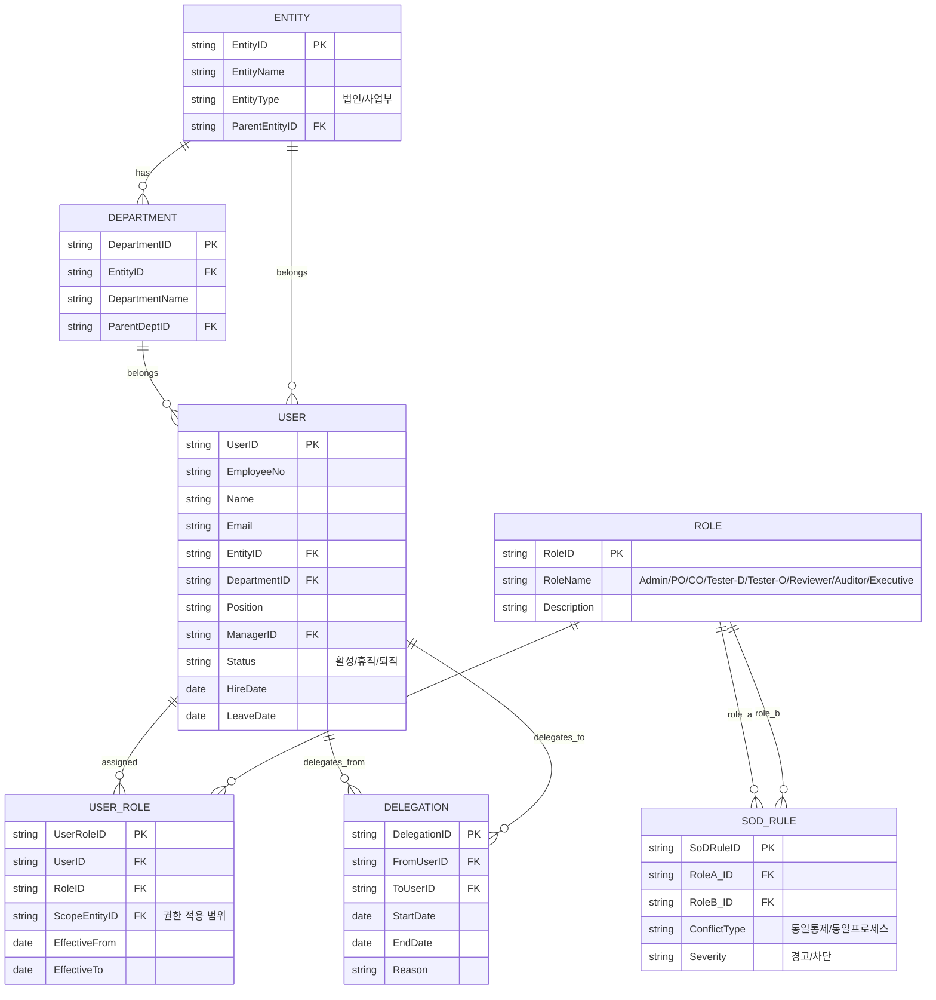
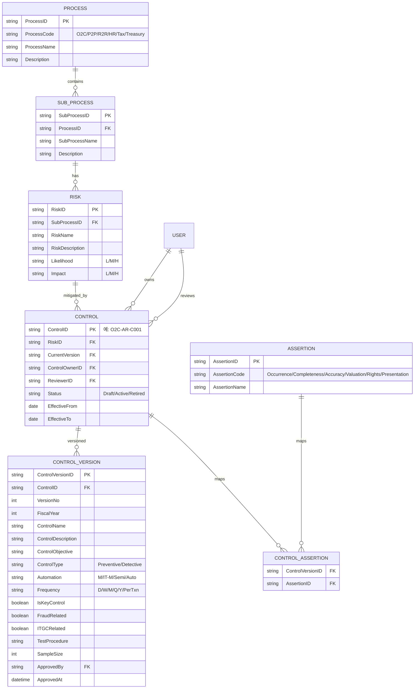
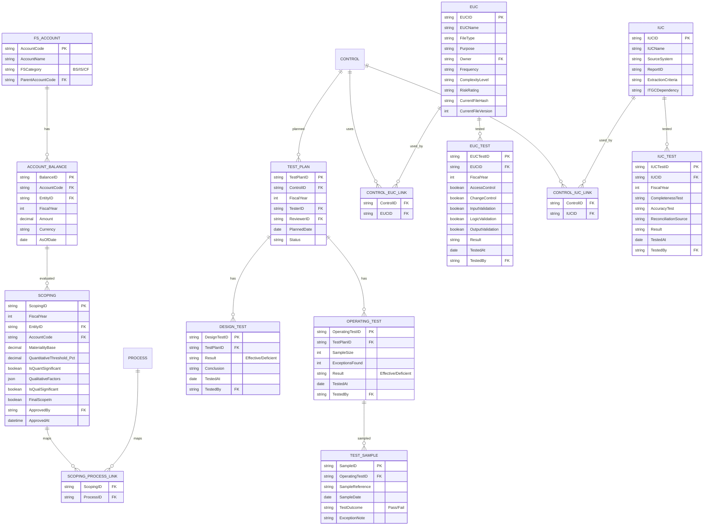
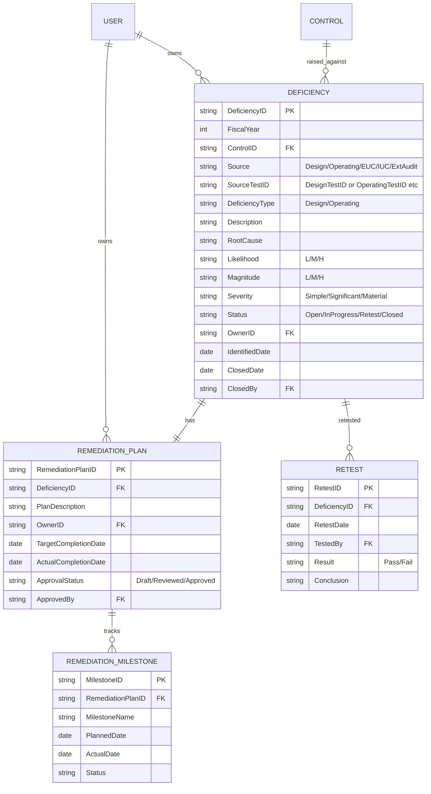

# ClaudeICFR.md — 내부회계관리제도(ICFR) 시스템 개발 기록

> **이 문서의 역할**
> 이 파일은 ICFR 시스템 개발의 **단일 진실 공급원(Single Source of Truth)** 입니다.
> - Claude(AI 보조)는 새 세션마다 **이 파일을 먼저 읽고**, 기존 코드는 필요할 때만 Git에서 직접 확인합니다.
> - 새로 합류하는 개발자도 이 문서만 끝까지 읽으면 프로젝트의 현재 상태와 다음 할 일을 이해할 수 있어야 합니다.
> - **모든 의사결정·범위 변경·완료 항목은 이 문서에 즉시 반영**합니다. 코드만 바뀌고 문서가 안 바뀌면 안 됩니다.

---

## 0. 문서 사용 규칙 (READ FIRST)

### 0.1 Claude 세션 시작 시 작업 절차
1. 이 파일 전체를 읽는다.
2. `섹션 12. 진행 상태 보드`에서 현재 어디까지 왔는지 확인한다.
3. `섹션 13. 다음 작업(Next Up)`을 확인하고 사용자에게 진행 의사를 묻는다.
4. 필요한 경우에만 Git에서 해당 파일을 직접 fetch하여 확인한다. **전체 코드 베이스를 무작정 읽지 않는다.**
5. 작업 완료 후 반드시 `섹션 12`, `섹션 13`, `섹션 14. 변경 로그`를 업데이트한다.

### 0.2 토큰 절약 원칙
- 이미 합의된 사항은 이 문서에서 짧게 참조만 한다 (재설명 금지).
- 코드 전체를 다시 붙여넣지 않는다. 파일 경로·함수 시그니처·핵심 변경점만 기록한다.
- 큰 결정(아키텍처, 데이터 모델 변경)은 `섹션 10. 의사결정 기록(ADR)`에 1건당 10줄 이내로 요약한다.

### 0.3 새 개발자 온보딩 체크리스트
- [ ] 섹션 1~3 (개요/아키텍처/기술스택)을 읽는다 → 30분
- [ ] 섹션 4 (모듈 명세) 정독 → 60분
- [ ] 섹션 5 (데이터 모델) 정독 → 30분
- [ ] 섹션 7 (Git/브랜치 전략) 읽고 로컬 환경 셋업 → 30분
- [ ] 섹션 12~14에서 현재 진행 상황과 다음 작업 확인 → 15분

---

## 1. 프로젝트 개요

### 1.1 목적
한국 외감법 및 K-IFRS 환경의 내부회계관리제도(ICFR) 운영 전 과정을 디지털화하여, 사무국·통제 수행자·내부감사·외부감사인이 한 시스템에서 협업하도록 한다.

### 1.2 범위 (9개 핵심 모듈)
1. 일정관리 (Schedule Management)
2. RCM 관리 (Risk Control Matrix)
3. Scoping
4. EUC (End User Computing)
5. IUC (Information Used in Control)
6. 개선계획 관리 (Remediation)
7. 증빙 관리 (Evidence)
8. 담당자 지정 및 관리 (User & Role)
9. 메일발송 (Notification)

### 1.3 대상 사용자
- ICFR 사무국 (Administrator)
- 프로세스 책임자 (Process Owner)
- 통제 수행자 (Control Owner)
- 설계/운영평가자 (Tester)
- 검토자 (Reviewer)
- 외부감사인 (External Auditor, 읽기 전용)
- 경영진 (Executive, 대시보드)

---

## 2. 아키텍처 개요 (TBD — 3단계에서 확정)

```
[작성 예정 - 3단계 산출물: 전체 모듈 관계도]
```

핵심 원칙:
- **RCM이 전역 키(ControlID)** 로 평가·미비점·IUC·증빙을 묶는다.
- **모든 데이터는 불변 감사로그(audit trail)** 를 남긴다.
- **이벤트 기반 알림** — 도메인 이벤트가 발생하면 Notification 모듈이 구독한다.

---

## 3. 기술 스택 (TBD)

| 영역 | 후보 | 결정 |
|---|---|---|
| Frontend | React + TypeScript / Vue3 | 미정 |
| Backend | Spring Boot(Java) / FastAPI(Python) / NestJS(Node) | 미정 |
| DB | PostgreSQL / MySQL / Oracle | 미정 |
| 파일저장 | S3 호환(MinIO 등) / 사내 NAS | 미정 |
| 인증 | SSO(SAML/OIDC) + LDAP 연동 | 미정 |
| 알림 | SMTP + Teams/Slack Webhook | 미정 |
| 배포 | Docker + K8s / 온프레미스 VM | 미정 |

> 결정은 `섹션 10 ADR`에 기록하며, 결정 시점에 위 표를 업데이트한다.

---

## 4. 모듈별 상세 기능명세

### 4.1 일정관리 (Schedule Management)
**목적**: 연간 ICFR 운영 사이클의 모든 활동을 계획·추적하고 지연을 사전에 인지.

**주요 화면**: 연간 마스터 일정(간트), 활동 상세, My Task, 지연/임박 알림

**핵심 엔티티 필드**
- ScheduleID, FiscalYear, ActivityType(설계/운영/EUC/IUC/보고/감사), ActivityName, ParentScheduleID
- PlannedStart/End, ActualStart/End, Progress, Status(미착수/진행중/지연/완료)
- OwnerUserID, RelatedRCMIDs[]

**주요 기능**
- 템플릿 기반 연간 일정 자동 생성(전년도 복제)
- WBS 계층(분기→월→활동)
- D-7/D-3/D-Day 알림
- 지연 자동 판정
- Excel/PDF 내보내기

**연계**: RCM, 담당자관리, 메일발송

---

### 4.2 RCM 관리 (Risk Control Matrix)
**목적**: 모든 ICFR 활동의 기준이 되는 통제 마스터를 버전 관리.

**주요 화면**: 인벤토리(트리+그리드), 통제 상세(탭), 버전 비교, 변경 승인 워크플로

**핵심 엔티티 필드** (Control)
- ControlID(PK, 예: O2C-AR-C001), RCMVersion, ProcessID, SubProcessID, RiskID
- ControlName, ControlDescription, ControlObjective
- ControlType(예방/적발), Automation(수동/IT의존수동/반자동/자동)
- Frequency(일/주/월/분기/연/거래시), IsKeyControl, Assertions[](발생/완전성/정확성/평가/권리의무/표시공시)
- FraudRelated, ITGCRelated
- ControlOwnerID, ReviewerID, TestProcedure, SampleSize
- EffectiveFrom/To, Status(Draft/Active/Retired)

**주요 기능**
- 버전 관리(스냅샷, Diff)
- 변경 워크플로(작성→검토→승인→적용)
- 일괄 등록(Excel 업로드)
- 다축 검색/필터
- 통제별 영향도 조회(연결 평가/미비점/IUC를 한 화면에)
- 변경 이력

**연계**: Scoping, 일정, IUC, 미비점, 증빙

---

### 4.3 Scoping
**목적**: 정량·정성 기준으로 유의계정 및 평가 대상 프로세스/통제 결정.

**주요 화면**: 재무제표 입력, 정량 결과, 정성 평가, 최종 Scope 승인

**핵심 엔티티 필드**
- ScopingID, FiscalYear, EntityID, AccountCode, AccountBalance
- TotalAssetsOrRevenue, MaterialityBase(PM), QuantitativeThreshold(%)
- IsQuantitativelySignificant, QualitativeFactors(JSON), IsQualitativelySignificant
- FinalScopeIn, LinkedProcessIDs[], ApprovedBy/At

**주요 기능**
- 재무제표 데이터 업로드(Excel/ERP)
- 정량 임계치 자동 적용
- 정성 체크리스트
- Account-Process 매핑
- Scope 결과 → RCM 평가 대상 자동 생성
- 변경 이력·사유, 승인 워크플로

**연계**: RCM, 일정관리

---

### 4.4 EUC (End User Computing)
**목적**: 통제에 활용되는 사용자 계산자료(주로 Excel)의 적정성 관리.

**주요 화면**: EUC 인벤토리, 상세, 파일 업로드/버전, 점검 결과

**핵심 엔티티 필드**
- EUCID, EUCName, FileType, Purpose, LinkedControlIDs[]
- Owner, Frequency, ComplexityLevel, RiskRating(영향도×복잡도)
- AccessControl, ChangeControl, InputValidation, LogicValidation, OutputValidation
- FileHash(SHA-256), FileVersion, LastTestedDate, TestResult(적정/미비/개선중)

**주요 기능**
- EUC 식별 체크리스트
- 파일 업로드 + 해시 자동 → 무단 변경 감지
- 버전 비교
- 위험도 자동 산정
- 정기 점검 일정 자동 생성
- 미비 시 미비점 자동 등록

**연계**: RCM, 미비점, 증빙, 일정

---

### 4.5 IUC (Information Used in Control)
**목적**: 통제 수행에 사용된 시스템 산출 정보의 완전성·정확성 검증.

**주요 화면**: IUC 인벤토리, 상세, 통제별 IUC 매핑

**핵심 엔티티 필드**
- IUCID, IUCName, SourceSystem(SAP/Oracle/자체개발 등), ReportID
- ExtractionCriteria, ExtractedBy/At, LinkedControlIDs[]
- CompletenessTest, AccuracyTest, ReconciliationSource
- TestResult(적정/미비), ITGCDependency

**주요 기능**
- 인벤토리 관리
- 통제-IUC 1:N 매핑
- 완전성·정확성 결과 기록
- ITGC와 연결(ITGC 미비 시 IUC 영향 자동 표시)
- 증빙 첨부

**연계**: RCM, ITGC(향후), 증빙, 미비점

---

### 4.6 개선계획 관리 (Remediation)
**목적**: 미비점 식별 → 종결까지 라이프사이클 관리.

**주요 화면**: 미비점 인벤토리, 상세, 진행 대시보드, 심각도 워크시트

**핵심 엔티티 필드**
- DeficiencyID, FiscalYear, LinkedControlID
- Source(설계/운영/EUC/IUC/외부감사), DeficiencyType(설계/운영)
- Description, RootCause
- Likelihood, Magnitude, Severity(단순/유의/중요한취약점)
- RemediationPlan, RemediationOwner, TargetCompletionDate, ActualCompletionDate
- ProgressStatus(계획수립/진행중/재테스트/종결), RetestResult, RetestEvidenceIDs[]
- ApprovedBy

**주요 기능**
- 평가/EUC/IUC 모듈에서 자동 등록
- 심각도 워크시트(Likelihood × Magnitude)
- 계획 수립→검토→승인 워크플로
- 마일스톤 추적
- 마감 임박/지연 알림
- 재테스트 등록 및 종결 승인
- 연도 간 이월 트래킹

**연계**: RCM, EUC, IUC, 증빙, 메일, 일정

---

### 4.7 증빙 관리 (Evidence)
**목적**: 모든 활동의 증빙 통합 저장 및 추적.

**주요 화면**: 증빙 라이브러리, 상세, PBC 패키지 빌더, 접근 로그

**핵심 엔티티 필드**
- EvidenceID, FileName, FileType, FileSize, FileHash, StoragePath
- Source, LinkedEntityType, LinkedEntityID, LinkedControlID, FiscalYear
- Tags[], UploadedBy/At, RetentionUntil, ConfidentialityLevel(일반/대외비/기밀)

**주요 기능**
- 드래그앤드롭, 폴더 일괄 업로드
- 출처 기반 자동 분류
- 태그·메타데이터 검색
- 미리보기(PDF/이미지/Excel)
- PBC 패키지(zip+인덱스) 생성
- 접근 로그
- 보존기간 만료 알림
- 외부감사인 읽기 전용

**연계**: 거의 모든 모듈

---

### 4.8 담당자 지정 및 관리 (User & Role)
**목적**: 조직 마스터 + 역할 기반 권한 + SoD.

**주요 화면**: 조직도, 사용자 관리, 권한 매트릭스, SoD 위반 모니터링

**핵심 엔티티 필드** (User)
- UserID, EmployeeNo, Name, Email
- EntityID, DepartmentID, Position
- Roles[], Status(활성/휴직/퇴직), ManagerID

**역할**: Administrator / Process Owner / Control Owner / Tester(Design) / Tester(Operating) / Reviewer / External Auditor / Executive

**주요 기능**
- HR 연동(입·퇴사 반영)
- 권한 매트릭스
- 통제별 담당자 일괄 지정
- SoD 룰(Control Owner = Tester 금지 등)
- 위임(Delegation)
- 권한 이력

**연계**: 전 모듈

---

### 4.9 메일발송 (Notification)
**목적**: 이벤트 기반 자동 알림 및 발송 이력.

**주요 화면**: 템플릿 관리, 트리거 룰, 발송 이력, 사용자별 채널 선호

**핵심 엔티티** (NotificationRule)
- RuleID, EventType, TriggerCondition(JSON), TemplateID, Recipients, Channels[], IsActive

**핵심 엔티티** (NotificationLog)
- LogID, RuleID, RecipientID, Channel, SentAt
- DeliveryStatus(성공/실패/대기), OpenedAt
- RelatedEntityType, RelatedEntityID

**주요 기능**
- 변수 치환 템플릿({{UserName}}, {{ControlID}}, {{DueDate}})
- 룰 기반 자동 발송
- 즉시/예약 발송
- 발송 결과 추적
- 다채널(Email + Teams/Slack)
- 사용자별 채널·시간대 설정
- 자동 재시도

**연계**: 전 모듈(이벤트 소스)

---

## 5. 데이터 모델 / ERD

### 5.1 설계 원칙
1. **RCM(Control)이 허브** — 모든 평가·미비점·IUC·EUC·증빙은 `ControlID`로 연결된다.
2. **버전·이력 분리** — 마스터 테이블(Active)과 이력 테이블(History)을 나누어 RCM/Scoping의 연도 간 변경을 추적한다.
3. **다형성 연결(Polymorphic Link)** — 증빙/알림은 `LinkedEntityType + LinkedEntityID`로 어떤 도메인 객체에도 붙는다.
4. **불변 감사로그** — 모든 주요 테이블은 `CreatedAt/By`, `UpdatedAt/By`를 가지며, 별도 `AuditLog` 테이블에 변경 전·후 JSON 스냅샷을 적재한다.
5. **소프트 삭제** — `IsDeleted`, `DeletedAt/By` 로 처리. 물리 삭제 금지(외부감사 대응).
6. **연도 분리(FiscalYear)** — 평가 결과·미비점·Scoping은 연도 키를 가진다. 마스터(RCM, User)는 EffectiveFrom/To로 시간 경계.

### 5.2 엔티티 그룹

| 그룹 | 엔티티 |
|---|---|
| **A. 조직·사용자** | Entity, Department, User, Role, UserRole, Delegation, SoD_Rule |
| **B. RCM 마스터** | Process, SubProcess, Risk, Control, ControlVersion, Assertion, ControlAssertion |
| **C. Scoping** | FSAccount, AccountBalance, Scoping, ScopingProcessLink |
| **D. 평가(공통)** | TestPlan, DesignTest, OperatingTest, TestSample |
| **E. EUC / IUC** | EUC, EUCTest, IUC, IUCTest, ControlIUCLink, ControlEUCLink |
| **F. 미비점/개선** | Deficiency, RemediationPlan, RemediationMilestone, Retest |
| **G. 증빙** | Evidence, EvidenceLink |
| **H. 일정** | Schedule, ScheduleControlLink |
| **I. 알림** | NotificationTemplate, NotificationRule, NotificationLog |
| **J. 시스템** | AuditLog, FileStore, Codebook |

### 5.3 ERD (Mermaid)

> 가독성을 위해 5개 다이어그램으로 분할.

#### 5.3.1 조직·사용자·권한 (그룹 A)



#### 5.3.2 RCM 마스터 (그룹 B)



#### 5.3.3 Scoping · 평가 · EUC · IUC (그룹 C, D, E)



#### 5.3.4 미비점 · 개선 · 재테스트 (그룹 F)



#### 5.3.5 증빙 · 일정 · 알림 · 시스템 (그룹 G, H, I, J)


### 5.4 핵심 관계 요약

| 관계 | Cardinality | 설명 |
|---|---|---|
| Control → ControlVersion | 1:N | 통제는 연도/개정마다 버전을 가짐 |
| Control → TestPlan | 1:N | 평가연도별 테스트 계획 |
| TestPlan → Design/OperatingTest | 1:N | 한 계획에 설계·운영 테스트 결과 |
| Control → Deficiency | 1:N | 통제별 미비점 누적 |
| Deficiency → RemediationPlan | 1:1 | 미비점당 하나의 개선계획 |
| Deficiency → Retest | 1:N | 재테스트는 여러 번 가능 |
| Control ↔ EUC | N:M | CONTROL_EUC_LINK |
| Control ↔ IUC | N:M | CONTROL_IUC_LINK |
| Evidence → 어떤 도메인이든 | N:M | EVIDENCE_LINK 다형성 |
| User → Role | N:M | USER_ROLE, ScopeEntity로 범위 제한 |

### 5.5 공통 컬럼 (모든 비즈니스 테이블)

| 컬럼 | 타입 | 비고 |
|---|---|---|
| CreatedAt | datetime | 자동 |
| CreatedBy | string FK→User | 자동 |
| UpdatedAt | datetime | 자동 |
| UpdatedBy | string FK→User | 자동 |
| IsDeleted | boolean | 기본 false |
| DeletedAt | datetime | 소프트 삭제 |
| DeletedBy | string FK→User | 소프트 삭제 |
| RowVersion | int / timestamp | 낙관적 락 |

### 5.6 인덱스 / 제약 가이드

- **FiscalYear + ControlID** — 평가 결과·미비점 조회의 최빈 패턴. 복합 인덱스 필수.
- **Control.ControlID** — 자연키(예: `O2C-AR-C001`)로 가독성 우선. 내부 PK는 별도 surrogate(uuid) 권장 — 추후 결정.
- **Evidence.FileHash** — 중복 업로드 검출용 인덱스.
- **EUC.CurrentFileHash** — 무단 변경 탐지 쿼리용.
- **NotificationLog.SentAt** — 파티셔닝 후보(월 단위).
- **AuditLog.EntityType + EntityID + ActedAt** — 변경 이력 조회용.

### 5.7 데이터 모델 관련 미결 사항 (Open Questions)

1. PK를 자연키(`O2C-AR-C001`)로 둘지, surrogate uuid + 자연키를 별도 컬럼으로 둘지 — **권장: surrogate + 자연키 unique**.
2. 다국어(영문 통제명) 지원 여부 — 외부감사인 영문 보고 필요 시 i18n 테이블 추가.
3. 첨부 파일 저장소 — S3 호환(MinIO) vs 사내 NAS. 보안 정책 확인 필요.
4. 회계기간 변경(예: 분기 평가 추가) 시 FiscalYear → FiscalPeriod 확장 필요 여부.

> 위 항목은 3~4단계에서 결정하고 ADR에 기록.

---

## 6. API 설계
> **상태**: TBD — 모듈별 구현 단계에서 OpenAPI 스펙으로 작성.
> 작성 위치: 코드 저장소 `/docs/api/openapi.yaml` (Git). 이 문서에는 모듈별 엔드포인트 요약만 둔다.

---

## 7. Git 저장소 / 브랜치 전략

### 7.1 저장소
- **호스팅**: GitHub (사용자 업무용 계정)
- **Remote URL**: TBD — 레포 생성 후 기입
- **레포명(제안)**: `claude-icfr` 또는 `icfr-system`
- **가시성**: Private
- **운영 방식**: Claude가 파일을 생성/수정하면 사용자가 직접 로컬에 받아 GitHub에 push. Claude는 GitHub에 직접 접근하지 않음.

### 7.2 디렉토리 구조 (제안)
```
claude-icfr/
├─ ClaudeICFR.md              ← 이 문서 (루트 상시 갱신)
├─ README.md                  ← 짧은 소개 + ClaudeICFR.md로 안내
├─ docs/
│   ├─ adr/                   ← 의사결정 기록(ADR) 마크다운
│   ├─ api/openapi.yaml       ← API 스펙
│   └─ erd/                   ← ERD 다이어그램 소스
├─ backend/
│   ├─ src/...
│   └─ tests/...
├─ frontend/
│   ├─ src/...
│   └─ tests/...
├─ infra/                     ← Docker, K8s, IaC
└─ scripts/                   ← 개발 보조 스크립트
```

### 7.3 브랜치 전략
- `main` — 배포 가능 상태만. 직접 push 금지.
- `develop` — 통합 브랜치.
- `feature/<module>-<short>` — 기능 단위 (예: `feature/rcm-version-diff`).
- `fix/<short>` — 버그 수정.
- `docs/<short>` — 문서 전용 변경.

### 7.4 커밋 컨벤션 (Conventional Commits)
```
feat(rcm): 통제 버전 Diff 화면 추가
fix(eviden): 업로드 시 한글 파일명 깨짐 수정
docs(claudeicfr): 진행 상태 보드 업데이트
refactor(notif): 발송 큐 추출
```

### 7.5 PR 규칙
- 모든 PR은 **ClaudeICFR.md의 어느 항목과 연관되는지** 본문에 명시.
- 리뷰어 1명 이상 승인 후 머지.
- 머지 후 `섹션 12~14`를 같은 PR(또는 후속 docs PR)에서 갱신.

---

## 8. 환경 / 셋업
> **상태**: TBD — 기술 스택 확정 후 작성.

작성 시 포함할 것:
- 필수 설치(언어 런타임, DB, Docker)
- `.env` 항목 목록
- 로컬 실행 명령
- 시드 데이터 적재 방법

---

## 9. 테스트 전략
> **상태**: TBD

원칙(잠정):
- 단위 테스트 — 도메인 로직 80% 이상
- 통합 테스트 — 모듈 간 연계(특히 RCM ↔ 평가 ↔ 미비점)
- E2E — 핵심 시나리오(연간 평가 사이클) 자동화

---

## 10. 의사결정 기록 (ADR)

> 형식: 날짜 / 결정 / 배경 / 대안 / 결과. 각 1건 10줄 이내.

### ADR-0001 (2026-05-11) — 프로젝트 단일 진실 공급원으로 ClaudeICFR.md 채택
- **배경**: Claude 세션 간 컨텍스트 유실, 신규 개발자 온보딩 시간 단축 필요.
- **결정**: 모든 진행상황·결정·다음 작업을 `ClaudeICFR.md`에 누적 기록. Claude는 이 파일을 우선 읽고 필요 시에만 Git 코드를 fetch.
- **대안**: Notion/Confluence 사용 — Git과 분리되어 코드 변경과 문서 동기화가 약함.
- **결과**: 채택. 위치는 레포 루트.

### ADR-0002 (2026-05-11) — Git 호스팅 GitHub + 사용자 직접 push 채택
- **배경**: Claude는 외부 Git 호스팅에 직접 인증·push할 수 없음(보안). 사용자는 GitHub 업무 계정 보유.
- **결정**: GitHub Private 레포 사용. Claude는 파일을 생성/수정만 하고, 사용자가 로컬에 받아 commit·push.
- **대안**: (1) Claude에 토큰 제공 — 자격증명 노출 위험. (2) Claude가 매번 사용자에게 코드 업로드 요청 — 비효율.
- **결과**: 채택. 다음 세션 시작 시 사용자는 최신 `ClaudeICFR.md`만 업로드하면 됨(코드는 필요할 때 발췌하여 업로드).

### (다음 ADR은 여기에 추가)

---

## 11. 용어집 (Glossary)

| 용어 | 설명 |
|---|---|
| ICFR | Internal Control over Financial Reporting (내부회계관리제도) |
| RCM | Risk Control Matrix (리스크-통제 매트릭스) |
| Scoping | 평가 대상 범위 결정 |
| EUC | End User Computing (사용자 계산자료, 주로 Excel) |
| IUC / IPE | Information Used in Control / Information Provided by Entity |
| ITGC | IT General Controls |
| PBC | Provided by Client (외부감사인 자료 요청 목록) |
| SoD | Segregation of Duties (직무분리) |
| PM | Performance Materiality (수행 중요성) |
| Assertion | 경영자 주장 (발생, 완전성, 정확성, 평가, 권리와 의무, 표시와 공시) |

---

## 12. 진행 상태 보드 (Status Board)

> **이 보드는 매 작업 종료 시 갱신한다.**

### 12.1 단계별 진행률

| 단계 | 산출물 | 상태 | 완료일 |
|---|---|---|---|
| 1 | 모듈별 상세 기능명세 | ✅ 완료 | 2026-05-11 |
| 2 | 데이터 모델 / ERD | ✅ 완료 | 2026-05-11 |
| 3 | 전체 모듈 관계도(아키텍처) | 🔄 진행 예정 | — |
| 4 | 개발 우선순위 및 로드맵 | ⏳ 대기 | — |
| 5 | 기술 스택 확정 (ADR) | ⏳ 대기 | — |
| 6 | Git 레포 생성 및 초기 커밋 | ⏳ 대기 | — |
| 7 | 백엔드 스켈레톤 | ⏳ 대기 | — |
| 8 | 프론트엔드 스켈레톤 | ⏳ 대기 | — |
| 9 | 모듈별 구현 (반복) | ⏳ 대기 | — |

### 12.2 모듈별 구현 상태

| 모듈 | 명세 | ERD | API | BE | FE | 테스트 | 비고 |
|---|---|---|---|---|---|---|---|
| 일정관리 | ✅ | ✅ | — | — | — | — | |
| RCM 관리 | ✅ | ✅ | — | — | — | — | 전역 키 역할 |
| Scoping | ✅ | ✅ | — | — | — | — | |
| EUC | ✅ | ✅ | — | — | — | — | |
| IUC | ✅ | ✅ | — | — | — | — | |
| 개선계획 | ✅ | ✅ | — | — | — | — | |
| 증빙 관리 | ✅ | ✅ | — | — | — | — | |
| 담당자/권한 | ✅ | ✅ | — | — | — | — | |
| 메일발송 | ✅ | ✅ | — | — | — | — | |

범례: ✅완료 / 🔄진행중 / ⏳대기 / — 시작 전

---

## 13. 다음 작업 (Next Up)

1. **3단계: 전체 모듈 관계도(아키텍처)** — 섹션 2 채우기. 시스템 컨텍스트 / 컴포넌트 / 도메인 이벤트 흐름.
2. **4단계: 개발 우선순위 및 로드맵** — 새 섹션(15) 신설. 모듈 의존성 기반 빌드 순서.
3. 위 1~2 완료 후 → 기술 스택 결정(ADR) → Git 레포 생성(사용자) → 백엔드 스켈레톤.

### 데이터 모델 미결 사항 (섹션 5.7 참조)
- PK 전략(자연키 vs surrogate)
- 다국어 지원 여부
- 파일 저장소 선택
- 회계기간 단위 확장 가능성

### Claude에게 주는 다음 세션 지시
> "ClaudeICFR.md를 읽고, 섹션 12에서 다음 작업을 확인한 뒤 진행. 작업 종료 시 섹션 12·13·14 업데이트 필수."

---

## 14. 변경 로그 (Changelog)

> 날짜 / 변경자 / 요약. 최신이 위로.

- **2026-05-11 / Claude** — 2단계 완료: 섹션 5 데이터 모델/ERD 작성(5개 Mermaid 다이어그램 + 22개 엔티티 + 공통컬럼·인덱스 가이드·미결사항). ADR-0002 추가(GitHub + 사용자 직접 push). 섹션 7.1 갱신.
- **2026-05-11 / Claude** — 초기 문서 생성. 섹션 0~14 골격 작성. 1단계(모듈별 기능명세) 반영. ADR-0001 등록.

---

*문서 끝. 갱신 시 마지막 줄 위에 새 변경 로그를 추가하세요.*
