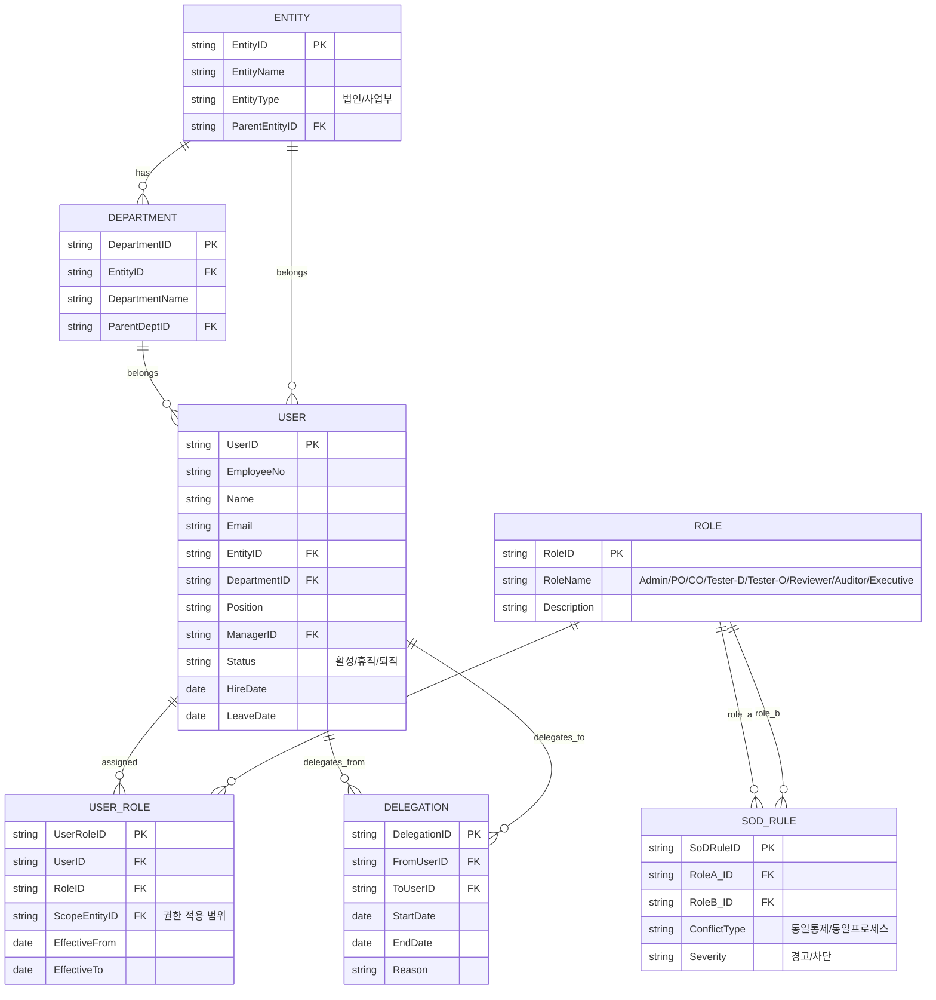
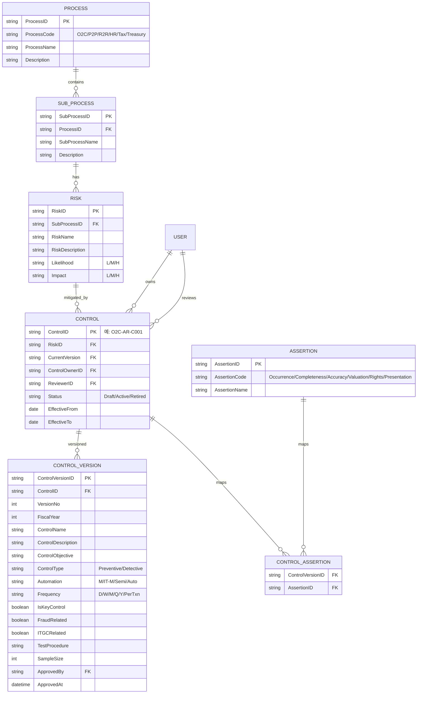
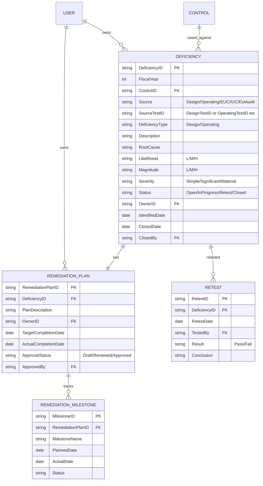
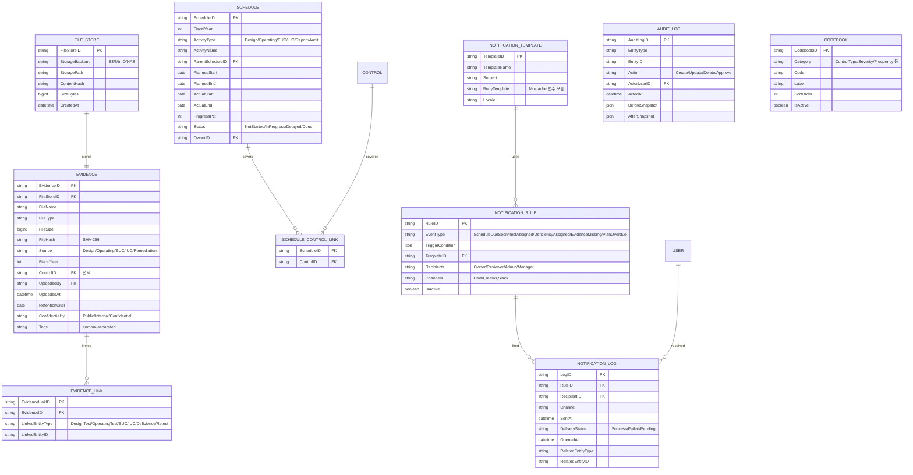

# ClaudeICFR.md — 내부회계관리제도(ICFR) 시스템 개발 기록

> **이 문서의 역할**
> 이 파일은 ICFR 시스템 개발의 **단일 진실 공급원(Single Source of Truth)** 입니다.
> - Claude(AI 보조)는 새 세션마다 **이 파일을 먼저 읽고**, 기존 코드는 필요할 때만 Git에서 직접 확인합니다.
> - 새로 합류하는 개발자도 이 문서만 끝까지 읽으면 프로젝트의 현재 상태와 다음 할 일을 이해할 수 있어야 합니다.
> - **모든 의사결정·범위 변경·완료 항목은 이 문서에 즉시 반영**합니다. 코드만 바뀌고 문서가 안 바뀌면 안 됩니다.

---

## 0. 문서 사용 규칙 (READ FIRST)

### 0.1 Claude 세션 시작 시 작업 절차
1. 이 파일 전체를 읽는다.
2. `섹션 12. 진행 상태 보드`에서 현재 어디까지 왔는지 확인한다.
3. `섹션 13. 다음 작업(Next Up)`을 확인하고 사용자에게 진행 의사를 묻는다.
4. 필요한 경우에만 Git에서 해당 파일을 직접 fetch하여 확인한다. **전체 코드 베이스를 무작정 읽지 않는다.**
5. 작업 완료 후 반드시 `섹션 12`, `섹션 13`, `섹션 14. 변경 로그`를 업데이트한다.

### 0.2 토큰 절약 원칙
- 이미 합의된 사항은 이 문서에서 짧게 참조만 한다 (재설명 금지).
- 코드 전체를 다시 붙여넣지 않는다. 파일 경로·함수 시그니처·핵심 변경점만 기록한다.
- 큰 결정(아키텍처, 데이터 모델 변경)은 `섹션 10. 의사결정 기록(ADR)`에 1건당 10줄 이내로 요약한다.

### 0.3 새 개발자 온보딩 체크리스트
- [ ] 섹션 1~3 (개요/아키텍처/기술스택)을 읽는다 → 30분
- [ ] 섹션 4 (모듈 명세) 정독 → 60분
- [ ] 섹션 5 (데이터 모델) 정독 → 30분
- [ ] 섹션 7 (Git/브랜치 전략) 읽고 로컬 환경 셋업 → 30분
- [ ] 섹션 12~14에서 현재 진행 상황과 다음 작업 확인 → 15분

---

## 1. 프로젝트 개요

### 1.1 목적
한국 외감법 및 K-IFRS 환경의 내부회계관리제도(ICFR) 운영 전 과정을 디지털화하여, 사무국·통제 수행자·내부감사·외부감사인이 한 시스템에서 협업하도록 한다.

### 1.2 범위 (11개 핵심 모듈)
1. 일정관리 (Schedule Management)
2. RCM 관리 (Risk Control Matrix)
3. Scoping
4. EUC (End User Computing)
5. IUC (Information Used in Control)
6. 개선계획 관리 (Remediation)
7. 증빙 관리 (Evidence)
8. 담당자 지정 및 관리 (User & Role)
9. 메일발송 (Notification)
10. Report (이사회 보고서 / PBC 패키지)
11. Test (설계·운영평가 실행)

### 1.3 대상 사용자
- ICFR 사무국 (Administrator)
- 프로세스 책임자 (Process Owner)
- 통제 수행자 (Control Owner)
- 설계/운영평가자 (Tester)
- 검토자 (Reviewer)
- 외부감사인 (External Auditor, 읽기 전용)
- 경영진 (Executive, 대시보드)

---

## 2. 아키텍처 개요

### 2.0 핵심 원칙
- **RCM이 전역 키(ControlID)** 로 평가·미비점·IUC·EUC·증빙을 묶는다.
- **모든 데이터는 불변 감사로그(audit trail)** 를 남긴다.
- **이벤트 기반 알림** — 도메인 이벤트가 발생하면 Notification 모듈이 구독한다.
- **역할 기반 접근제어(RBAC)** — API 게이트웨이에서 일괄 검증, SoD 룰 실시간 체크.

---

### 2.1 시스템 컨텍스트 다이어그램

```
                        ┌──────────────────────────────────────────────┐
                        │              ICFR 시스템                      │
  ┌──────────────┐      │  ┌─────────┐  ┌────────┐  ┌──────────────┐  │
  │ ICFR 사무국  │◄────►│  │일정관리  │  │ RCM   │  │ Scoping      │  │
  │ (Admin)      │      │  └─────────┘  └────────┘  └──────────────┘  │
  └──────────────┘      │  ┌─────────┐  ┌────────┐  ┌──────────────┐  │
  ┌──────────────┐      │  │  EUC    │  │  IUC   │  │ 개선계획     │  │
  │ Process Owner│◄────►│  └─────────┘  └────────┘  └──────────────┘  │
  └──────────────┘      │  ┌─────────┐  ┌────────┐  ┌──────────────┐  │
  ┌──────────────┐      │  │ 증빙관리 │  │User&Role│ │ Notification │  │
  │ Control Owner│◄────►│  └─────────┘  └────────┘  └──────────────┘  │
  └──────────────┘      │  ┌─────────┐  ┌────────┐                    │
  ┌──────────────┐      │  │ Report  │  │  Test  │                    │
  │   Tester     │◄────►│  └─────────┘  └────────┘                    │
  └──────────────┘      └──────────┬───────────────────────────────────┘
  ┌──────────────┐                 │
  │   Reviewer   │◄────────────────┤  외부 시스템 연동
  └──────────────┘                 │
  ┌──────────────┐          ┌──────┴───────────────────────────────────┐
  │External Audit│◄────────►│ SSO/IdP │ ERP/회계 │ SMTP │ 잔디Webhook │
  │ (읽기전용)   │          │         │ 시스템   │      │ 파일저장소  │
  └──────────────┘          └──────────────────────────────────────────┘
  ┌──────────────┐
  │   경영진     │◄── 대시보드                산출물
  └──────────────┘         ┌──────────────────────────┐
  ┌──────────────┐         │ PBC 패키지 (zip+인덱스)  │
  │이사회/감사위 │◄── PDF  │ 이사회 보고서 PDF        │
  └──────────────┘         └──────────────────────────┘
```

**행위자 (8명)**

| 역할 | 주요 접점 모듈 |
|---|---|
| ICFR 사무국 (Administrator) | 전 모듈 관리 |
| 프로세스 책임자 (Process Owner) | Scoping, RCM, 일정, Report |
| 통제 수행자 (Control Owner) | Test, EUC, IUC, 증빙, 개선계획 |
| 평가자 (Tester — 설계/운영) | Test, 증빙 |
| 검토자 (Reviewer) | Test, 개선계획, Report |
| 외부감사인 (External Auditor) | 증빙(읽기), PBC 패키지 |
| 경영진 (Executive) | 대시보드, Report |
| 이사회 / 감사위원회 | Report (PDF 수령) |

**외부 시스템 (5개)**

| 시스템 | 연동 방식 | 주요 용도 |
|---|---|---|
| SSO / IdP (SAML·OIDC) | OAuth2/OIDC | 사용자 인증·세션 |
| ERP / 회계시스템 | API / Excel | Scoping 재무데이터 취득 |
| 메일 SMTP | SMTP | Notification 발송 |
| 잔디 Webhook | HTTPS POST | 팀 채널 알림 |
| 파일저장소 (S3/MinIO/NAS) | S3 API / 마운트 | 증빙·EUC·보고서 파일 저장 |

---

### 2.2 컴포넌트 도식 (6계층)

```
┌─────────────────────────────────────────────────────────────────┐
│  Layer 1 — 프레젠테이션                                          │
│  Web UI (React/Vue + TypeScript)                                 │
│  · 11개 모듈 화면 · 대시보드 · PBC Builder · 보고서 뷰어         │
└─────────────────────────┬───────────────────────────────────────┘
                          │ HTTPS / REST·GraphQL
┌─────────────────────────▼───────────────────────────────────────┐
│  Layer 2 — API 게이트웨이                                        │
│  인증(JWT검증) / 인가(RBAC·SoD) / Rate Limit / 라우팅            │
└──┬──────────────────────┬───────────────────────────────────────┘
   │                      │
┌──▼──────────────────────▼────────────────────────────────────┐
│  Layer 3 — 응용 모듈 (비즈니스 로직)                           │
│  일정관리 · Scoping · EUC · IUC · 개선계획 · 증빙관리          │
│  Notification · Report · Test                                  │
└──┬───────────────────────────────────────────────────────────┘
   │  의존 (읽기/쓰기)
┌──▼───────────────────────────────────────────────────────────┐
│  Layer 4 — 마스터 모듈                                         │
│  RCM(ControlID 발급·버전관리) · User&Role(RBAC·SoD) · Codebook│
└──┬───────────────────────────────────────────────────────────┘
   │  공통 서비스 호출
┌──▼───────────────────────────────────────────────────────────┐
│  Layer 5 — 횡단 인프라                                         │
│  이벤트 버스(도메인 이벤트 발행/구독)                           │
│  감사로그(불변 AuditLog 적재)                                   │
│  파일저장소 어댑터(S3 API 추상화)                               │
│  작업큐(비동기: 보고서 생성·메일 발송·파일 해시 검증)            │
└──┬───────────────────────────────────────────────────────────┘
   │
┌──▼───────────────────────────────────────────────────────────┐
│  Layer 6 — 데이터                                              │
│  RDBMS (PostgreSQL / MySQL / Oracle — 섹션 3 미정)            │
│  파일 오브젝트 스토어 (S3 호환)                                 │
└──────────────────────────────────────────────────────────────┘
```

**모듈 간 주요 의존 관계**

| 소스 모듈 | → 의존 대상 | 이유 |
|---|---|---|
| Test | RCM | ControlID 기준으로 TestPlan 생성 |
| Test | 증빙 | 테스트 결과 증빙 첨부 |
| Test | 개선계획 | 미비점 자동 등록 |
| Scoping | RCM | Scope In → 평가 대상 통제 목록 |
| EUC / IUC | RCM | 통제-EUC·IUC 매핑 |
| Report | Test / 개선계획 / Scoping | 보고서 원본 데이터 수집 |
| Notification | 전 모듈 | 도메인 이벤트 구독 후 발송 |
| 모든 모듈 | User&Role | 권한 검증 |
| 모든 모듈 | 감사로그 | 변경 이력 적재 |

---

### 2.3 연간 평가 사이클


> SVG 원본: `docs/diagrams/annual_cycle.svg`

---

### 2.4 도메인 이벤트 흐름 (5개 시나리오)

#### 시나리오 1 — 운영평가 → 미비점 → 개선 → 종결


> Mermaid 원본: `docs/diagrams/scenario1_operating_test.mmd`

**이벤트 체인 요약**
1. `TestPlan 생성` → Test 모듈이 Control Owner에게 할당 알림 발송
2. `OperatingTest 완료(미비점 있음)` → Deficiency 자동 생성 + Control Owner 알림
3. `RemediationPlan 등록` → Reviewer 검토 요청 알림
4. `RemediationPlan 승인` → 마일스톤 추적 시작
5. `Retest 완료(Pass)` → Deficiency 종결 + 감사위원회 알림 (선택)

---

#### 시나리오 2 — 이사회 보고서 생성


> Mermaid 원본: `docs/diagrams/scenario2_board_report.mmd`

**이벤트 체인 요약**
1. `보고서 초안 자동 생성 트리거` → Report 모듈이 Test·개선계획·Scoping 데이터 스냅샷
2. `초안 편집 완료` → 검토자 승인 요청 알림
3. `시스템 결재 완료` → 오프라인 서명본 업로드 대기
4. `오프라인 서명본 첨부` → 보고서 최종 잠금(Locked)
5. `배포` → 이사회·감사위 수신인에게 PDF 링크 발송

---

#### 시나리오 3 — EUC 변경 감지 → 재점검


> Mermaid 원본: `docs/diagrams/scenario3_euc_change.mmd`

**이벤트 체인 요약**
1. `EUC 파일 업로드` → 파일 해시(SHA-256) 자동 계산
2. `해시 불일치 감지` → `EUCFileChanged` 이벤트 발행
3. Notification 모듈 구독 → Control Owner·EUC Owner 즉시 알림
4. `EUC 점검 요청 생성` → 점검 일정 등록(일정관리 모듈)
5. `점검 결과 미비` → Deficiency 자동 등록

---

#### 시나리오 4 — PBC 패키지 생성

**트리거**: 외부감사인 요청 또는 사무국 수동 실행

1. 사무국이 대상 FiscalYear·ControlID·기간 범위를 지정하여 PBC 생성 요청
2. 작업큐(비동기)가 해당 TestPlan·샘플·증빙·미비점 데이터를 수집
3. 파일저장소에서 증빙 파일을 zip으로 번들링 + 인덱스(Excel) 자동 생성
4. `PBCPackageReady` 이벤트 → 외부감사인에게 다운로드 링크 메일 발송
5. Evidence 모듈에 PBC 패키지 파일 등록(접근 로그 포함)

---

#### 시나리오 5 — SoD 위반 감지

**트리거**: 사용자 역할 변경 또는 통제 담당자 지정 시 실시간 체크

1. `UserRole 변경` or `Control.ControlOwnerID 변경` 이벤트 발행
2. User&Role 모듈이 SoD 룰 테이블과 대조 (Control Owner = Tester 금지 등)
3. **경고**: 관리자 알림 발송, 작업 진행은 허용하되 위반 로그 기록
4. **차단**: 지정 불가 처리, 관리자에게 승인 요청 알림
5. AuditLog에 SoD 위반 시도 스냅샷 적재

---

## 3. 기술 스택

### 3.1 결정 요약

| 영역 | 결정 | Phase 확장 |
|---|---|---|
| Backend | FastAPI (Python 3.12+) | — |
| Database | PostgreSQL 16 | — |
| Frontend | React 18 + TypeScript 5 + Vite + shadcn/ui + Tailwind CSS | — |
| 인증 | JWT (Phase 1) | Phase 2: OAuth2 → Phase 3: SSO/Keycloak |
| 파일 저장 | MinIO (S3 호환, Docker) | Phase 2+: AWS S3 가능 |
| 작업 큐 | FastAPI BackgroundTasks | Phase 1.5+: Celery + Redis |
| 배포 | Docker Compose | Phase 2+: Kubernetes (필요 시) |

### 3.2 결정 이유 (요약)

- **FastAPI**: Claude Code 호환성 최상, 개발 속도 빠름, 자동 API 문서, Pydantic 강타입
- **PostgreSQL 16**: JSONB 필드 다수 활용(QualitativeFactors, SystemSignatures 등), 무료, 무결성·이력 강력
- **React + TS + shadcn/ui**: 표·폼·워크플로 중심 업무 UI 최적, 한국 표준, AI 호환성 최상
- **JWT 단계화**: MVP는 빠른 셋업 우선, SSO는 실 서비스 진입 후
- **MinIO**: S3 호환으로 미래 마이그레이션 자유, Docker 1분 셋업
- **BackgroundTasks 단계화**: MVP 부하 가벼움, 인터페이스 추상화 후 Celery 전환 용이
- **Docker Compose**: 단일 서버 ~ 수백 명 규모에 충분, 로컬·운영 환경 일치

자세한 의사결정 배경·대안 비교는 섹션 10의 ADR-0008~0014 참조.

### 3.3 표준 라이브러리·도구

**Backend**
- ORM: SQLAlchemy 2.x
- 마이그레이션: Alembic
- 검증·문서: Pydantic v2
- 테스트: pytest
- 린터·포매터: ruff
- ASGI 서버: uvicorn
- 인증·암호: python-jose, passlib, bcrypt
- S3/MinIO 클라이언트: boto3
- 외부 API 호출: httpx (잔디 Webhook 등)

**Frontend**
- 라우팅: React Router v6
- 서버 상태: TanStack Query
- 클라이언트 상태: Zustand
- 폼·검증: React Hook Form + Zod
- 표: TanStack Table
- 차트: Recharts
- 다이어그램: Mermaid.js (.mmd 파일 그대로 활용)
- HTTP 클라이언트: axios
- 테스트: Vitest
- 코드 품질: ESLint + Prettier

**Infra**
- 컨테이너: Docker + Docker Compose
- 데이터베이스: PostgreSQL 16
- 파일 저장: MinIO
- 리버스 프록시: Nginx (Phase 2+)
- CI/CD: GitHub Actions

---

## 4. 모듈별 상세 기능명세

### 4.1 일정관리 (Schedule Management)
**목적**: 연간 ICFR 운영 사이클의 모든 활동을 계획·추적하고 지연을 사전에 인지.

**주요 화면**: 연간 마스터 일정(간트), 활동 상세, My Task, 지연/임박 알림

**핵심 엔티티 필드**
- ScheduleID, FiscalYear, ActivityType(설계/운영/EUC/IUC/보고/감사), ActivityName, ParentScheduleID
- PlannedStart/End, ActualStart/End, Progress, Status(미착수/진행중/지연/완료)
- OwnerUserID, RelatedRCMIDs[]

**주요 기능**
- 템플릿 기반 연간 일정 자동 생성(전년도 복제)
- WBS 계층(분기→월→활동)
- D-7/D-3/D-Day 알림
- 지연 자동 판정
- Excel/PDF 내보내기

**연계**: RCM, 담당자관리, 메일발송

---

### 4.2 RCM 관리 (Risk Control Matrix)
**목적**: 모든 ICFR 활동의 기준이 되는 통제 마스터를 버전 관리.

**주요 화면**: 인벤토리(트리+그리드), 통제 상세(탭), 버전 비교, 변경 승인 워크플로

**핵심 엔티티 필드** (Control)
- ControlID(PK, 예: O2C-AR-C001), RCMVersion, ProcessID, SubProcessID, RiskID
- ControlName, ControlDescription, ControlObjective
- ControlType(예방/적발), Automation(수동/IT의존수동/반자동/자동)
- Frequency(일/주/월/분기/연/거래시), IsKeyControl, Assertions[](발생/완전성/정확성/평가/권리의무/표시공시)
- FraudRelated, ITGCRelated
- ControlOwnerID, ReviewerID, TestProcedure, SampleSize
- EffectiveFrom/To, Status(Draft/Active/Retired)

**주요 기능**
- 버전 관리(스냅샷, Diff)
- 변경 워크플로(작성→검토→승인→적용)
- 일괄 등록(Excel 업로드)
- 다축 검색/필터
- 통제별 영향도 조회(연결 평가/미비점/IUC를 한 화면에)
- 변경 이력

**연계**: Scoping, 일정, IUC, 미비점, 증빙

> **책임 명확화**: 평가 실행(테스트 계획·설계·운영·샘플·결과)은 **11. Test 모듈**로 분리. RCM은 통제 정의·버전 관리·변경 워크플로·영향도 조회·전역 키(ControlID) 발급에 집중.

---

### 4.3 Scoping
**목적**: 정량·정성 기준으로 유의계정 및 평가 대상 프로세스/통제 결정.

**주요 화면**: 재무제표 입력, 정량 결과, 정성 평가, 최종 Scope 승인

**핵심 엔티티 필드**
- ScopingID, FiscalYear, EntityID, AccountCode, AccountBalance
- TotalAssetsOrRevenue, MaterialityBase(PM), QuantitativeThreshold(%)
- IsQuantitativelySignificant, QualitativeFactors(JSON), IsQualitativelySignificant
- FinalScopeIn, LinkedProcessIDs[], ApprovedBy/At

**주요 기능**
- 재무제표 데이터 업로드(Excel/ERP)
- 정량 임계치 자동 적용
- 정성 체크리스트
- Account-Process 매핑
- Scope 결과 → RCM 평가 대상 자동 생성
- 변경 이력·사유, 승인 워크플로

**연계**: RCM, 일정관리

---

### 4.4 EUC (End User Computing)
**목적**: 통제에 활용되는 사용자 계산자료(주로 Excel)의 적정성 관리.

**주요 화면**: EUC 인벤토리, 상세, 파일 업로드/버전, 점검 결과

**핵심 엔티티 필드**
- EUCID, EUCName, FileType, Purpose, LinkedControlIDs[]
- Owner, Frequency, ComplexityLevel, RiskRating(영향도×복잡도)
- AccessControl, ChangeControl, InputValidation, LogicValidation, OutputValidation
- FileHash(SHA-256), FileVersion, LastTestedDate, TestResult(적정/미비/개선중)

**주요 기능**
- EUC 식별 체크리스트
- 파일 업로드 + 해시 자동 → 무단 변경 감지
- 버전 비교
- 위험도 자동 산정
- 정기 점검 일정 자동 생성
- 미비 시 미비점 자동 등록

**연계**: RCM, 미비점, 증빙, 일정

---

### 4.5 IUC (Information Used in Control)
**목적**: 통제 수행에 사용된 시스템 산출 정보의 완전성·정확성 검증.

**주요 화면**: IUC 인벤토리, 상세, 통제별 IUC 매핑

**핵심 엔티티 필드**
- IUCID, IUCName, SourceSystem(SAP/Oracle/자체개발 등), ReportID
- ExtractionCriteria, ExtractedBy/At, LinkedControlIDs[]
- CompletenessTest, AccuracyTest, ReconciliationSource
- TestResult(적정/미비), ITGCDependency

**주요 기능**
- 인벤토리 관리
- 통제-IUC 1:N 매핑
- 완전성·정확성 결과 기록
- ITGC와 연결(ITGC 미비 시 IUC 영향 자동 표시)
- 증빙 첨부

**연계**: RCM, ITGC(향후), 증빙, 미비점

---

### 4.6 개선계획 관리 (Remediation)
**목적**: 미비점 식별 → 종결까지 라이프사이클 관리.

**주요 화면**: 미비점 인벤토리, 상세, 진행 대시보드, 심각도 워크시트

**핵심 엔티티 필드**
- DeficiencyID, FiscalYear, LinkedControlID
- Source(설계/운영/EUC/IUC/외부감사), DeficiencyType(설계/운영)
- Description, RootCause
- Likelihood, Magnitude, Severity(단순/유의/중요한취약점)
- RemediationPlan, RemediationOwner, TargetCompletionDate, ActualCompletionDate
- ProgressStatus(계획수립/진행중/재테스트/종결), RetestResult, RetestEvidenceIDs[]
- ApprovedBy

**주요 기능**
- 평가/EUC/IUC 모듈에서 자동 등록
- 심각도 워크시트(Likelihood × Magnitude)
- 계획 수립→검토→승인 워크플로
- 마일스톤 추적
- 마감 임박/지연 알림
- 재테스트 등록 및 종결 승인
- 연도 간 이월 트래킹

**연계**: RCM, EUC, IUC, 증빙, 메일, 일정

---

### 4.7 증빙 관리 (Evidence)
**목적**: 모든 활동의 증빙 통합 저장 및 추적.

**주요 화면**: 증빙 라이브러리, 상세, PBC 패키지 빌더, 접근 로그

**핵심 엔티티 필드**
- EvidenceID, FileName, FileType, FileSize, FileHash, StoragePath
- Source, LinkedEntityType, LinkedEntityID, LinkedControlID, FiscalYear
- Tags[], UploadedBy/At, RetentionUntil, ConfidentialityLevel(일반/대외비/기밀)

**주요 기능**
- 드래그앤드롭, 폴더 일괄 업로드
- 출처 기반 자동 분류
- 태그·메타데이터 검색
- 미리보기(PDF/이미지/Excel)
- PBC 패키지(zip+인덱스) 생성
- 접근 로그
- 보존기간 만료 알림
- 외부감사인 읽기 전용

**연계**: 거의 모든 모듈

---

### 4.8 담당자 지정 및 관리 (User & Role)
**목적**: 조직 마스터 + 역할 기반 권한 + SoD.

**주요 화면**: 조직도, 사용자 관리, 권한 매트릭스, SoD 위반 모니터링

**핵심 엔티티 필드** (User)
- UserID, EmployeeNo, Name, Email
- EntityID, DepartmentID, Position
- Roles[], Status(활성/휴직/퇴직), ManagerID

**역할**: Administrator / Process Owner / Control Owner / Tester(Design) / Tester(Operating) / Reviewer / External Auditor / Executive

**주요 기능**
- HR 연동(입·퇴사 반영)
- 권한 매트릭스
- 통제별 담당자 일괄 지정
- SoD 룰(Control Owner = Tester 금지 등)
- 위임(Delegation)
- 권한 이력

**연계**: 전 모듈

---

### 4.9 메일발송 (Notification)
**목적**: 이벤트 기반 자동 알림 및 발송 이력.

**주요 화면**: 템플릿 관리, 트리거 룰, 발송 이력, 사용자별 채널 선호

**핵심 엔티티** (NotificationRule)
- RuleID, EventType, TriggerCondition(JSON), TemplateID, Recipients, Channels[], IsActive

**핵심 엔티티** (NotificationLog)
- LogID, RuleID, RecipientID, Channel, SentAt
- DeliveryStatus(성공/실패/대기), OpenedAt
- RelatedEntityType, RelatedEntityID

**주요 기능**
- 변수 치환 템플릿({{UserName}}, {{ControlID}}, {{DueDate}})
- 룰 기반 자동 발송
- 즉시/예약 발송
- 발송 결과 추적
- 다채널(Email + Teams/Slack)
- 사용자별 채널·시간대 설정
- 자동 재시도

**연계**: 전 모듈(이벤트 소스)

---

### 4.10 Report (이사회 보고서 / PBC 패키지)
**목적**: 내부회계관리제도 운영 결과를 이사회·감사위원회에 보고하는 공식 문서를 생성·관리하고, 외부감사인 요청 자료(PBC 패키지)를 번들링.

**산출물**
- 이사회 보고서: 반기(H1·H2) 및 수시 — 시스템 결재 + 오프라인 서명본 첨부 후 최종 잠금
- PBC 패키지: 외부감사인 요청 자료 zip (증빙·테스트결과·미비점·인덱스Excel 포함)

**핵심 엔티티 필드** (Report)
- ReportID, ReportType(BoardReport/PBCPackage), FiscalYear
- ReportingPeriod(H1/H2/Q1~Q4/AdHoc), Status(Draft/Editing/Approved/Signed/Archived)
- TemplateID, GeneratedAt/By, EditedContent(JSON — 섹션별 편집 내용)
- SystemSignatures(JSON — 결재선·승인자·일시), OfflineSignedFileID(FK→Evidence)
- FinalLockedAt, DistributedTo(수신인 목록), SourceDataSnapshot(JSON — 생성 시점 원본 데이터)

**주요 기능**
- 자동 초안 생성 (Test·개선계획·Scoping 데이터 스냅샷 기반)
- 섹션별 편집 및 버전 비교
- 시스템 결재 워크플로 (작성→검토→승인)
- 오프라인 서명본 첨부 후 최종 잠금 (이후 편집 불가)
- 배포 이력 및 수신인별 접근 로그
- PBC 패키지 비동기 생성 (작업큐) + 다운로드 링크 발송

**연계**: Test, 개선계획, Scoping, 증빙, Notification, User&Role

---

### 4.11 Test (설계·운영평가 실행)
**목적**: 통제별 설계평가 및 운영평가를 체계적으로 계획·실행하고, 미비점 발생 시 개선계획 모듈로 자동 연결.

**두 가지 평가**
- **설계평가 (Design Test)**: 통제 설계의 적정성 평가 — 통제 목적 달성 가능 여부
- **운영평가 (Operating Test)**: 통제가 계획대로 운영되는지 샘플 기반 검증

**핵심 엔티티 필드**: 섹션 5의 `TestPlan / DesignTest / OperatingTest / TestSample` 참조.

**주요 기능**
- 평가 계획 수립 (FiscalYear·ControlID·Tester·기간 지정)
- 샘플 추출 (모집단 등록 → 무작위/속성 추출)
- 테스트 워크시트 작성 (설계: 체크리스트, 운영: 샘플별 Pass/Fail)
- 검토 워크플로 (Tester → Reviewer → 승인)
- 결과 자동 판정: 미비점 발견 시 개선계획 모듈에 Deficiency 자동 생성
- 재테스트 연결 (개선계획 종결 후 Retest 등록)
- 증빙 첨부 (Evidence 모듈 연계)

**연계**: RCM(ControlID), 증빙, 개선계획, 일정, Notification, User&Role

---

## 5. 데이터 모델 / ERD

### 5.1 설계 원칙
1. **RCM(Control)이 허브** — 모든 평가·미비점·IUC·EUC·증빙은 `ControlID`로 연결된다.
2. **버전·이력 분리** — 마스터 테이블(Active)과 이력 테이블(History)을 나누어 RCM/Scoping의 연도 간 변경을 추적한다.
3. **다형성 연결(Polymorphic Link)** — 증빙/알림은 `LinkedEntityType + LinkedEntityID`로 어떤 도메인 객체에도 붙는다.
4. **불변 감사로그** — 모든 주요 테이블은 `CreatedAt/By`, `UpdatedAt/By`를 가지며, 별도 `AuditLog` 테이블에 변경 전·후 JSON 스냅샷을 적재한다.
5. **소프트 삭제** — `IsDeleted`, `DeletedAt/By` 로 처리. 물리 삭제 금지(외부감사 대응).
6. **연도 분리(FiscalYear)** — 평가 결과·미비점·Scoping은 연도 키를 가진다. 마스터(RCM, User)는 EffectiveFrom/To로 시간 경계.

### 5.2 엔티티 그룹

| 그룹 | 엔티티 |
|---|---|
| **A. 조직·사용자** | Entity, Department, User, Role, UserRole, Delegation, SoD_Rule |
| **B. RCM 마스터** | Process, SubProcess, Risk, Control, ControlVersion, Assertion, ControlAssertion |
| **C. Scoping** | FSAccount, AccountBalance, Scoping, ScopingProcessLink |
| **D. 평가(Test 모듈)** | TestPlan, DesignTest, OperatingTest, TestSample |
| **E. EUC / IUC** | EUC, EUCTest, IUC, IUCTest, ControlIUCLink, ControlEUCLink |
| **F. 미비점/개선** | Deficiency, RemediationPlan, RemediationMilestone, Retest |
| **G. 증빙** | Evidence, EvidenceLink |
| **H. 일정** | Schedule, ScheduleControlLink |
| **I. 알림** | NotificationTemplate, NotificationRule, NotificationLog |
| **J. 시스템** | AuditLog, FileStore, Codebook |
| **K. 보고서** | Report, ReportTemplate, ReportSignature |

### 5.3 ERD (Mermaid)

> 가독성을 위해 5개 다이어그램으로 분할.

#### 5.3.1 조직·사용자·권한 (그룹 A)



#### 5.3.2 RCM 마스터 (그룹 B)



#### 5.3.3 Scoping · 평가 · EUC · IUC (그룹 C, D, E)


#### 5.3.4 미비점 · 개선 · 재테스트 (그룹 F)



#### 5.3.5 증빙 · 일정 · 알림 · 시스템 (그룹 G, H, I, J)



### 5.4 핵심 관계 요약

| 관계 | Cardinality | 설명 |
|---|---|---|
| Control → ControlVersion | 1:N | 통제는 연도/개정마다 버전을 가짐 |
| Control → TestPlan | 1:N | 평가연도별 테스트 계획 |
| TestPlan → Design/OperatingTest | 1:N | 한 계획에 설계·운영 테스트 결과 |
| Control → Deficiency | 1:N | 통제별 미비점 누적 |
| Deficiency → RemediationPlan | 1:1 | 미비점당 하나의 개선계획 |
| Deficiency → Retest | 1:N | 재테스트는 여러 번 가능 |
| Control ↔ EUC | N:M | CONTROL_EUC_LINK |
| Control ↔ IUC | N:M | CONTROL_IUC_LINK |
| Evidence → 어떤 도메인이든 | N:M | EVIDENCE_LINK 다형성 |
| User → Role | N:M | USER_ROLE, ScopeEntity로 범위 제한 |

### 5.5 공통 컬럼 (모든 비즈니스 테이블)

| 컬럼 | 타입 | 비고 |
|---|---|---|
| CreatedAt | datetime | 자동 |
| CreatedBy | string FK→User | 자동 |
| UpdatedAt | datetime | 자동 |
| UpdatedBy | string FK→User | 자동 |
| IsDeleted | boolean | 기본 false |
| DeletedAt | datetime | 소프트 삭제 |
| DeletedBy | string FK→User | 소프트 삭제 |
| RowVersion | int / timestamp | 낙관적 락 |

### 5.6 인덱스 / 제약 가이드

- **FiscalYear + ControlID** — 평가 결과·미비점 조회의 최빈 패턴. 복합 인덱스 필수.
- **Control.ControlID** — 자연키(예: `O2C-AR-C001`)로 가독성 우선. 내부 PK는 별도 surrogate(uuid) 권장 — 추후 결정.
- **Evidence.FileHash** — 중복 업로드 검출용 인덱스.
- **EUC.CurrentFileHash** — 무단 변경 탐지 쿼리용.
- **NotificationLog.SentAt** — 파티셔닝 후보(월 단위).
- **AuditLog.EntityType + EntityID + ActedAt** — 변경 이력 조회용.

### 5.7 데이터 모델 관련 미결 사항 (Open Questions)

1. PK를 자연키(`O2C-AR-C001`)로 둘지, surrogate uuid + 자연키를 별도 컬럼으로 둘지 — **권장: surrogate + 자연키 unique**.
2. 다국어(영문 통제명) 지원 여부 — 외부감사인 영문 보고 필요 시 i18n 테이블 추가.
3. 첨부 파일 저장소 — S3 호환(MinIO) vs 사내 NAS. 보안 정책 확인 필요.
4. 회계기간 변경(예: 분기 평가 추가) 시 FiscalYear → FiscalPeriod 확장 필요 여부.

> 위 항목은 3~4단계에서 결정하고 ADR에 기록.

---

## 6. API 설계
> **상태**: TBD — 모듈별 구현 단계에서 OpenAPI 스펙으로 작성.
> 작성 위치: 코드 저장소 `/docs/api/openapi.yaml` (Git). 이 문서에는 모듈별 엔드포인트 요약만 둔다.

---

## 7. Git 저장소 / 브랜치 전략

### 7.1 저장소
- **호스팅**: GitHub
- **계정**: jeremydev99
- **Remote URL**: `https://github.com/jeremydev99/claude-icfr.git`
- **레포명**: `claude-icfr`
- **가시성**: **Public** (학습·기록 공유 목적)
- **로컬 경로**: `C:\claudeprojects\ICFR` (Windows)
- **운영 방식**: Claude Code가 파일을 생성/수정하고 `ClaudeICFR.md`를 갱신한 뒤, 커밋 메시지를 사용자에게 제시하여 **OK를 받은 후** git add → commit → push까지 직접 수행. claude.ai 채팅은 기획·설계 토론 전용.
- **민감정보 주의**: Public 레포이므로 `.env`, 토큰, 비밀번호, 실 계정 정보는 절대 커밋 금지. (이는 `.gitignore`에 반영됨)

### 7.2 디렉토리 구조 (제안)
```
claude-icfr/
├─ ClaudeICFR.md              ← 단일 진실 공급원
├─ CLAUDE.md                  ← Claude Code 자동 로드
├─ README.md
├─ .gitignore
├─ prompts/                   ← Claude Code 작업 명령 파일 (신규)
│   └─ README.md              ← 명명 규칙 안내
├─ docs/
│   ├─ adr/
│   ├─ api/
│   └─ diagrams/
├─ backend/
├─ frontend/
├─ infra/
└─ scripts/
```

### 7.3 브랜치 전략
- `main` — 배포 가능 상태만. 직접 push 금지.
- `develop` — 통합 브랜치.
- `feature/<module>-<short>` — 기능 단위 (예: `feature/rcm-version-diff`).
- `fix/<short>` — 버그 수정.
- `docs/<short>` — 문서 전용 변경.

### 7.4 커밋 컨벤션 (Conventional Commits)
```
feat(rcm): 통제 버전 Diff 화면 추가
fix(eviden): 업로드 시 한글 파일명 깨짐 수정
docs(claudeicfr): 진행 상태 보드 업데이트
refactor(notif): 발송 큐 추출
```

### 7.5 PR 규칙
- 모든 PR은 **ClaudeICFR.md의 어느 항목과 연관되는지** 본문에 명시.
- 리뷰어 1명 이상 승인 후 머지.
- 머지 후 `섹션 12~14`를 같은 PR(또는 후속 docs PR)에서 갱신.

---

## 8. 환경 / 셋업

### 8.1 셋업 완료 현황 (2026-05-11)

- [x] GitHub Public 레포 `jeremydev99/claude-icfr` 생성
- [x] 로컬 작업 폴더 `C:\claudeprojects\ICFR` 생성
- [x] 핵심 문서 4종 배치: `ClaudeICFR.md`, `CLAUDE.md`, `README.md`, `.gitignore`
- [x] 디렉토리 구조 생성: `docs/{adr,api,erd}`, `backend`, `frontend`, `infra`, `scripts`
- [x] Git 초기화 + 첫 커밋 (`c010c9d`) + GitHub push 완료
- [ ] 기술 스택 결정 (다음 단계)
- [ ] 백엔드/프론트엔드 스켈레톤 생성 (기술 스택 결정 후)

### 8.2 신규 합류자 셋업 절차

```bash
# 1) 레포 클론
git clone https://github.com/jeremydev99/claude-icfr.git
cd claude-icfr

# 2) 핵심 문서 정독
#    - ClaudeICFR.md 섹션 0 (문서 사용 규칙)
#    - ClaudeICFR.md 섹션 12 (진행 상태)
#    - CLAUDE.md (Claude Code 사용 시)

# 3) (향후) 백엔드/프론트엔드 의존성 설치
#    기술 스택 결정 후 이 섹션 갱신 예정
```

### 8.3 Claude Code 사용자

레포 루트의 `CLAUDE.md`가 세션 시작 시 자동 로드됨. 사용자는 별도 지시 없이 Claude Code를 ICFR 폴더에서 실행하면 됨.

### 8.4 향후 작성 예정

- `.env.example` — 환경변수 템플릿 (기술 스택 결정 후)
- 로컬 개발 서버 실행 명령
- 시드 데이터 적재 스크립트
- Docker compose 파일

---

## 9. 테스트 전략
> **상태**: TBD

원칙(잠정):
- 단위 테스트 — 도메인 로직 80% 이상
- 통합 테스트 — 모듈 간 연계(특히 RCM ↔ 평가 ↔ 미비점)
- E2E — 핵심 시나리오(연간 평가 사이클) 자동화

---

## 10. 의사결정 기록 (ADR)

> 형식: 날짜 / 결정 / 배경 / 대안 / 결과. 각 1건 10줄 이내.

### ADR-0001 (2026-05-11) — 프로젝트 단일 진실 공급원으로 ClaudeICFR.md 채택
- **배경**: Claude 세션 간 컨텍스트 유실, 신규 개발자 온보딩 시간 단축 필요.
- **결정**: 모든 진행상황·결정·다음 작업을 `ClaudeICFR.md`에 누적 기록. Claude는 이 파일을 우선 읽고 필요 시에만 Git 코드를 fetch.
- **대안**: Notion/Confluence 사용 — Git과 분리되어 코드 변경과 문서 동기화가 약함.
- **결과**: 채택. 위치는 레포 루트.

### ADR-0002 (2026-05-11) — Git 호스팅 GitHub + 사용자 직접 push 채택
- **배경**: Claude는 외부 Git 호스팅에 직접 인증·push할 수 없음(보안). 사용자는 GitHub 업무 계정 보유.
- **결정**: GitHub Private 레포 사용. Claude는 파일을 생성/수정만 하고, 사용자가 로컬에 받아 commit·push.
- **대안**: (1) Claude에 토큰 제공 — 자격증명 노출 위험. (2) Claude가 매번 사용자에게 코드 업로드 요청 — 비효율.
- **결과**: 채택. 다음 세션 시작 시 사용자는 최신 `ClaudeICFR.md`만 업로드하면 됨(코드는 필요할 때 발췌하여 업로드).

### ADR-0003 (2026-05-11) — 레포 가시성 Public 채택
- **배경**: 학습·기록 공유 목적. 사내 정책상 비공개 의무가 없는 일반 회계감사 표준 기반 시스템.
- **결정**: GitHub `jeremydev99/claude-icfr` 를 **Public** 으로 운영.
- **대안**: Private — 협업자 추가가 번거롭고, 외부 참조용 URL 공유가 불편.
- **결과**: 채택. 단, **민감정보(자격증명, 실 계정, 회사 고유 데이터) 절대 커밋 금지**. `.gitignore`에 `.env`, 토큰류 사전 차단. 실제 회사 데이터를 다루게 되는 시점에 가시성 재검토 필요.

### ADR-0004 (2026-05-11) — Claude Code가 git commit·push 자동 수행 채택
- **배경**: claude.ai 채팅에서 설계 토론 후 파일 반영을 사용자가 직접 하는 방식은 번거롭고 누락 위험이 있음.
- **결정**: Claude Code가 파일 수정 + `ClaudeICFR.md` 갱신 후 커밋 메시지를 제시 → **사용자 OK 확인** → git add·commit·push를 직접 실행.
- **대안**: 사용자가 직접 push — ADR-0002 원안. 반영 누락·지연 위험.
- **결과**: 채택. `CLAUDE.md` 섹션 5·7 반영. claude.ai는 기획·토론 전용, Claude Code는 실행 전용으로 역할 분리.

### ADR-0005 (2026-05-13) — Report 모듈 신설
- **배경**: 이사회 보고서 및 외부감사인 PBC 패키지는 별도 생명주기(초안→결재→잠금→배포)를 가지며, 기존 9개 모듈에 포함하기 어려움.
- **결정**: Report를 독립 모듈(10번)로 신설. 보고서 유형(BoardReport/PBCPackage)을 단일 Report 엔티티로 통합 관리.
- **대안**: 증빙 모듈에 통합 — 결재·잠금·배포 워크플로가 증빙과 성격이 달라 부적합.
- **결과**: 채택. 섹션 1.2·4.10·5.2·K 그룹 반영.

### ADR-0006 (2026-05-13) — Test 모듈 신설 (RCM에서 분리)
- **배경**: RCM은 통제 정의·버전 관리에 집중해야 하나, 평가 실행 기능이 혼재되어 단일 책임 원칙 위반 우려.
- **결정**: 설계·운영평가 실행(TestPlan·샘플·결과)을 Test 모듈(11번)로 분리. RCM은 ControlID 발급·버전·변경 워크플로에만 집중.
- **대안**: RCM 내 서브모듈 — 경계가 모호해져 장기적으로 비대해질 위험.
- **결과**: 채택. 섹션 1.2·2.2·4.2·4.11·5.2·D 그룹 반영.

### ADR-0007 (2026-05-15) — MVP 전략으로 Walking Skeleton + A-1안 채택
- **배경**: 11개 모듈 동시 개발은 9-12개월 소요. 빠른 출시·점진 확장 필요.
- **결정**: Phase 0에서 전체 골조 셋업 + Phase 1에서 5개 모듈 필수 기능만 구현(A-1안).
- **대안**: 시나리오 A(작은 MVP), 시나리오 B(균형), 시나리오 C(전체).
- **결과**: A-1안 채택 — 시나리오 A에서 한 번 더 잘라낸 최소형. Phase 1.5/2/3로 단계 확장.

### ADR-0008 (2026-05-15) — Backend = FastAPI (Python) 채택
- **배경**: Claude Code 의존도 높음. 사용자 모든 기술 가능. 회사 제약 없음(전문 SW 개발사).
- **결정**: FastAPI + Python 3.12+.
- **대안**: Spring Boot(Java), NestJS(TypeScript).
- **결과**: AI 호환성·개발 속도·표현력으로 FastAPI 채택. SQLAlchemy 2.x + Alembic + Pydantic v2 표준.

### ADR-0009 (2026-05-15) — Database = PostgreSQL 16 채택
- **배경**: ICFR ERD에 JSON 필드 다수(QualitativeFactors, SystemSignatures, AuditLog 등). 무결성·이력 관리 중요. 비용 최소화.
- **결정**: PostgreSQL 16.
- **대안**: MySQL, Oracle.
- **결과**: JSONB·Temporal Tables·무료로 채택. SQLAlchemy 2.x + Alembic.

### ADR-0010 (2026-05-15) — Frontend = React + TS + Vite + shadcn/ui 채택
- **배경**: 표·폼·워크플로 중심 업무 UI. AI 호환·생태계·인력풀 중시.
- **결정**: React 18 + TypeScript 5 + Vite + shadcn/ui + Tailwind CSS.
- **대안**: Vue 3, Next.js.
- **결과**: 사내 업무 시스템엔 Next.js의 SSR 불필요. React + shadcn/ui로 결정. TanStack Query/Table, Zustand, RHF+Zod 표준.

### ADR-0011 (2026-05-15) — 인증 단계화 (Phase 1 JWT → Phase 2 OAuth2 → Phase 3 SSO)
- **배경**: MVP는 빠른 셋업 필요. SSO는 실 서비스 도입 단계에 적합.
- **결정**: Phase 1 JWT 자체 인증. Phase 2 OAuth2 도입. Phase 3 Keycloak/SAML SSO.
- **대안**: 처음부터 SSO.
- **결과**: 단계화 채택. python-jose + passlib + bcrypt 표준.

### ADR-0012 (2026-05-15) — 파일 저장 = MinIO (S3 호환) 채택
- **배경**: 증빙·EUC·보고서 PDF 대량 처리. S3 호환 표준으로 미래 마이그레이션 자유.
- **결정**: MinIO (Docker).
- **대안**: 사내 NAS, 로컬 디스크, AWS S3.
- **결과**: MinIO 채택. boto3로 S3 API 사용. Phase 2+에 AWS S3 또는 사내 MinIO 서버로 이전 가능.

### ADR-0013 (2026-05-15) — 작업 큐 단계화 (Phase 1 BG Tasks → Phase 1.5+ Celery)
- **배경**: MVP의 작업 부하는 가벼움. 별도 인프라 도입은 시기상조.
- **결정**: Phase 1 FastAPI BackgroundTasks. Phase 1.5+ Celery + Redis 전환.
- **대안**: 처음부터 Celery, RQ.
- **결과**: 인터페이스 추상화 후 단계 채택. Phase 1.5에서 정기 스케줄·재시도·분산 필요해지면 Celery로 갈아끼움.

### ADR-0014 (2026-05-15) — 배포 단계화 (Phase 1 Docker Compose → Phase 2+ K8s 검토)
- **배경**: 사용자 수 수십~수백 명. 단일 서버로 충분.
- **결정**: Phase 1 Docker Compose. Phase 2+ 필요 시 Kubernetes.
- **대안**: 처음부터 Kubernetes, 베어메탈.
- **결과**: Compose 채택. 컨테이너 표준이라 추후 K8s 이전 자유. GitHub Actions로 CI/CD.

### (다음 ADR은 여기에 추가)

---

## 11. 용어집 (Glossary)

| 용어 | 설명 |
|---|---|
| ICFR | Internal Control over Financial Reporting (내부회계관리제도) |
| RCM | Risk Control Matrix (리스크-통제 매트릭스) |
| Scoping | 평가 대상 범위 결정 |
| EUC | End User Computing (사용자 계산자료, 주로 Excel) |
| IUC / IPE | Information Used in Control / Information Provided by Entity |
| ITGC | IT General Controls |
| PBC | Provided by Client (외부감사인 자료 요청 목록) |
| SoD | Segregation of Duties (직무분리) |
| PM | Performance Materiality (수행 중요성) |
| Assertion | 경영자 주장 (발생, 완전성, 정확성, 평가, 권리와 의무, 표시와 공시) |

---

## 12. 진행 상태 보드 (Status Board)

> **이 보드는 매 작업 종료 시 갱신한다.**

### 12.1 단계별 진행률

| 단계 | 산출물 | 상태 | 완료일 |
|---|---|---|---|
| 1 | 모듈별 상세 기능명세 | ✅ 완료 | 2026-05-11 |
| 2 | 데이터 모델 / ERD | ✅ 완료 | 2026-05-11 |
| 3 | 전체 모듈 관계도(아키텍처) | ✅ 완료 | 2026-05-13 |
| 4 | 개발 우선순위 및 로드맵 | ✅ 완료 | 2026-05-15 |
| 5 | 기술 스택 확정 | ✅ 완료 | 2026-05-15 |
| 6 | Git 레포 생성 및 초기 커밋 | ✅ 완료 | 2026-05-11 |
| 7 | 로컬 환경 셋업 | ✅ 완료 | 2026-05-11 |
| 8 | Claude Code 동작 확인 | ✅ 완료 | 2026-05-11 |
| 9 | Phase 0 — Walking Skeleton 실행 | 🔄 다음 작업 | — |
| 10 | Phase 1 — A-1안 구현 | ⏳ 대기 | — |
| 11 | Phase 1.5 — A안 완성 | ⏳ 대기 | — |
| 12 | Phase 2 — B안 완성 | ⏳ 대기 | — |
| 13 | Phase 3 — C안 완성 | ⏳ 대기 | — |

### 12.2 모듈별 구현 상태

| 모듈 | 명세 | ERD | API | BE | FE | 테스트 | 비고 |
|---|---|---|---|---|---|---|---|
| 일정관리 | ✅ | ✅ | — | — | — | — | |
| RCM 관리 | ✅ | ✅ | — | — | — | — | 전역 키 역할 |
| Scoping | ✅ | ✅ | — | — | — | — | |
| EUC | ✅ | ✅ | — | — | — | — | |
| IUC | ✅ | ✅ | — | — | — | — | |
| 개선계획 | ✅ | ✅ | — | — | — | — | |
| 증빙 관리 | ✅ | ✅ | — | — | — | — | |
| 담당자/권한 | ✅ | ✅ | — | — | — | — | |
| 메일발송 | ✅ | ✅ | — | — | — | — | |
| Report | ✅ | — | — | — | — | — | ERD 미작성 |
| Test | ✅ | — | — | — | — | — | ERD 미작성 |

범례: ✅완료 / 🔄진행중 / ⏳대기 / — 시작 전

---

## 13. 다음 작업 (Next Up)

### 13.1 완료
1. ~~**Claude Code 동작 확인**~~ ✅ 완료 (2026-05-11)
2. ~~**3단계: 전체 모듈 관계도(아키텍처)**~~ ✅ 완료 (2026-05-13)
3. ~~**4단계: 개발 우선순위 및 로드맵**~~ ✅ 완료 (2026-05-15)
4. ~~**5단계: 기술 스택 확정**~~ ✅ 완료 (2026-05-15)

### 13.2 즉시 진행 가능 (갱신)

1. **Phase 0 — Walking Skeleton 실행** (다음 큰 작업)
   - 백엔드 골조: FastAPI 프로젝트 셋업, 11개 모듈 폴더·기본 API 엔드포인트, PostgreSQL 연결, Alembic 초기화, JWT 인증 골조, MinIO 연결, 감사로그·이벤트 버스 기반
   - 프론트엔드 골조: Vite + React + TS 셋업, 11개 모듈 메뉴·라우트, shadcn/ui 베이스, axios + TanStack Query 클라이언트
   - 인프라: docker-compose.yml (FastAPI + PostgreSQL + MinIO), `.env.example`, GitHub Actions CI 골조
   - 시작 전 결정 필요:
     - PK 전략 (자연키 vs surrogate uuid) — claude.ai에서 토론 후 ADR
     - 가짜 데이터 시드 방침 (회사 데이터 가공·랜덤 생성)

### 13.3 후속 작업

2. Phase 1 — A-1안 구현 (5개 모듈 × 필수 기능)
3. Phase 1.5 → 2 → 3 단계적 확장

### Claude에게 주는 다음 세션 지시
> "ClaudeICFR.md를 읽고, 섹션 12에서 다음 작업을 확인한 뒤 진행. 작업 종료 시 섹션 12·13·14 업데이트 필수."

---

## 14. 변경 로그 (Changelog)

> 날짜 / 변경자 / 요약. 최신이 위로.

- **2026-05-15 / 사용자(전용남) + Claude** — 4단계(개발 로드맵) + 5단계(기술 스택) 완료. Walking Skeleton + A-1안 MVP 전략 확정. 기술 스택 7개 영역 결정(FastAPI + PostgreSQL 16 + React/TS/shadcn/ui + JWT + MinIO + BG Tasks + Docker Compose). ADR-0007~0014 등록. 프롬프트 파일 운영 규칙 도입(CLAUDE.md 섹션 7 신설). 섹션 3 본문 작성, 섹션 15(개발 로드맵) 신설, 섹션 7.2·12·13 갱신.
- **2026-05-13 / 사용자(전용남) + Claude Code** — 3단계 완료: 시스템 컨텍스트·컴포넌트 도식(6계층)·도메인 이벤트 흐름(5개 시나리오) 작성. 다이어그램 8종 `docs/diagrams/` 보관. 모듈 9 → 11개 확장(Report, Test 신설). ADR-0005·0006 등록. 섹션 1.2·2·4(4.2·4.10·4.11)·5.2·12·13 갱신.
- **2026-05-11 / 사용자(전용남) + Claude Code** — 운영 방침 변경: Claude Code가 `ClaudeICFR.md` 직접 갱신 + git commit·push 자동화(사용자 OK 후) 채택. `CLAUDE.md` 섹션 5·7 수정, ADR-0004 등록. 섹션 7.1·12(단계8 ✅)·13 갱신.
- **2026-05-11 / 사용자(전용남) + Claude** — 환경 셋업 완료: GitHub Public 레포 `jeremydev99/claude-icfr` 생성, 로컬 `C:\claudeprojects\ICFR` 초기화, 4개 핵심 문서(`ClaudeICFR.md`, `CLAUDE.md`, `README.md`, `.gitignore`) 배치, 디렉토리 구조 생성, 첫 커밋(`c010c9d`) push 완료. ADR-0003 추가(Public 가시성). 섹션 7.1·8 갱신.
- **2026-05-11 / Claude** — 2단계 완료: 섹션 5 데이터 모델/ERD 작성(5개 Mermaid 다이어그램 + 22개 엔티티 + 공통컬럼·인덱스 가이드·미결사항). ADR-0002 추가(GitHub + 사용자 직접 push). 섹션 7.1 갱신.
- **2026-05-11 / Claude** — 초기 문서 생성. 섹션 0~14 골격 작성. 1단계(모듈별 기능명세) 반영. ADR-0001 등록.

---

---

## 15. 개발 로드맵

### 15.1 MVP 전략 — Walking Skeleton + A-1안

> Walking Skeleton: 살은 없지만 뼈대는 완성되어 "걸을 수 있는" 시스템.
> 모든 모듈의 껍데기는 다 있고 서로 연결되어 있지만, 실제 비즈니스 기능은 최소만 구현.

**두 층 분리**
- **구조(Structure)**: 11개 모듈 전체 뼈대를 Phase 0에서 일괄 셋업
- **기능(Functionality)**: A-1안(5개 모듈, 필수 기능만)부터 시작 → 점진 확장

### 15.2 Phase 로드맵

| Phase | 기간 | 목표 |
|---|---|---|
| Phase 0 | 2-3주 | Walking Skeleton — 11개 모듈 폴더·기본 API·DB 테이블·UI 메뉴 골조 + 인증·라우팅·이벤트버스·감사로그 인프라 |
| Phase 1 | 2.5-3.5개월 | A-1안 — 5개 모듈 핵심 기능 구현 |
| Phase 1.5 | 1-2개월 | A안 완성 — 자동화·재테스트·설계평가·버전관리·SoD 추가 |
| Phase 2 | 3-4개월 | B안 완성 — Scoping + 일정 + 알림 풀세트 |
| Phase 3 | 3-4개월 | C안 완성 — EUC + IUC + Report + SSO |

**누적 출시 시점 감각**
- 3.5개월: Phase 1 (A-1) — 사무국 1~2명이 핵심 흐름 사용 가능
- 5개월: Phase 1.5 (A 완성)
- 9개월: Phase 2 (B 완성) — 한 회계연도 시스템 내 완주 가능
- 13개월: Phase 3 (C 완성) — 외부감사 대응 자동화

### 15.3 Phase 1 (A-1안) 상세 — 모듈별 포함/제외 기능

**8. 사용자/권한**
- 포함: 로그인 ID/PW, 사용자 CRUD, 단순 역할 (Admin/User)
- 제외: SoD, 위임, HR 연동

**2. RCM**
- 포함: 통제 CRUD, 검색·필터, Excel 일괄 업로드, 단순 이력 (누가 언제 변경)
- 제외: 버전관리 스냅샷·Diff, 변경 승인 워크플로

**11. Test**
- 포함: 평가 계획 수동 등록, 운영평가 결과 입력, Pass/Fail + 결론, 단순 검토 워크플로 (1단계)
- 제외: 자동 샘플 추출, 자동 미비점 등록 연동, 재테스트, 설계평가

**6. 개선계획**
- 포함: 미비점 CRUD, 단순 심각도 3단계, 개선계획 서술형, 종결 처리
- 제외: 심각도 매트릭스, 마일스톤 추적, 이월 트래킹

**7. 증빙**
- 포함: 업로드/다운로드, 모듈 연결, 단순 검색 (파일명·태그)
- 제외: 미리보기, PBC 빌더, 보존기간 알림

### 15.4 협업 전략

현재는 단독 진행. 협업자 합류 시점에 분담 방식 재결정.

검토 대안 (미래용):
- 수평 분담: 사용자 = Backend 전체, 협업자 = Frontend 전체
- 계층+모듈 혼합: 사용자 = 공통 인프라 + 마스터 모듈(권한·RCM·증빙), 협업자 = 응용 모듈(Test·개선·Report)

### 15.5 모듈 의존성·빌드 순서

```
[Foundation 기반] 8.권한 → 7.증빙 → 9.알림 골조
                           ↓
[Master 마스터]    2.RCM
                           ↓
[Planning]         3.Scoping → 1.일정
                           ↓
[Data Sources]     4.EUC  5.IUC
                           ↓
[Execution]        11.Test
                           ↓
[Resolution]       6.개선계획
                           ↓
[Reporting]        10.Report
```

A → B 는 "A를 만들려면 B가 먼저 있어야 한다"는 뜻.

---

*문서 끝. 갱신 시 마지막 줄 위에 새 변경 로그를 추가하세요.*
