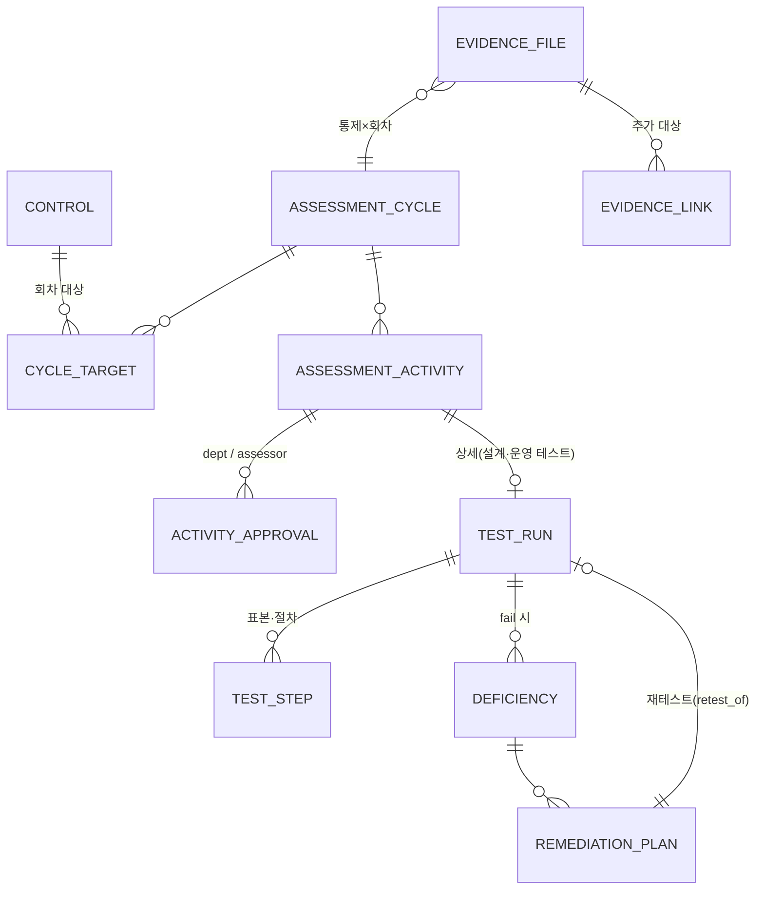

# ICFR-EVAL-01 — 평가 영역 도메인 계약 초안

> 기준 커밋: `dfe28e8` · 2026-10-02 · **초안 — 확정 아님.** 확정은 ADR(정본 모델 결정) 이후.
> 짝 문서: `docs/ICFR-EVAL-01-gap-map.md` (현황·리스크 R1~R9)
> 표기: **[실존]** 로컬 DB에서 확인 / **[제안]** 신규 필요

## 1. 엔티티 관계

ADR-0032(회차·활동·승인)를 정본 축으로 두고, 레거시 TestRun·DesignAssessment는 **활동의 상세 기록**으로 흡수하는 안(안 A)을 기준으로 그렸다. 이 안을 쓸지는 §6 Q1에서 정한다.

흐름: **Control → (회차) Activity/TestRun → 결과 fail → Deficiency(3단계 심각도) → RemediationPlan → 재테스트 TestRun → Deficiency 종결**

## 2. 엔티티별 필드

### 2.1 AssessmentCycle / CycleTarget / AssessmentActivity / ActivityApproval — [실존] 전부
ADR-0032 그대로. 회차 `kind`(design/operation)·`status`(open→closed→approved), 활동 5종, 승인 단계 `dept`(정책 토글)·`assessor`. 추가 제안 없음.

### 2.2 TestRun
| 필드 | 구분 | 비고 |
|---|---|---|
| control_id, baseline_control_id, instance_control_id, fiscal_year | 실존 | control_id FK는 레거시 `controls` (R6) |
| tester_id, test_date, result(pass/fail/n/a), status, notes | 실존 | |
| method_* 4종, population, test_frequency, sample_size, procedure, wtt_summary | 실존 | |
| approved_by_id, approved_at | 실존 | 직무분리 검사 없음 (R3) |
| **cycle_id** | 제안 | 회차 연결. 증빙과 같은 축 |
| **activity_id** | 제안 | 안 A일 때 활동 1:1 |
| **test_type** (design / operating) | 제안 | 설계·운영 효과성 구분 |
| **retest_of_id** (self FK), **remediation_plan_id** | 제안 | 재테스트 연결 (R7) |
| **exceptions_count** | 제안 | 표본 예외 수 — 결론 근거 |

### 2.3 TestStep — [실존] step_order·description·result(pass/fail). 제안: **sample_ref**(표본 식별자)

### 2.4 Deficiency
| 필드 | 구분 | 비고 |
|---|---|---|
| code, test_run_id, control 3종, description, fiscal_year | 실존 | |
| severity `low/medium/high` | 실존 → **변경 제안** | `deficiency` / `significant_deficiency` / `material_weakness` (R5) |
| status `open/in_progress/closed` | 실존 | |
| final_conclusion, confirmed_at, confirmed_by_id | 실존 | |
| **deficiency_type** (design / operating) | 제안 | |
| **cycle_id** | 제안 | |
| **severity_rationale** | 제안 | 심각도 판단 근거 — 감사 대응 필수 |

### 2.5 RemediationPlan — [실존] deficiency_id·owner_id·target_date·action_plan·status·priority·owner/reviewer_opinion·approved_*. 제안: **completed_at**, **retest_run_id**

### 2.6 EvidenceFile / EvidenceLink
| 필드 | 구분 | 비고 |
|---|---|---|
| filename, mime_type, size_bytes, minio_key, sha256, uploaded_by_id | 실존 | 경로 `{tenant}/cycles/{cycle}/controls/{control}/{id}` |
| cycle_id, control_id | 실존 | nullable(레거시 4건), 신규는 핸들러 필수 |
| deleted_by_id, deleted_at_ts, delete_reason | 실존 | 파일·레코드 보존 |
| EvidenceLink.linked_entity_type | 실존 | 허용 `control`만 → **`test_run`·`deficiency`·`remediation_plan` 추가 제안** (R9) |
| **version_no, supersedes_id** | 제안 | 교체 이력 (R8) — 외부 판매 기준 권장 |

## 3. 상태 전이와 권한 주체

| 엔티티 | 전이 | 현재 권한 | 제안 권한 |
|---|---|---|---|
| TestRun | planned→in_progress→completed | 인증 사용자 누구나 | 수행 역할(활동 규칙: control_owner / assessor) + `require_write` |
| TestRun | completed→approved | 누구나, 본인 포함 | 승인 역할 + **수행자 ≠ 승인자** (ADR-0031 §2.4 원칙: 막지 않고 경고+사유 vs 차단 — Q3) |
| Deficiency | open→in_progress→closed | 누구나 | 생성 assessor, closed는 재테스트 pass 필수 |
| RemediationPlan | planned→in_progress→completed→approved | 누구나 | 수행 owner, 승인 assessor/icfr_manager |
| Evidence | 업로드·수정·삭제 | 회차 open + 통제 역할 + 정책 토글 [실존] | 유지 |
| 회차 | open→closed→approved | require_write / icfr_manager [실존] | 유지 |

**공통**: external_auditor는 전 엔티티 읽기 전용 (`require_write`).

## 4. 공통 기준 (외부 판매 수준)

| 기준 | 현재 | 필요 여부 |
|---|---|---|
| 멀티테넌트 `tenant_id` | 평가 14테이블 전부 있음 [실존] | 충족 |
| 감사 컬럼 (created/updated/deleted_by) | AuditedBase, ADR-0036 [실존] | 충족 |
| 상태 이력 | test·remediation 이력 테이블 [실존], 미비점 이력 없음 | 미비점 이력 **필요** |
| 증빙 무결성 (SHA256) | 있음 | 충족. 다운로드 시 재검증은 선택 |
| 증빙 버전 | 없음 | **권장** |
| 보존기간 | ADR-0032 §2.9, retention 테스트 있음 | 충족 |

## 5. 결정 전 원칙
- 실데이터(테스트 1·미비점 4·개선계획 3·증빙 4건, 로컬 기준)는 지어내지 않는다 — 13.9-29와 같은 원칙.
- 심각도 값 변경은 기존 데이터 변경 마이그레이션 → Opus 진행·마스터 승인.

## 6. TrustBuilder 확인 질문

1. **Q1 정본 모델**: TestRun·DesignAssessment를 `assessment_activities`의 상세로 흡수(안 A)할지, TestRun에 `cycle_id`만 붙여 병존(안 B)할지. ADR-0032 §5는 미비점을 "미해결"로 남김.
2. **Q2** test/remediation 쓰기에 `require_write`가 없는 것이 의도된 것인지(Phase 1 잔재로 추정). 즉시 적용해도 되는지.
3. **Q3** 승인 직무분리 — 수행자 = 승인자를 **차단**할지, ADR-0031 §2.4처럼 **경고+사유**로 둘지.
4. **Q4** 미비점 심각도 3단계 명칭·값 확정, 기존 `low/medium/high` 매핑 규칙.
5. **Q5** 레거시 `controls` FK(R6) 제거 시점 — 13.9-72 후속으로 계획이 있는지.
6. **Q6** 증빙 첨부 대상 확장(테스트·미비점·개선계획) 시 권한 판정 기준 — 통제×회차 판정을 그대로 상속할지.
7. **Q7** 운영 DB의 평가 테이블 건수 (로컬만 확인함).
